# Разведочный анализ данных. Исследование и визуализация данных.

## 1) Текстовое описание набора данных

В качестве набора данных мы будем использовать набор данных 
о ценах на жилье в Бостоне - https://archive.ics.uci.edu/ml/machine-learning-databases/housing/

Датасет состоит из файла:
- housing.data - обучающая выборка (в этом примере используется только данный файл)

Файл содержит следующие колонки:
- CRIM - уровень преступности на душу населения в разбивке по городам.
- ZN - доля жилой земли, зонированной на участки площадью более 25 000 кв.футов.
- INDUS - доля акров, не связанных с розничной торговлей, на город.
- CHAS - Фиктивная переменная реки Чарльз (= 1, если тракт ограничивает реку; 0 в противном случае).
- NOX - концентрация оксидов азота (частей на 10 миллионов).
- RM - среднее количество комнат в жилом помещении.
- AGE - доля жилых помещений, занятых владельцами, построенных до 1940 года.
- DIS - взвешенные расстояния до пяти бостонских центров занятости.
- RAD - индекс доступности к радиальным магистралям.
- TAX - ставка налога на недвижимость с полной стоимостью за 10 000 долларов США.
- PTRATIO - соотношение учащихся и учителей в разбивке по городам.
- B - 1000(Bk - 0,63)^2, где Bk - доля чернокожих по городам.
- LSTAT - % более низкий статус населения.
- MEDV - средняя стоимость домов, занятых владельцами, в 1000 долларов.

# Импорт библиотек


```python
import numpy as np
import pandas as pd
import seaborn as sns
import matplotlib.pyplot as plt
%matplotlib inline 
from sklearn.datasets import *
sns.set(style="ticks")
```

# Загрузка данных

Загрузим файлы датасета из библиатеке `sklearn.datasets`, и преобразуем в `DataFrame` библиотеки *Pandas*.


```python
ds = load_boston()
df = pd.DataFrame(data= np.c_[ds['data'], ds['target']],
                 columns= list(ds['feature_names']) + ['target'])
```

# 2) Основные характеристики датасета


```python
# Первые 5 строк датасета
df.head()
```


<div>
<style scoped>
    .dataframe tbody tr th:only-of-type {
        vertical-align: middle;
    }

    .dataframe tbody tr th {
        vertical-align: top;
    }

    .dataframe thead th {
        text-align: right;
    }
</style>
<table border="1" class="dataframe">
  <thead>
    <tr style="text-align: right;">
      <th></th>
      <th>CRIM</th>
      <th>ZN</th>
      <th>INDUS</th>
      <th>CHAS</th>
      <th>NOX</th>
      <th>RM</th>
      <th>AGE</th>
      <th>DIS</th>
      <th>RAD</th>
      <th>TAX</th>
      <th>PTRATIO</th>
      <th>B</th>
      <th>LSTAT</th>
      <th>target</th>
    </tr>
  </thead>
  <tbody>
    <tr>
      <th>0</th>
      <td>0.00632</td>
      <td>18.0</td>
      <td>2.31</td>
      <td>0.0</td>
      <td>0.538</td>
      <td>6.575</td>
      <td>65.2</td>
      <td>4.0900</td>
      <td>1.0</td>
      <td>296.0</td>
      <td>15.3</td>
      <td>396.90</td>
      <td>4.98</td>
      <td>24.0</td>
    </tr>
    <tr>
      <th>1</th>
      <td>0.02731</td>
      <td>0.0</td>
      <td>7.07</td>
      <td>0.0</td>
      <td>0.469</td>
      <td>6.421</td>
      <td>78.9</td>
      <td>4.9671</td>
      <td>2.0</td>
      <td>242.0</td>
      <td>17.8</td>
      <td>396.90</td>
      <td>9.14</td>
      <td>21.6</td>
    </tr>
    <tr>
      <th>2</th>
      <td>0.02729</td>
      <td>0.0</td>
      <td>7.07</td>
      <td>0.0</td>
      <td>0.469</td>
      <td>7.185</td>
      <td>61.1</td>
      <td>4.9671</td>
      <td>2.0</td>
      <td>242.0</td>
      <td>17.8</td>
      <td>392.83</td>
      <td>4.03</td>
      <td>34.7</td>
    </tr>
    <tr>
      <th>3</th>
      <td>0.03237</td>
      <td>0.0</td>
      <td>2.18</td>
      <td>0.0</td>
      <td>0.458</td>
      <td>6.998</td>
      <td>45.8</td>
      <td>6.0622</td>
      <td>3.0</td>
      <td>222.0</td>
      <td>18.7</td>
      <td>394.63</td>
      <td>2.94</td>
      <td>33.4</td>
    </tr>
    <tr>
      <th>4</th>
      <td>0.06905</td>
      <td>0.0</td>
      <td>2.18</td>
      <td>0.0</td>
      <td>0.458</td>
      <td>7.147</td>
      <td>54.2</td>
      <td>6.0622</td>
      <td>3.0</td>
      <td>222.0</td>
      <td>18.7</td>
      <td>396.90</td>
      <td>5.33</td>
      <td>36.2</td>
    </tr>
  </tbody>
</table>
</div>


```python
# Размер датасета - 8143 строк, 7 колонок
df.shape
```


    (506, 14)


```python
total_count = df.shape[0]
print('Всего строк: {}'.format(total_count))
```

    Всего строк: 506
    


```python
# Список колонок
df.columns
```


    Index(['CRIM', 'ZN', 'INDUS', 'CHAS', 'NOX', 'RM', 'AGE', 'DIS', 'RAD', 'TAX',
           'PTRATIO', 'B', 'LSTAT', 'target'],
          dtype='object')


```python
# Список колонок с типами данных
df.dtypes
```


    CRIM       float64
    ZN         float64
    INDUS      float64
    CHAS       float64
    NOX        float64
    RM         float64
    AGE        float64
    DIS        float64
    RAD        float64
    TAX        float64
    PTRATIO    float64
    B          float64
    LSTAT      float64
    target     float64
    dtype: object


```python
# Проверим наличие пустых значений
# Цикл по колонкам датасета
for col in df.columns:
    # Количество пустых значений - все значения заполнены
    temp_null_count = df[df[col].isnull()].shape[0]
    print('{} - {}'.format(col, temp_null_count))
```

    CRIM - 0
    ZN - 0
    INDUS - 0
    CHAS - 0
    NOX - 0
    RM - 0
    AGE - 0
    DIS - 0
    RAD - 0
    TAX - 0
    PTRATIO - 0
    B - 0
    LSTAT - 0
    target - 0
    


```python
# Основные статистические характеристки набора данных
df.describe()
```


<div>
<style scoped>
    .dataframe tbody tr th:only-of-type {
        vertical-align: middle;
    }

    .dataframe tbody tr th {
        vertical-align: top;
    }

    .dataframe thead th {
        text-align: right;
    }
</style>
<table border="1" class="dataframe">
  <thead>
    <tr style="text-align: right;">
      <th></th>
      <th>CRIM</th>
      <th>ZN</th>
      <th>INDUS</th>
      <th>CHAS</th>
      <th>NOX</th>
      <th>RM</th>
      <th>AGE</th>
      <th>DIS</th>
      <th>RAD</th>
      <th>TAX</th>
      <th>PTRATIO</th>
      <th>B</th>
      <th>LSTAT</th>
      <th>target</th>
    </tr>
  </thead>
  <tbody>
    <tr>
      <th>count</th>
      <td>506.000000</td>
      <td>506.000000</td>
      <td>506.000000</td>
      <td>506.000000</td>
      <td>506.000000</td>
      <td>506.000000</td>
      <td>506.000000</td>
      <td>506.000000</td>
      <td>506.000000</td>
      <td>506.000000</td>
      <td>506.000000</td>
      <td>506.000000</td>
      <td>506.000000</td>
      <td>506.000000</td>
    </tr>
    <tr>
      <th>mean</th>
      <td>3.613524</td>
      <td>11.363636</td>
      <td>11.136779</td>
      <td>0.069170</td>
      <td>0.554695</td>
      <td>6.284634</td>
      <td>68.574901</td>
      <td>3.795043</td>
      <td>9.549407</td>
      <td>408.237154</td>
      <td>18.455534</td>
      <td>356.674032</td>
      <td>12.653063</td>
      <td>22.532806</td>
    </tr>
    <tr>
      <th>std</th>
      <td>8.601545</td>
      <td>23.322453</td>
      <td>6.860353</td>
      <td>0.253994</td>
      <td>0.115878</td>
      <td>0.702617</td>
      <td>28.148861</td>
      <td>2.105710</td>
      <td>8.707259</td>
      <td>168.537116</td>
      <td>2.164946</td>
      <td>91.294864</td>
      <td>7.141062</td>
      <td>9.197104</td>
    </tr>
    <tr>
      <th>min</th>
      <td>0.006320</td>
      <td>0.000000</td>
      <td>0.460000</td>
      <td>0.000000</td>
      <td>0.385000</td>
      <td>3.561000</td>
      <td>2.900000</td>
      <td>1.129600</td>
      <td>1.000000</td>
      <td>187.000000</td>
      <td>12.600000</td>
      <td>0.320000</td>
      <td>1.730000</td>
      <td>5.000000</td>
    </tr>
    <tr>
      <th>25%</th>
      <td>0.082045</td>
      <td>0.000000</td>
      <td>5.190000</td>
      <td>0.000000</td>
      <td>0.449000</td>
      <td>5.885500</td>
      <td>45.025000</td>
      <td>2.100175</td>
      <td>4.000000</td>
      <td>279.000000</td>
      <td>17.400000</td>
      <td>375.377500</td>
      <td>6.950000</td>
      <td>17.025000</td>
    </tr>
    <tr>
      <th>50%</th>
      <td>0.256510</td>
      <td>0.000000</td>
      <td>9.690000</td>
      <td>0.000000</td>
      <td>0.538000</td>
      <td>6.208500</td>
      <td>77.500000</td>
      <td>3.207450</td>
      <td>5.000000</td>
      <td>330.000000</td>
      <td>19.050000</td>
      <td>391.440000</td>
      <td>11.360000</td>
      <td>21.200000</td>
    </tr>
    <tr>
      <th>75%</th>
      <td>3.677083</td>
      <td>12.500000</td>
      <td>18.100000</td>
      <td>0.000000</td>
      <td>0.624000</td>
      <td>6.623500</td>
      <td>94.075000</td>
      <td>5.188425</td>
      <td>24.000000</td>
      <td>666.000000</td>
      <td>20.200000</td>
      <td>396.225000</td>
      <td>16.955000</td>
      <td>25.000000</td>
    </tr>
    <tr>
      <th>max</th>
      <td>88.976200</td>
      <td>100.000000</td>
      <td>27.740000</td>
      <td>1.000000</td>
      <td>0.871000</td>
      <td>8.780000</td>
      <td>100.000000</td>
      <td>12.126500</td>
      <td>24.000000</td>
      <td>711.000000</td>
      <td>22.000000</td>
      <td>396.900000</td>
      <td>37.970000</td>
      <td>50.000000</td>
    </tr>
  </tbody>
</table>
</div>


```python
# Определим уникальные значения для целевого признака
df['target'].unique()
```


    array([24. , 21.6, 34.7, 33.4, 36.2, 28.7, 22.9, 27.1, 16.5, 18.9, 15. ,
           21.7, 20.4, 18.2, 19.9, 23.1, 17.5, 20.2, 13.6, 19.6, 15.2, 14.5,
           15.6, 13.9, 16.6, 14.8, 18.4, 21. , 12.7, 13.2, 13.1, 13.5, 20. ,
           24.7, 30.8, 34.9, 26.6, 25.3, 21.2, 19.3, 14.4, 19.4, 19.7, 20.5,
           25. , 23.4, 35.4, 31.6, 23.3, 18.7, 16. , 22.2, 33. , 23.5, 22. ,
           17.4, 20.9, 24.2, 22.8, 24.1, 21.4, 20.8, 20.3, 28. , 23.9, 24.8,
           22.5, 23.6, 22.6, 20.6, 28.4, 38.7, 43.8, 33.2, 27.5, 26.5, 18.6,
           20.1, 19.5, 19.8, 18.8, 18.5, 18.3, 19.2, 17.3, 15.7, 16.2, 18. ,
           14.3, 23. , 18.1, 17.1, 13.3, 17.8, 14. , 13.4, 11.8, 13.8, 14.6,
           15.4, 21.5, 15.3, 17. , 41.3, 24.3, 27. , 50. , 22.7, 23.8, 22.3,
           19.1, 29.4, 23.2, 24.6, 29.9, 37.2, 39.8, 37.9, 32.5, 26.4, 29.6,
           32. , 29.8, 37. , 30.5, 36.4, 31.1, 29.1, 33.3, 30.3, 34.6, 32.9,
           42.3, 48.5, 24.4, 22.4, 28.1, 23.7, 26.7, 30.1, 44.8, 37.6, 46.7,
           31.5, 31.7, 41.7, 48.3, 29. , 25.1, 17.6, 24.5, 26.2, 42.8, 21.9,
           44. , 36. , 33.8, 43.1, 48.8, 31. , 36.5, 30.7, 43.5, 20.7, 21.1,
           25.2, 35.2, 32.4, 33.1, 35.1, 45.4, 46. , 32.2, 28.5, 37.3, 27.9,
           28.6, 36.1, 28.2, 16.1, 22.1, 19. , 32.7, 31.2, 17.2, 16.8, 10.2,
           10.4, 10.9, 11.3, 12.3,  8.8,  7.2, 10.5,  7.4, 11.5, 15.1,  9.7,
           12.5,  8.5,  5. ,  6.3,  5.6, 12.1,  8.3, 11.9, 17.9, 16.3,  7. ,
            7.5,  8.4, 16.7, 14.2, 11.7, 11. ,  9.5, 14.1,  9.6,  8.7, 12.8,
           10.8, 14.9, 12.6, 13. , 16.4, 17.7, 12. , 21.8,  8.1])


Целевой признак имеет множество различных значений

# 3) Визуальное исследование датасета
Для визуального исследования могут быть использованы различные виды диаграмм, мы построим только некоторые варианты диаграмм, которые используются достаточно часто.

### [Диаграмма рассеяния](https://en.wikipedia.org/wiki/Scatter_plot)


```python
fig, ax = plt.subplots(figsize=(10,10)) 
sns.scatterplot(ax=ax, x='TAX', y='DIS', data=df)
```


    <matplotlib.axes._subplots.AxesSubplot at 0x273fc52c850>


    
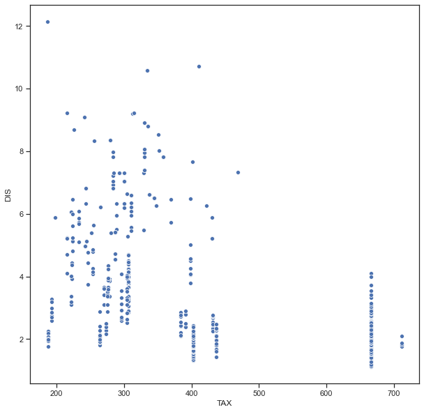
    


Можно сделать вывод, что налог на недвижемость не имеет ярко выраженно зависимости с удалённости центра занятости

Посмотрим насколько на эту зависимость влияет целевой признак.


```python
fig, ax = plt.subplots(figsize=(10,10)) 
sns.scatterplot(ax=ax, x='TAX', y='DIS', data=df, hue='target')
```


    <matplotlib.axes._subplots.AxesSubplot at 0x273fcd224f0>


    
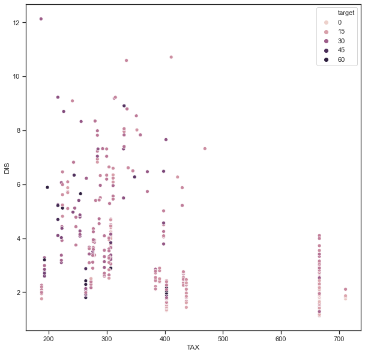
    


## [Гистограмма](https://en.wikipedia.org/wiki/Histogram) 
Позволяет оценить плотность вероятности распределения данных.


```python
fig, ax = plt.subplots(figsize=(10,10)) 
sns.distplot(df['target'])
```


    <matplotlib.axes._subplots.AxesSubplot at 0x273fccdfc70>


    
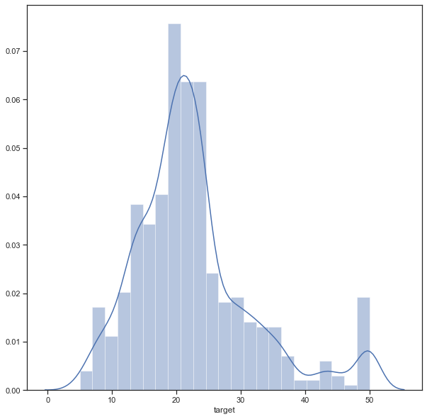
    


### Jointplot
Комбинация гистограмм и диаграмм рассеивания.


```python
sns.jointplot(x='TAX', y='DIS', data=df)
```


    <seaborn.axisgrid.JointGrid at 0x273f7329910>


    
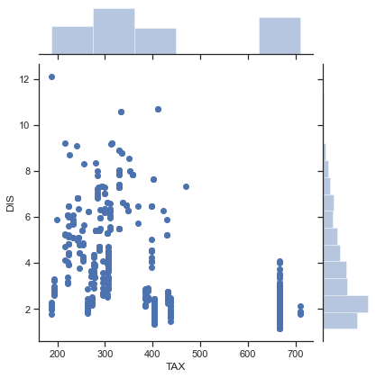
    


```python
sns.jointplot(x='TAX', y='DIS', data=df, kind="hex", color="r")
```


    <seaborn.axisgrid.JointGrid at 0x273fd15b6a0>


    
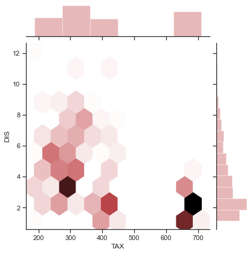
    


```python
sns.jointplot(x='TAX', y='DIS', data=df, kind="kde", color="r")
```


    <seaborn.axisgrid.JointGrid at 0x273fd671640>


    
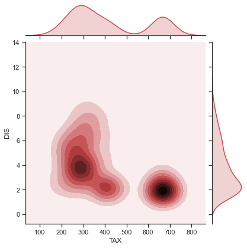
    


### "Парные диаграммы"
Комбинация гистограмм и диаграмм рассеивания для всего набора данных.

Выводится матрица графиков. На пересечении строки и столбца, которые соответстуют двум показателям, строится диаграмма рассеивания. В главной диагонали матрицы строятся гистограммы распределения соответствующих показателей.


```python
sns.pairplot(df)
```


    <seaborn.axisgrid.PairGrid at 0x273fd730e20>


    
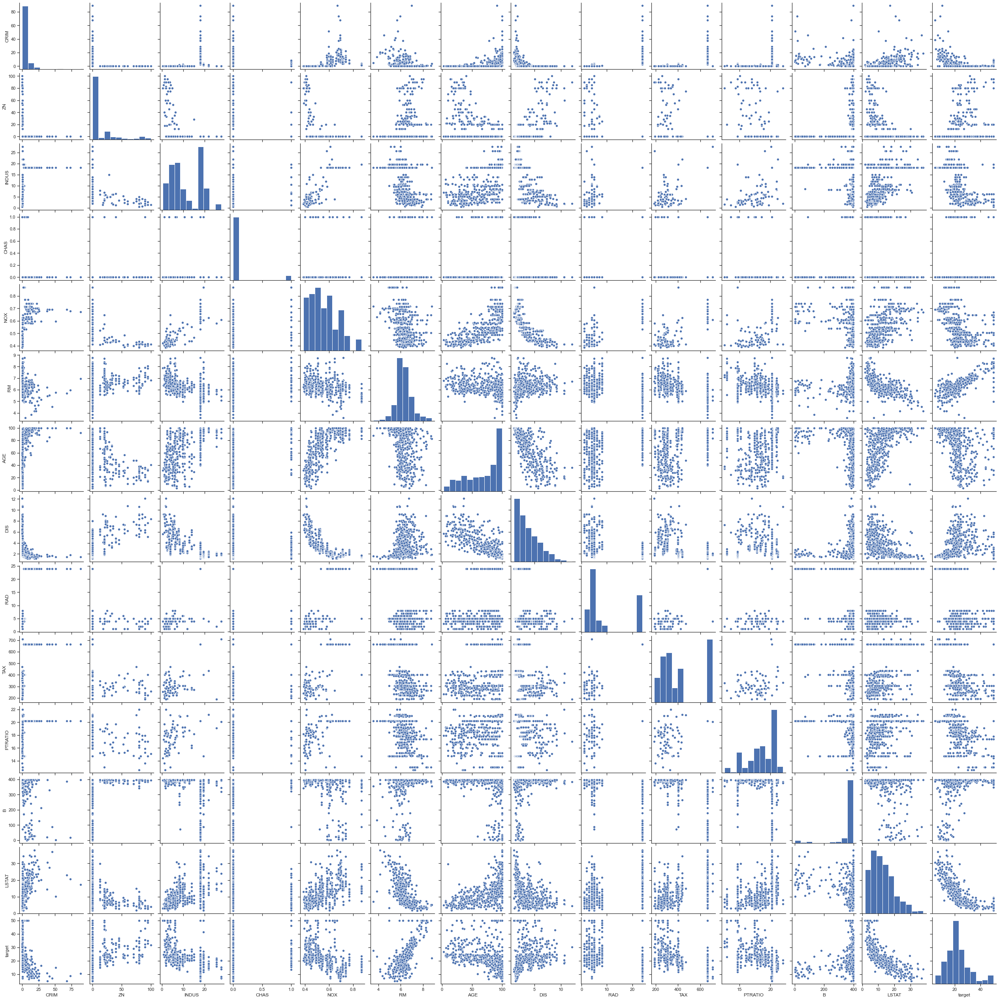
    


С помощью параметра "hue" возможна группировка по значениям какого-либо признака.


```python
sns.pairplot(df, hue="target", diag_kind='hist')
```


    <seaborn.axisgrid.PairGrid at 0x273c6075700>


    
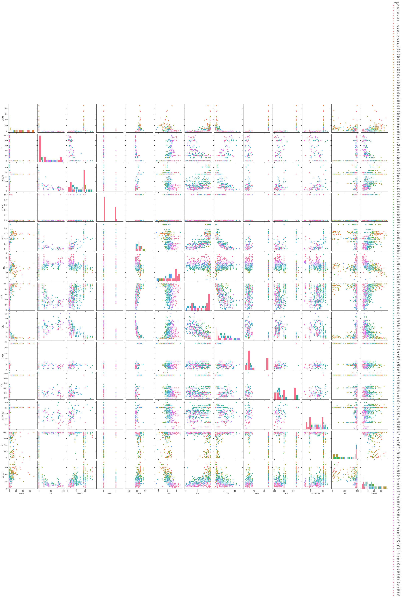
    


### [Ящик с усами](https://en.wikipedia.org/wiki/Box_plot)
Отображает одномерное распределение вероятности.


```python
sns.boxplot(x=df['TAX'])
```


    <matplotlib.axes._subplots.AxesSubplot at 0x27393fc6040>


    
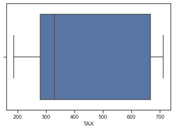
    


```python
# По вертикали
sns.boxplot(y=df['TAX'])
```


    <matplotlib.axes._subplots.AxesSubplot at 0x2739307a5b0>


    
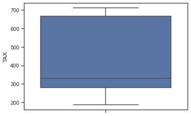
    


```python
# Распределение параметра TAX сгруппированные по DIS.
fg, ax = plt.subplots(figsize=(50,50))
sns.boxplot(x='TAX', y='DIS', data=df, ax=ax)
plt.show()
```


    
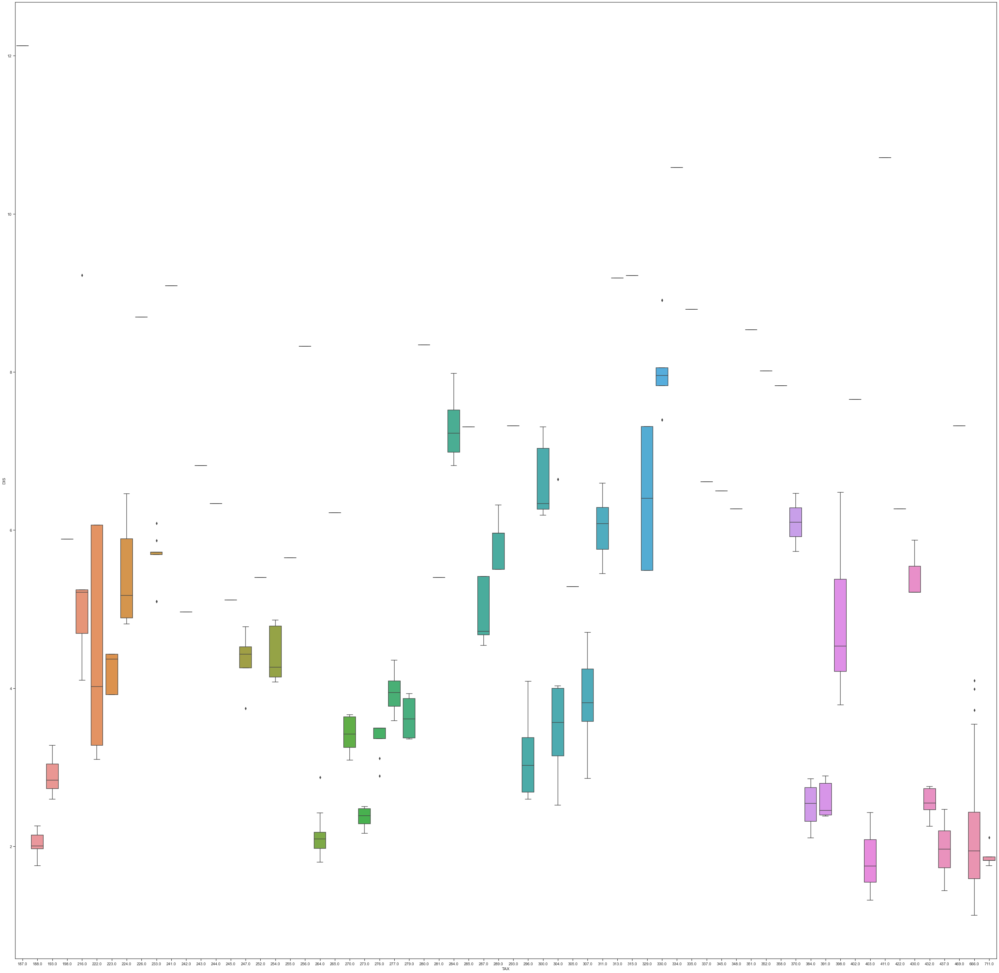
    


### [Violin plot](https://en.wikipedia.org/wiki/Violin_plot)
Похоже на предыдущую диаграмму, но по краям отображаются распределения плотности - https://en.wikipedia.org/wiki/Kernel_density_estimation


```python
sns.violinplot(x=df['TAX'])
```


    <matplotlib.axes._subplots.AxesSubplot at 0x273938f4eb0>


    
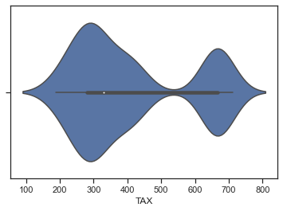
    


```python
fig, ax = plt.subplots(2, 1, figsize=(10,10))
sns.violinplot(ax=ax[0], x=df['TAX'])
sns.distplot(df['TAX'], ax=ax[1])
```


    <matplotlib.axes._subplots.AxesSubplot at 0x27395bbf550>


    
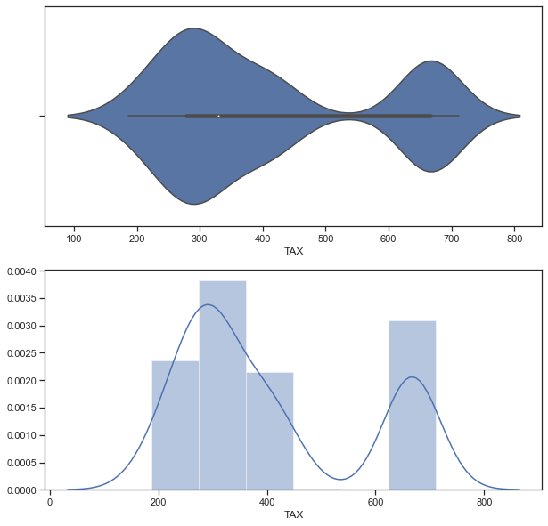
    


Из приведенных графиков видно, что violinplot действительно показывает распределение плотности.


```python
# Распределение параметра TAX сгруппированные по CHAS.
sns.violinplot(x='CHAS', y='TAX', data=df)
```


    <matplotlib.axes._subplots.AxesSubplot at 0x273946f5190>


    
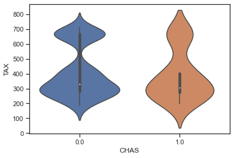
    


```python
sns.catplot(y='TAX', x='CHAS', data=df, kind="violin", split=True)
```


    <seaborn.axisgrid.FacetGrid at 0x273945f76a0>


    
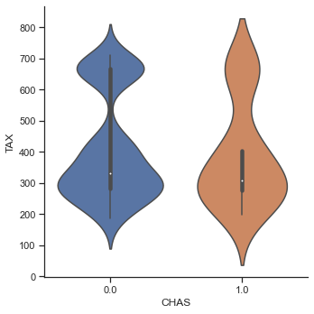
    


# 4) Информация о корреляции признаков

Проверка корреляции признаков позволяет решить две задачи:
1. Понять какие признаки (колонки датасета) наиболее сильно коррелируют с целевым признаком (в нашем примере это колонка "RM"). Именно эти признаки будут наиболее информативными для моделей машинного обучения. Признаки, которые слабо коррелируют с целевым признаком, можно попробовать исключить из построения модели, иногда это повышает качество модели. Нужно отметить, что некоторые алгоритмы машинного обучения автоматически определяют ценность того или иного признака для построения модели.
1. Понять какие нецелевые признаки линейно зависимы между собой. Линейно зависимые признаки, как правило, очень плохо влияют на качество моделей. Поэтому если несколько признаков линейно зависимы, то для построения модели из них выбирают какой-то один признак.


```python
df.corr()
```


<div>
<style scoped>
    .dataframe tbody tr th:only-of-type {
        vertical-align: middle;
    }

    .dataframe tbody tr th {
        vertical-align: top;
    }

    .dataframe thead th {
        text-align: right;
    }
</style>
<table border="1" class="dataframe">
  <thead>
    <tr style="text-align: right;">
      <th></th>
      <th>CRIM</th>
      <th>ZN</th>
      <th>INDUS</th>
      <th>CHAS</th>
      <th>NOX</th>
      <th>RM</th>
      <th>AGE</th>
      <th>DIS</th>
      <th>RAD</th>
      <th>TAX</th>
      <th>PTRATIO</th>
      <th>B</th>
      <th>LSTAT</th>
      <th>target</th>
    </tr>
  </thead>
  <tbody>
    <tr>
      <th>CRIM</th>
      <td>1.000000</td>
      <td>-0.200469</td>
      <td>0.406583</td>
      <td>-0.055892</td>
      <td>0.420972</td>
      <td>-0.219247</td>
      <td>0.352734</td>
      <td>-0.379670</td>
      <td>0.625505</td>
      <td>0.582764</td>
      <td>0.289946</td>
      <td>-0.385064</td>
      <td>0.455621</td>
      <td>-0.388305</td>
    </tr>
    <tr>
      <th>ZN</th>
      <td>-0.200469</td>
      <td>1.000000</td>
      <td>-0.533828</td>
      <td>-0.042697</td>
      <td>-0.516604</td>
      <td>0.311991</td>
      <td>-0.569537</td>
      <td>0.664408</td>
      <td>-0.311948</td>
      <td>-0.314563</td>
      <td>-0.391679</td>
      <td>0.175520</td>
      <td>-0.412995</td>
      <td>0.360445</td>
    </tr>
    <tr>
      <th>INDUS</th>
      <td>0.406583</td>
      <td>-0.533828</td>
      <td>1.000000</td>
      <td>0.062938</td>
      <td>0.763651</td>
      <td>-0.391676</td>
      <td>0.644779</td>
      <td>-0.708027</td>
      <td>0.595129</td>
      <td>0.720760</td>
      <td>0.383248</td>
      <td>-0.356977</td>
      <td>0.603800</td>
      <td>-0.483725</td>
    </tr>
    <tr>
      <th>CHAS</th>
      <td>-0.055892</td>
      <td>-0.042697</td>
      <td>0.062938</td>
      <td>1.000000</td>
      <td>0.091203</td>
      <td>0.091251</td>
      <td>0.086518</td>
      <td>-0.099176</td>
      <td>-0.007368</td>
      <td>-0.035587</td>
      <td>-0.121515</td>
      <td>0.048788</td>
      <td>-0.053929</td>
      <td>0.175260</td>
    </tr>
    <tr>
      <th>NOX</th>
      <td>0.420972</td>
      <td>-0.516604</td>
      <td>0.763651</td>
      <td>0.091203</td>
      <td>1.000000</td>
      <td>-0.302188</td>
      <td>0.731470</td>
      <td>-0.769230</td>
      <td>0.611441</td>
      <td>0.668023</td>
      <td>0.188933</td>
      <td>-0.380051</td>
      <td>0.590879</td>
      <td>-0.427321</td>
    </tr>
    <tr>
      <th>RM</th>
      <td>-0.219247</td>
      <td>0.311991</td>
      <td>-0.391676</td>
      <td>0.091251</td>
      <td>-0.302188</td>
      <td>1.000000</td>
      <td>-0.240265</td>
      <td>0.205246</td>
      <td>-0.209847</td>
      <td>-0.292048</td>
      <td>-0.355501</td>
      <td>0.128069</td>
      <td>-0.613808</td>
      <td>0.695360</td>
    </tr>
    <tr>
      <th>AGE</th>
      <td>0.352734</td>
      <td>-0.569537</td>
      <td>0.644779</td>
      <td>0.086518</td>
      <td>0.731470</td>
      <td>-0.240265</td>
      <td>1.000000</td>
      <td>-0.747881</td>
      <td>0.456022</td>
      <td>0.506456</td>
      <td>0.261515</td>
      <td>-0.273534</td>
      <td>0.602339</td>
      <td>-0.376955</td>
    </tr>
    <tr>
      <th>DIS</th>
      <td>-0.379670</td>
      <td>0.664408</td>
      <td>-0.708027</td>
      <td>-0.099176</td>
      <td>-0.769230</td>
      <td>0.205246</td>
      <td>-0.747881</td>
      <td>1.000000</td>
      <td>-0.494588</td>
      <td>-0.534432</td>
      <td>-0.232471</td>
      <td>0.291512</td>
      <td>-0.496996</td>
      <td>0.249929</td>
    </tr>
    <tr>
      <th>RAD</th>
      <td>0.625505</td>
      <td>-0.311948</td>
      <td>0.595129</td>
      <td>-0.007368</td>
      <td>0.611441</td>
      <td>-0.209847</td>
      <td>0.456022</td>
      <td>-0.494588</td>
      <td>1.000000</td>
      <td>0.910228</td>
      <td>0.464741</td>
      <td>-0.444413</td>
      <td>0.488676</td>
      <td>-0.381626</td>
    </tr>
    <tr>
      <th>TAX</th>
      <td>0.582764</td>
      <td>-0.314563</td>
      <td>0.720760</td>
      <td>-0.035587</td>
      <td>0.668023</td>
      <td>-0.292048</td>
      <td>0.506456</td>
      <td>-0.534432</td>
      <td>0.910228</td>
      <td>1.000000</td>
      <td>0.460853</td>
      <td>-0.441808</td>
      <td>0.543993</td>
      <td>-0.468536</td>
    </tr>
    <tr>
      <th>PTRATIO</th>
      <td>0.289946</td>
      <td>-0.391679</td>
      <td>0.383248</td>
      <td>-0.121515</td>
      <td>0.188933</td>
      <td>-0.355501</td>
      <td>0.261515</td>
      <td>-0.232471</td>
      <td>0.464741</td>
      <td>0.460853</td>
      <td>1.000000</td>
      <td>-0.177383</td>
      <td>0.374044</td>
      <td>-0.507787</td>
    </tr>
    <tr>
      <th>B</th>
      <td>-0.385064</td>
      <td>0.175520</td>
      <td>-0.356977</td>
      <td>0.048788</td>
      <td>-0.380051</td>
      <td>0.128069</td>
      <td>-0.273534</td>
      <td>0.291512</td>
      <td>-0.444413</td>
      <td>-0.441808</td>
      <td>-0.177383</td>
      <td>1.000000</td>
      <td>-0.366087</td>
      <td>0.333461</td>
    </tr>
    <tr>
      <th>LSTAT</th>
      <td>0.455621</td>
      <td>-0.412995</td>
      <td>0.603800</td>
      <td>-0.053929</td>
      <td>0.590879</td>
      <td>-0.613808</td>
      <td>0.602339</td>
      <td>-0.496996</td>
      <td>0.488676</td>
      <td>0.543993</td>
      <td>0.374044</td>
      <td>-0.366087</td>
      <td>1.000000</td>
      <td>-0.737663</td>
    </tr>
    <tr>
      <th>target</th>
      <td>-0.388305</td>
      <td>0.360445</td>
      <td>-0.483725</td>
      <td>0.175260</td>
      <td>-0.427321</td>
      <td>0.695360</td>
      <td>-0.376955</td>
      <td>0.249929</td>
      <td>-0.381626</td>
      <td>-0.468536</td>
      <td>-0.507787</td>
      <td>0.333461</td>
      <td>-0.737663</td>
      <td>1.000000</td>
    </tr>
  </tbody>
</table>
</div>


Корреляционная матрица содержит коэффициенты корреляции между всеми парами признаков.

Корреляционная матрица симметрична относительно главной диагонали. На главной диагонали расположены единицы (корреляция признака самого с собой).


На основе корреляционной матрицы можно сделать следующие выводы:
- Целевой признак наиболее сильно коррелирует с освещенностью (0.9) и концентрацией углекислого газа (0.71). Эти признаки обязательно следует оставить в модели.
- Целевой признак отчасти коррелирует с температурой (0.54). Этот признак стоит также оставить в модели.
- Целевой признак слабо коррелирует с влажностью (0.13) и HumidityRatio (0.3). Скорее всего эти признаки стоит исключить из модели, возможно они только ухудшат качество модели.
- Влажность и HumidityRatio очень сильно коррелируют между собой (0.96). Это неудивительно, ведь HumidityRatio величина производная от влажности. Поэтому из этих признаков в модели можно оставлять только один. 
- Также можно сделать вывод, что выбирая из признаков влажность и HumidityRatio лучше выбрать HumidityRatio, потому что он сильнее коррелирован с целевым признаком. Если линейно зависимые признаки сильно коррелированы с целевым, то оставляют именно тот признак, который коррелирован с целевым сильнее. Но для этой пары признаков этот вывод нельзя считать надежным, потому что и 0.13 и 0.3 являются довольно малыми величинами. 

Описание метода corr - https://pandas.pydata.org/pandas-docs/stable/reference/api/pandas.DataFrame.corr.html

По умолчанию при построении матрицы используется коэффициент корреляции [Пирсона](https://ru.wikipedia.org/wiki/%D0%9A%D0%BE%D1%80%D1%80%D0%B5%D0%BB%D1%8F%D1%86%D0%B8%D1%8F). Возможно также построить корреляционную матрицу на основе коэффициентов корреляции Кендалла и Спирмена. На практике три метода редко дают значимые различия.


```python
df.corr(method='pearson')
```


<div>
<style scoped>
    .dataframe tbody tr th:only-of-type {
        vertical-align: middle;
    }

    .dataframe tbody tr th {
        vertical-align: top;
    }

    .dataframe thead th {
        text-align: right;
    }
</style>
<table border="1" class="dataframe">
  <thead>
    <tr style="text-align: right;">
      <th></th>
      <th>CRIM</th>
      <th>ZN</th>
      <th>INDUS</th>
      <th>CHAS</th>
      <th>NOX</th>
      <th>RM</th>
      <th>AGE</th>
      <th>DIS</th>
      <th>RAD</th>
      <th>TAX</th>
      <th>PTRATIO</th>
      <th>B</th>
      <th>LSTAT</th>
      <th>target</th>
    </tr>
  </thead>
  <tbody>
    <tr>
      <th>CRIM</th>
      <td>1.000000</td>
      <td>-0.200469</td>
      <td>0.406583</td>
      <td>-0.055892</td>
      <td>0.420972</td>
      <td>-0.219247</td>
      <td>0.352734</td>
      <td>-0.379670</td>
      <td>0.625505</td>
      <td>0.582764</td>
      <td>0.289946</td>
      <td>-0.385064</td>
      <td>0.455621</td>
      <td>-0.388305</td>
    </tr>
    <tr>
      <th>ZN</th>
      <td>-0.200469</td>
      <td>1.000000</td>
      <td>-0.533828</td>
      <td>-0.042697</td>
      <td>-0.516604</td>
      <td>0.311991</td>
      <td>-0.569537</td>
      <td>0.664408</td>
      <td>-0.311948</td>
      <td>-0.314563</td>
      <td>-0.391679</td>
      <td>0.175520</td>
      <td>-0.412995</td>
      <td>0.360445</td>
    </tr>
    <tr>
      <th>INDUS</th>
      <td>0.406583</td>
      <td>-0.533828</td>
      <td>1.000000</td>
      <td>0.062938</td>
      <td>0.763651</td>
      <td>-0.391676</td>
      <td>0.644779</td>
      <td>-0.708027</td>
      <td>0.595129</td>
      <td>0.720760</td>
      <td>0.383248</td>
      <td>-0.356977</td>
      <td>0.603800</td>
      <td>-0.483725</td>
    </tr>
    <tr>
      <th>CHAS</th>
      <td>-0.055892</td>
      <td>-0.042697</td>
      <td>0.062938</td>
      <td>1.000000</td>
      <td>0.091203</td>
      <td>0.091251</td>
      <td>0.086518</td>
      <td>-0.099176</td>
      <td>-0.007368</td>
      <td>-0.035587</td>
      <td>-0.121515</td>
      <td>0.048788</td>
      <td>-0.053929</td>
      <td>0.175260</td>
    </tr>
    <tr>
      <th>NOX</th>
      <td>0.420972</td>
      <td>-0.516604</td>
      <td>0.763651</td>
      <td>0.091203</td>
      <td>1.000000</td>
      <td>-0.302188</td>
      <td>0.731470</td>
      <td>-0.769230</td>
      <td>0.611441</td>
      <td>0.668023</td>
      <td>0.188933</td>
      <td>-0.380051</td>
      <td>0.590879</td>
      <td>-0.427321</td>
    </tr>
    <tr>
      <th>RM</th>
      <td>-0.219247</td>
      <td>0.311991</td>
      <td>-0.391676</td>
      <td>0.091251</td>
      <td>-0.302188</td>
      <td>1.000000</td>
      <td>-0.240265</td>
      <td>0.205246</td>
      <td>-0.209847</td>
      <td>-0.292048</td>
      <td>-0.355501</td>
      <td>0.128069</td>
      <td>-0.613808</td>
      <td>0.695360</td>
    </tr>
    <tr>
      <th>AGE</th>
      <td>0.352734</td>
      <td>-0.569537</td>
      <td>0.644779</td>
      <td>0.086518</td>
      <td>0.731470</td>
      <td>-0.240265</td>
      <td>1.000000</td>
      <td>-0.747881</td>
      <td>0.456022</td>
      <td>0.506456</td>
      <td>0.261515</td>
      <td>-0.273534</td>
      <td>0.602339</td>
      <td>-0.376955</td>
    </tr>
    <tr>
      <th>DIS</th>
      <td>-0.379670</td>
      <td>0.664408</td>
      <td>-0.708027</td>
      <td>-0.099176</td>
      <td>-0.769230</td>
      <td>0.205246</td>
      <td>-0.747881</td>
      <td>1.000000</td>
      <td>-0.494588</td>
      <td>-0.534432</td>
      <td>-0.232471</td>
      <td>0.291512</td>
      <td>-0.496996</td>
      <td>0.249929</td>
    </tr>
    <tr>
      <th>RAD</th>
      <td>0.625505</td>
      <td>-0.311948</td>
      <td>0.595129</td>
      <td>-0.007368</td>
      <td>0.611441</td>
      <td>-0.209847</td>
      <td>0.456022</td>
      <td>-0.494588</td>
      <td>1.000000</td>
      <td>0.910228</td>
      <td>0.464741</td>
      <td>-0.444413</td>
      <td>0.488676</td>
      <td>-0.381626</td>
    </tr>
    <tr>
      <th>TAX</th>
      <td>0.582764</td>
      <td>-0.314563</td>
      <td>0.720760</td>
      <td>-0.035587</td>
      <td>0.668023</td>
      <td>-0.292048</td>
      <td>0.506456</td>
      <td>-0.534432</td>
      <td>0.910228</td>
      <td>1.000000</td>
      <td>0.460853</td>
      <td>-0.441808</td>
      <td>0.543993</td>
      <td>-0.468536</td>
    </tr>
    <tr>
      <th>PTRATIO</th>
      <td>0.289946</td>
      <td>-0.391679</td>
      <td>0.383248</td>
      <td>-0.121515</td>
      <td>0.188933</td>
      <td>-0.355501</td>
      <td>0.261515</td>
      <td>-0.232471</td>
      <td>0.464741</td>
      <td>0.460853</td>
      <td>1.000000</td>
      <td>-0.177383</td>
      <td>0.374044</td>
      <td>-0.507787</td>
    </tr>
    <tr>
      <th>B</th>
      <td>-0.385064</td>
      <td>0.175520</td>
      <td>-0.356977</td>
      <td>0.048788</td>
      <td>-0.380051</td>
      <td>0.128069</td>
      <td>-0.273534</td>
      <td>0.291512</td>
      <td>-0.444413</td>
      <td>-0.441808</td>
      <td>-0.177383</td>
      <td>1.000000</td>
      <td>-0.366087</td>
      <td>0.333461</td>
    </tr>
    <tr>
      <th>LSTAT</th>
      <td>0.455621</td>
      <td>-0.412995</td>
      <td>0.603800</td>
      <td>-0.053929</td>
      <td>0.590879</td>
      <td>-0.613808</td>
      <td>0.602339</td>
      <td>-0.496996</td>
      <td>0.488676</td>
      <td>0.543993</td>
      <td>0.374044</td>
      <td>-0.366087</td>
      <td>1.000000</td>
      <td>-0.737663</td>
    </tr>
    <tr>
      <th>target</th>
      <td>-0.388305</td>
      <td>0.360445</td>
      <td>-0.483725</td>
      <td>0.175260</td>
      <td>-0.427321</td>
      <td>0.695360</td>
      <td>-0.376955</td>
      <td>0.249929</td>
      <td>-0.381626</td>
      <td>-0.468536</td>
      <td>-0.507787</td>
      <td>0.333461</td>
      <td>-0.737663</td>
      <td>1.000000</td>
    </tr>
  </tbody>
</table>
</div>


```python
df.corr(method='kendall')
```


<div>
<style scoped>
    .dataframe tbody tr th:only-of-type {
        vertical-align: middle;
    }

    .dataframe tbody tr th {
        vertical-align: top;
    }

    .dataframe thead th {
        text-align: right;
    }
</style>
<table border="1" class="dataframe">
  <thead>
    <tr style="text-align: right;">
      <th></th>
      <th>CRIM</th>
      <th>ZN</th>
      <th>INDUS</th>
      <th>CHAS</th>
      <th>NOX</th>
      <th>RM</th>
      <th>AGE</th>
      <th>DIS</th>
      <th>RAD</th>
      <th>TAX</th>
      <th>PTRATIO</th>
      <th>B</th>
      <th>LSTAT</th>
      <th>target</th>
    </tr>
  </thead>
  <tbody>
    <tr>
      <th>CRIM</th>
      <td>1.000000</td>
      <td>-0.462057</td>
      <td>0.521014</td>
      <td>0.033948</td>
      <td>0.603361</td>
      <td>-0.211718</td>
      <td>0.497297</td>
      <td>-0.539878</td>
      <td>0.563969</td>
      <td>0.544956</td>
      <td>0.312768</td>
      <td>-0.264378</td>
      <td>0.454837</td>
      <td>-0.403964</td>
    </tr>
    <tr>
      <th>ZN</th>
      <td>-0.462057</td>
      <td>1.000000</td>
      <td>-0.535468</td>
      <td>-0.039419</td>
      <td>-0.511464</td>
      <td>0.278134</td>
      <td>-0.429389</td>
      <td>0.478524</td>
      <td>-0.234663</td>
      <td>-0.289911</td>
      <td>-0.361607</td>
      <td>0.128177</td>
      <td>-0.386818</td>
      <td>0.339989</td>
    </tr>
    <tr>
      <th>INDUS</th>
      <td>0.521014</td>
      <td>-0.535468</td>
      <td>1.000000</td>
      <td>0.075889</td>
      <td>0.612030</td>
      <td>-0.291318</td>
      <td>0.489070</td>
      <td>-0.565137</td>
      <td>0.353967</td>
      <td>0.483228</td>
      <td>0.336612</td>
      <td>-0.192017</td>
      <td>0.465980</td>
      <td>-0.418430</td>
    </tr>
    <tr>
      <th>CHAS</th>
      <td>0.033948</td>
      <td>-0.039419</td>
      <td>0.075889</td>
      <td>1.000000</td>
      <td>0.056387</td>
      <td>0.048080</td>
      <td>0.055616</td>
      <td>-0.065619</td>
      <td>0.021739</td>
      <td>-0.037655</td>
      <td>-0.115694</td>
      <td>-0.033277</td>
      <td>-0.041344</td>
      <td>0.115202</td>
    </tr>
    <tr>
      <th>NOX</th>
      <td>0.603361</td>
      <td>-0.511464</td>
      <td>0.612030</td>
      <td>0.056387</td>
      <td>1.000000</td>
      <td>-0.215633</td>
      <td>0.589608</td>
      <td>-0.683930</td>
      <td>0.434828</td>
      <td>0.453258</td>
      <td>0.278678</td>
      <td>-0.202430</td>
      <td>0.452005</td>
      <td>-0.394995</td>
    </tr>
    <tr>
      <th>RM</th>
      <td>-0.211718</td>
      <td>0.278134</td>
      <td>-0.291318</td>
      <td>0.048080</td>
      <td>-0.215633</td>
      <td>1.000000</td>
      <td>-0.187611</td>
      <td>0.179801</td>
      <td>-0.076569</td>
      <td>-0.190532</td>
      <td>-0.223194</td>
      <td>0.032951</td>
      <td>-0.468231</td>
      <td>0.482829</td>
    </tr>
    <tr>
      <th>AGE</th>
      <td>0.497297</td>
      <td>-0.429389</td>
      <td>0.489070</td>
      <td>0.055616</td>
      <td>0.589608</td>
      <td>-0.187611</td>
      <td>1.000000</td>
      <td>-0.609836</td>
      <td>0.306201</td>
      <td>0.360311</td>
      <td>0.251857</td>
      <td>-0.154056</td>
      <td>0.485359</td>
      <td>-0.387758</td>
    </tr>
    <tr>
      <th>DIS</th>
      <td>-0.539878</td>
      <td>0.478524</td>
      <td>-0.565137</td>
      <td>-0.065619</td>
      <td>-0.683930</td>
      <td>0.179801</td>
      <td>-0.609836</td>
      <td>1.000000</td>
      <td>-0.361892</td>
      <td>-0.381988</td>
      <td>-0.223486</td>
      <td>0.168631</td>
      <td>-0.409347</td>
      <td>0.313115</td>
    </tr>
    <tr>
      <th>RAD</th>
      <td>0.563969</td>
      <td>-0.234663</td>
      <td>0.353967</td>
      <td>0.021739</td>
      <td>0.434828</td>
      <td>-0.076569</td>
      <td>0.306201</td>
      <td>-0.361892</td>
      <td>1.000000</td>
      <td>0.558107</td>
      <td>0.251913</td>
      <td>-0.214364</td>
      <td>0.287943</td>
      <td>-0.248115</td>
    </tr>
    <tr>
      <th>TAX</th>
      <td>0.544956</td>
      <td>-0.289911</td>
      <td>0.483228</td>
      <td>-0.037655</td>
      <td>0.453258</td>
      <td>-0.190532</td>
      <td>0.360311</td>
      <td>-0.381988</td>
      <td>0.558107</td>
      <td>1.000000</td>
      <td>0.287769</td>
      <td>-0.241606</td>
      <td>0.384191</td>
      <td>-0.414650</td>
    </tr>
    <tr>
      <th>PTRATIO</th>
      <td>0.312768</td>
      <td>-0.361607</td>
      <td>0.336612</td>
      <td>-0.115694</td>
      <td>0.278678</td>
      <td>-0.223194</td>
      <td>0.251857</td>
      <td>-0.223486</td>
      <td>0.251913</td>
      <td>0.287769</td>
      <td>1.000000</td>
      <td>-0.042152</td>
      <td>0.330335</td>
      <td>-0.398789</td>
    </tr>
    <tr>
      <th>B</th>
      <td>-0.264378</td>
      <td>0.128177</td>
      <td>-0.192017</td>
      <td>-0.033277</td>
      <td>-0.202430</td>
      <td>0.032951</td>
      <td>-0.154056</td>
      <td>0.168631</td>
      <td>-0.214364</td>
      <td>-0.241606</td>
      <td>-0.042152</td>
      <td>1.000000</td>
      <td>-0.145430</td>
      <td>0.126955</td>
    </tr>
    <tr>
      <th>LSTAT</th>
      <td>0.454837</td>
      <td>-0.386818</td>
      <td>0.465980</td>
      <td>-0.041344</td>
      <td>0.452005</td>
      <td>-0.468231</td>
      <td>0.485359</td>
      <td>-0.409347</td>
      <td>0.287943</td>
      <td>0.384191</td>
      <td>0.330335</td>
      <td>-0.145430</td>
      <td>1.000000</td>
      <td>-0.668656</td>
    </tr>
    <tr>
      <th>target</th>
      <td>-0.403964</td>
      <td>0.339989</td>
      <td>-0.418430</td>
      <td>0.115202</td>
      <td>-0.394995</td>
      <td>0.482829</td>
      <td>-0.387758</td>
      <td>0.313115</td>
      <td>-0.248115</td>
      <td>-0.414650</td>
      <td>-0.398789</td>
      <td>0.126955</td>
      <td>-0.668656</td>
      <td>1.000000</td>
    </tr>
  </tbody>
</table>
</div>


```python
df.corr(method='spearman')
```


<div>
<style scoped>
    .dataframe tbody tr th:only-of-type {
        vertical-align: middle;
    }

    .dataframe tbody tr th {
        vertical-align: top;
    }

    .dataframe thead th {
        text-align: right;
    }
</style>
<table border="1" class="dataframe">
  <thead>
    <tr style="text-align: right;">
      <th></th>
      <th>CRIM</th>
      <th>ZN</th>
      <th>INDUS</th>
      <th>CHAS</th>
      <th>NOX</th>
      <th>RM</th>
      <th>AGE</th>
      <th>DIS</th>
      <th>RAD</th>
      <th>TAX</th>
      <th>PTRATIO</th>
      <th>B</th>
      <th>LSTAT</th>
      <th>target</th>
    </tr>
  </thead>
  <tbody>
    <tr>
      <th>CRIM</th>
      <td>1.000000</td>
      <td>-0.571660</td>
      <td>0.735524</td>
      <td>0.041537</td>
      <td>0.821465</td>
      <td>-0.309116</td>
      <td>0.704140</td>
      <td>-0.744986</td>
      <td>0.727807</td>
      <td>0.729045</td>
      <td>0.465283</td>
      <td>-0.360555</td>
      <td>0.634760</td>
      <td>-0.558891</td>
    </tr>
    <tr>
      <th>ZN</th>
      <td>-0.571660</td>
      <td>1.000000</td>
      <td>-0.642811</td>
      <td>-0.041937</td>
      <td>-0.634828</td>
      <td>0.361074</td>
      <td>-0.544423</td>
      <td>0.614627</td>
      <td>-0.278767</td>
      <td>-0.371394</td>
      <td>-0.448475</td>
      <td>0.163135</td>
      <td>-0.490074</td>
      <td>0.438179</td>
    </tr>
    <tr>
      <th>INDUS</th>
      <td>0.735524</td>
      <td>-0.642811</td>
      <td>1.000000</td>
      <td>0.089841</td>
      <td>0.791189</td>
      <td>-0.415301</td>
      <td>0.679487</td>
      <td>-0.757080</td>
      <td>0.455507</td>
      <td>0.664361</td>
      <td>0.433710</td>
      <td>-0.285840</td>
      <td>0.638747</td>
      <td>-0.578255</td>
    </tr>
    <tr>
      <th>CHAS</th>
      <td>0.041537</td>
      <td>-0.041937</td>
      <td>0.089841</td>
      <td>1.000000</td>
      <td>0.068426</td>
      <td>0.058813</td>
      <td>0.067792</td>
      <td>-0.080248</td>
      <td>0.024579</td>
      <td>-0.044486</td>
      <td>-0.136065</td>
      <td>-0.039810</td>
      <td>-0.050575</td>
      <td>0.140612</td>
    </tr>
    <tr>
      <th>NOX</th>
      <td>0.821465</td>
      <td>-0.634828</td>
      <td>0.791189</td>
      <td>0.068426</td>
      <td>1.000000</td>
      <td>-0.310344</td>
      <td>0.795153</td>
      <td>-0.880015</td>
      <td>0.586429</td>
      <td>0.649527</td>
      <td>0.391309</td>
      <td>-0.296662</td>
      <td>0.636828</td>
      <td>-0.562609</td>
    </tr>
    <tr>
      <th>RM</th>
      <td>-0.309116</td>
      <td>0.361074</td>
      <td>-0.415301</td>
      <td>0.058813</td>
      <td>-0.310344</td>
      <td>1.000000</td>
      <td>-0.278082</td>
      <td>0.263168</td>
      <td>-0.107492</td>
      <td>-0.271898</td>
      <td>-0.312923</td>
      <td>0.053660</td>
      <td>-0.640832</td>
      <td>0.633576</td>
    </tr>
    <tr>
      <th>AGE</th>
      <td>0.704140</td>
      <td>-0.544423</td>
      <td>0.679487</td>
      <td>0.067792</td>
      <td>0.795153</td>
      <td>-0.278082</td>
      <td>1.000000</td>
      <td>-0.801610</td>
      <td>0.417983</td>
      <td>0.526366</td>
      <td>0.355384</td>
      <td>-0.228022</td>
      <td>0.657071</td>
      <td>-0.547562</td>
    </tr>
    <tr>
      <th>DIS</th>
      <td>-0.744986</td>
      <td>0.614627</td>
      <td>-0.757080</td>
      <td>-0.080248</td>
      <td>-0.880015</td>
      <td>0.263168</td>
      <td>-0.801610</td>
      <td>1.000000</td>
      <td>-0.495806</td>
      <td>-0.574336</td>
      <td>-0.322041</td>
      <td>0.249595</td>
      <td>-0.564262</td>
      <td>0.445857</td>
    </tr>
    <tr>
      <th>RAD</th>
      <td>0.727807</td>
      <td>-0.278767</td>
      <td>0.455507</td>
      <td>0.024579</td>
      <td>0.586429</td>
      <td>-0.107492</td>
      <td>0.417983</td>
      <td>-0.495806</td>
      <td>1.000000</td>
      <td>0.704876</td>
      <td>0.318330</td>
      <td>-0.282533</td>
      <td>0.394322</td>
      <td>-0.346776</td>
    </tr>
    <tr>
      <th>TAX</th>
      <td>0.729045</td>
      <td>-0.371394</td>
      <td>0.664361</td>
      <td>-0.044486</td>
      <td>0.649527</td>
      <td>-0.271898</td>
      <td>0.526366</td>
      <td>-0.574336</td>
      <td>0.704876</td>
      <td>1.000000</td>
      <td>0.453345</td>
      <td>-0.329843</td>
      <td>0.534423</td>
      <td>-0.562411</td>
    </tr>
    <tr>
      <th>PTRATIO</th>
      <td>0.465283</td>
      <td>-0.448475</td>
      <td>0.433710</td>
      <td>-0.136065</td>
      <td>0.391309</td>
      <td>-0.312923</td>
      <td>0.355384</td>
      <td>-0.322041</td>
      <td>0.318330</td>
      <td>0.453345</td>
      <td>1.000000</td>
      <td>-0.072027</td>
      <td>0.467259</td>
      <td>-0.555905</td>
    </tr>
    <tr>
      <th>B</th>
      <td>-0.360555</td>
      <td>0.163135</td>
      <td>-0.285840</td>
      <td>-0.039810</td>
      <td>-0.296662</td>
      <td>0.053660</td>
      <td>-0.228022</td>
      <td>0.249595</td>
      <td>-0.282533</td>
      <td>-0.329843</td>
      <td>-0.072027</td>
      <td>1.000000</td>
      <td>-0.210562</td>
      <td>0.185664</td>
    </tr>
    <tr>
      <th>LSTAT</th>
      <td>0.634760</td>
      <td>-0.490074</td>
      <td>0.638747</td>
      <td>-0.050575</td>
      <td>0.636828</td>
      <td>-0.640832</td>
      <td>0.657071</td>
      <td>-0.564262</td>
      <td>0.394322</td>
      <td>0.534423</td>
      <td>0.467259</td>
      <td>-0.210562</td>
      <td>1.000000</td>
      <td>-0.852914</td>
    </tr>
    <tr>
      <th>target</th>
      <td>-0.558891</td>
      <td>0.438179</td>
      <td>-0.578255</td>
      <td>0.140612</td>
      <td>-0.562609</td>
      <td>0.633576</td>
      <td>-0.547562</td>
      <td>0.445857</td>
      <td>-0.346776</td>
      <td>-0.562411</td>
      <td>-0.555905</td>
      <td>0.185664</td>
      <td>-0.852914</td>
      <td>1.000000</td>
    </tr>
  </tbody>
</table>
</div>


В случае большого количества признаков анализ числовой корреляционной матрицы становится неудобен. 

Для визуализации корреляционной матрицы будем использовать "тепловую карту" heatmap которая показывает степень корреляции различными цветами.

Используем метод heatmap библиотеки seaborn - https://seaborn.pydata.org/generated/seaborn.heatmap.html


```python
sns.heatmap(df.corr())
```


    <matplotlib.axes._subplots.AxesSubplot at 0x2738baf6340>


    
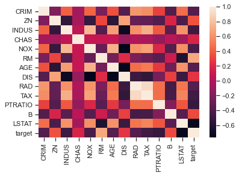
    


```python
# Вывод значений в ячейках
fg, ax = plt.subplots(figsize=(30,30))
sns.heatmap(df.corr(), annot=True, fmt='.3f', ax=ax)
plt.show()
```


    
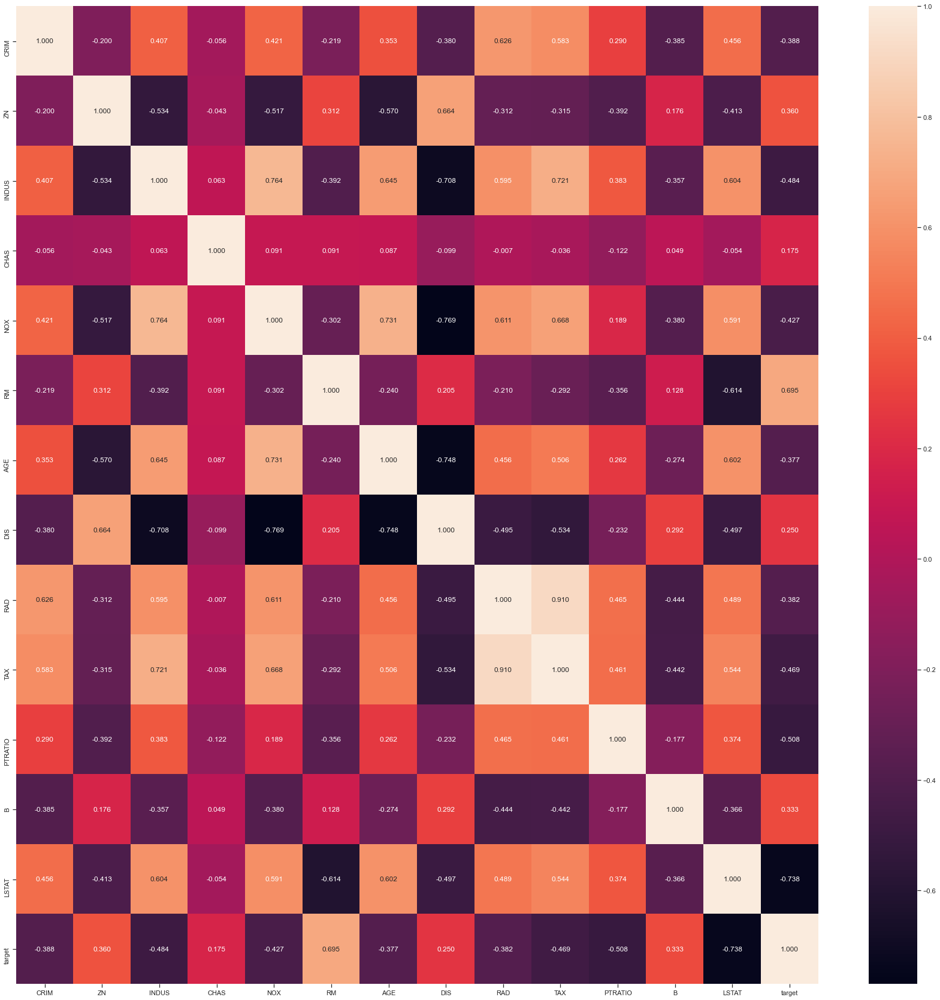
    


```python
# Изменение цветовой гаммы
fg, ax = plt.subplots(figsize=(30,30))
sns.heatmap(df.corr(), cmap='YlGnBu', annot=True, fmt='.3f', ax=ax)
plt.show()
```


    
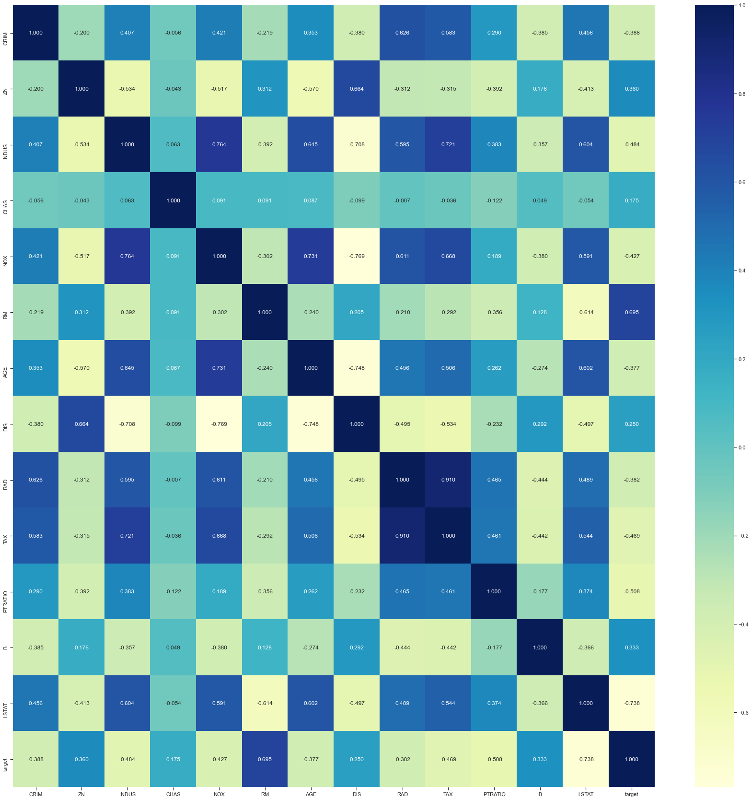
    


```python
# Треугольный вариант матрицы
mask = np.zeros_like(df.corr(), dtype=np.bool)
# чтобы оставить нижнюю часть матрицы
# mask[np.triu_indices_from(mask)] = True
# чтобы оставить верхнюю часть матрицы
fg, ax = plt.subplots(figsize=(30,30))
mask[np.tril_indices_from(mask)] = True
sns.heatmap(df.corr(), mask=mask, annot=True, fmt='.3f', ax=ax)
plt.show()
```


    
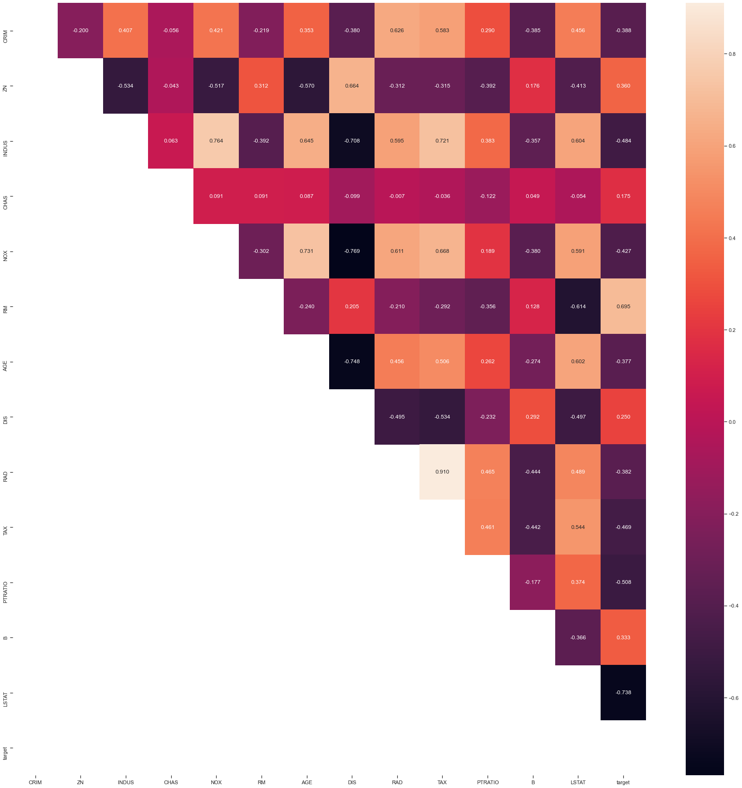
    


```python
fig, ax = plt.subplots(1, 3, sharex='col', sharey='row', figsize=(60,20))
sns.heatmap(df.corr(method='pearson'), ax=ax[0], annot=True, fmt='.2f')
sns.heatmap(df.corr(method='kendall'), ax=ax[1], annot=True, fmt='.2f')
sns.heatmap(df.corr(method='spearman'), ax=ax[2], annot=True, fmt='.2f')
fig.suptitle('Корреляционные матрицы, построенные различными методами')
ax[0].title.set_text('Pearson')
ax[1].title.set_text('Kendall')
ax[2].title.set_text('Spearman')
```


    
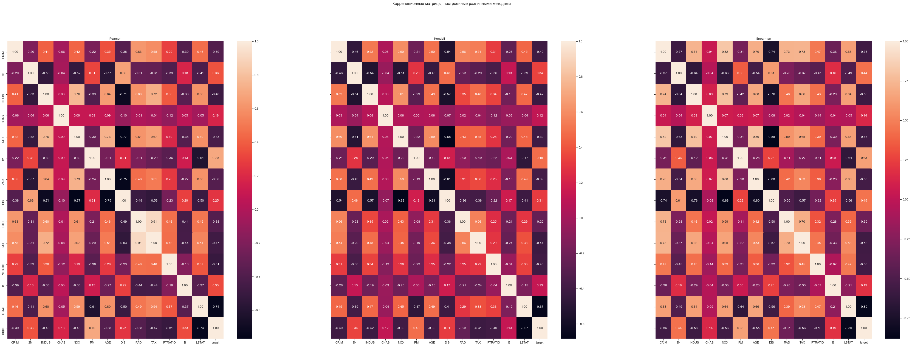
    


```python

```
