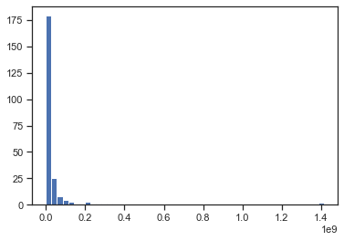

# Обработка пропусков в данных, кодирование категориальных признаков, масштабирование данных.

### В чем состоит проблема?

- Если в данных есть пропуски, то большинство алгоритмов машинного обучения не будут с ними работать. Даже корреляционная матрица не будет строиться корректно.
- Большинство алгоритмов машинного обучения требуют явного перекодирования категориальных признаков в числовые. Даже если алгоритм не требует этого явно, такое перекодирование возможно стоит попробовать, чтобы повысить качество модели.
- Большинство алгоритмов показывает лучшее качество на масштабированных признаках, в особенности алгоритмы, использующие методы градиентного спуска.


```python
import numpy as np
import pandas as pd
import seaborn as sns
import matplotlib.pyplot as plt
%matplotlib inline 
sns.set(style="ticks")
```

## Загрузка и первичный анализ данных

Используем данные о странах [Country & Area Dataset](https://www.kaggle.com/datasets/lukexun/country-area-continent-region-codes)


```python
# Загружаем данные
data = pd.read_csv('country_and_area_data.csv', sep=",")
```


```python
# размер набора данных
data.shape
```


    (250, 10)


```python
# типы колонок
data.dtypes
```


    country _or_area                        object
    iso_alpha3 _code                        object
    m49_code                                 int64
    region_1                                object
    region_2                                object
    continent                               object
    population_rank                        float64
    population                             float64
    population_percentage_ of_the_world    float64
    date                                    object
    dtype: object


```python
# проверим есть ли пропущенные значения
data.isnull().sum()
```


    country _or_area                        0
    iso_alpha3 _code                        1
    m49_code                                0
    region_1                                0
    region_2                                7
    continent                               0
    population_rank                        60
    population                             21
    population_percentage_ of_the_world    23
    date                                   22
    dtype: int64


```python
# Первые 5 строк датасета
data.head()
```


<div>
<style scoped>
    .dataframe tbody tr th:only-of-type {
        vertical-align: middle;
    }

    .dataframe tbody tr th {
        vertical-align: top;
    }

    .dataframe thead th {
        text-align: right;
    }
</style>
<table border="1" class="dataframe">
  <thead>
    <tr style="text-align: right;">
      <th></th>
      <th>country _or_area</th>
      <th>iso_alpha3 _code</th>
      <th>m49_code</th>
      <th>region_1</th>
      <th>region_2</th>
      <th>continent</th>
      <th>population_rank</th>
      <th>population</th>
      <th>population_percentage_ of_the_world</th>
      <th>date</th>
    </tr>
  </thead>
  <tbody>
    <tr>
      <th>0</th>
      <td>Afghanistan</td>
      <td>AFG</td>
      <td>4</td>
      <td>Southern Asia</td>
      <td>None</td>
      <td>Asia</td>
      <td>43.0</td>
      <td>32890171.0</td>
      <td>0.004140</td>
      <td>1/07/2020</td>
    </tr>
    <tr>
      <th>1</th>
      <td>Åland Islands</td>
      <td>ALA</td>
      <td>248</td>
      <td>Northern Europe</td>
      <td>None</td>
      <td>Europe</td>
      <td>NaN</td>
      <td>30344.0</td>
      <td>0.000004</td>
      <td>31/12/2021</td>
    </tr>
    <tr>
      <th>2</th>
      <td>Albania</td>
      <td>ALB</td>
      <td>8</td>
      <td>Southern Europe</td>
      <td>None</td>
      <td>Europe</td>
      <td>135.0</td>
      <td>2829741.0</td>
      <td>0.000356</td>
      <td>1/01/2021</td>
    </tr>
    <tr>
      <th>3</th>
      <td>Algeria</td>
      <td>DZA</td>
      <td>12</td>
      <td>Northern Africa</td>
      <td>None</td>
      <td>Africa</td>
      <td>32.0</td>
      <td>45400000.0</td>
      <td>0.005710</td>
      <td>1/01/2022</td>
    </tr>
    <tr>
      <th>4</th>
      <td>American Samoa</td>
      <td>ASM</td>
      <td>16</td>
      <td>Polynesia</td>
      <td>None</td>
      <td>Oceania</td>
      <td>NaN</td>
      <td>49710.0</td>
      <td>0.000006</td>
      <td>1/04/2020</td>
    </tr>
  </tbody>
</table>
</div>


```python
total_count = data.shape[0]
print('Всего строк: {}'.format(total_count))
```

    Всего строк: 250
    

# Обработка пропусков в данных

## Простые стратегии - удаление или заполнение нулями

Удаление колонок, содержащих пустые значения
`res = data.dropna(axis=1, how='any')`

Удаление строк, содержащих пустые значения
`res = data.dropna(axis=0, how='any')`

[Документация](https://pandas.pydata.org/pandas-docs/stable/reference/api/pandas.DataFrame.dropna.html)

**Удаление может производиться для группы строк или колонок.**


```python
# Удаление колонок, содержащих пустые значения
data_with_drop_null_columns = data.dropna(axis=1, how='any')
(data.shape, data_with_drop_null_columns.shape)
```


    ((250, 10), (250, 4))


```python
# Удаление строк, содержащих пустые значения
data_with_drop_null_rows = data.dropna(axis=0, how='any')
(data.shape, data_with_drop_null_rows.shape)
```


    ((250, 10), (185, 10))


```python
data.head()
```


<div>
<style scoped>
    .dataframe tbody tr th:only-of-type {
        vertical-align: middle;
    }

    .dataframe tbody tr th {
        vertical-align: top;
    }

    .dataframe thead th {
        text-align: right;
    }
</style>
<table border="1" class="dataframe">
  <thead>
    <tr style="text-align: right;">
      <th></th>
      <th>country _or_area</th>
      <th>iso_alpha3 _code</th>
      <th>m49_code</th>
      <th>region_1</th>
      <th>region_2</th>
      <th>continent</th>
      <th>population_rank</th>
      <th>population</th>
      <th>population_percentage_ of_the_world</th>
      <th>date</th>
    </tr>
  </thead>
  <tbody>
    <tr>
      <th>0</th>
      <td>Afghanistan</td>
      <td>AFG</td>
      <td>4</td>
      <td>Southern Asia</td>
      <td>None</td>
      <td>Asia</td>
      <td>43.0</td>
      <td>32890171.0</td>
      <td>0.004140</td>
      <td>1/07/2020</td>
    </tr>
    <tr>
      <th>1</th>
      <td>Åland Islands</td>
      <td>ALA</td>
      <td>248</td>
      <td>Northern Europe</td>
      <td>None</td>
      <td>Europe</td>
      <td>NaN</td>
      <td>30344.0</td>
      <td>0.000004</td>
      <td>31/12/2021</td>
    </tr>
    <tr>
      <th>2</th>
      <td>Albania</td>
      <td>ALB</td>
      <td>8</td>
      <td>Southern Europe</td>
      <td>None</td>
      <td>Europe</td>
      <td>135.0</td>
      <td>2829741.0</td>
      <td>0.000356</td>
      <td>1/01/2021</td>
    </tr>
    <tr>
      <th>3</th>
      <td>Algeria</td>
      <td>DZA</td>
      <td>12</td>
      <td>Northern Africa</td>
      <td>None</td>
      <td>Africa</td>
      <td>32.0</td>
      <td>45400000.0</td>
      <td>0.005710</td>
      <td>1/01/2022</td>
    </tr>
    <tr>
      <th>4</th>
      <td>American Samoa</td>
      <td>ASM</td>
      <td>16</td>
      <td>Polynesia</td>
      <td>None</td>
      <td>Oceania</td>
      <td>NaN</td>
      <td>49710.0</td>
      <td>0.000006</td>
      <td>1/04/2020</td>
    </tr>
  </tbody>
</table>
</div>


```python
# Заполнение всех пропущенных значений нулями
# В данном случае это некорректно, так как нулями заполняются в том числе категориальные колонки
data_with_set_null_values_as_zero = data.fillna(0)
data_with_set_null_values_as_zero.head()
```


<div>
<style scoped>
    .dataframe tbody tr th:only-of-type {
        vertical-align: middle;
    }

    .dataframe tbody tr th {
        vertical-align: top;
    }

    .dataframe thead th {
        text-align: right;
    }
</style>
<table border="1" class="dataframe">
  <thead>
    <tr style="text-align: right;">
      <th></th>
      <th>country _or_area</th>
      <th>iso_alpha3 _code</th>
      <th>m49_code</th>
      <th>region_1</th>
      <th>region_2</th>
      <th>continent</th>
      <th>population_rank</th>
      <th>population</th>
      <th>population_percentage_ of_the_world</th>
      <th>date</th>
    </tr>
  </thead>
  <tbody>
    <tr>
      <th>0</th>
      <td>Afghanistan</td>
      <td>AFG</td>
      <td>4</td>
      <td>Southern Asia</td>
      <td>None</td>
      <td>Asia</td>
      <td>43.0</td>
      <td>32890171.0</td>
      <td>0.004140</td>
      <td>1/07/2020</td>
    </tr>
    <tr>
      <th>1</th>
      <td>Åland Islands</td>
      <td>ALA</td>
      <td>248</td>
      <td>Northern Europe</td>
      <td>None</td>
      <td>Europe</td>
      <td>0.0</td>
      <td>30344.0</td>
      <td>0.000004</td>
      <td>31/12/2021</td>
    </tr>
    <tr>
      <th>2</th>
      <td>Albania</td>
      <td>ALB</td>
      <td>8</td>
      <td>Southern Europe</td>
      <td>None</td>
      <td>Europe</td>
      <td>135.0</td>
      <td>2829741.0</td>
      <td>0.000356</td>
      <td>1/01/2021</td>
    </tr>
    <tr>
      <th>3</th>
      <td>Algeria</td>
      <td>DZA</td>
      <td>12</td>
      <td>Northern Africa</td>
      <td>None</td>
      <td>Africa</td>
      <td>32.0</td>
      <td>45400000.0</td>
      <td>0.005710</td>
      <td>1/01/2022</td>
    </tr>
    <tr>
      <th>4</th>
      <td>American Samoa</td>
      <td>ASM</td>
      <td>16</td>
      <td>Polynesia</td>
      <td>None</td>
      <td>Oceania</td>
      <td>0.0</td>
      <td>49710.0</td>
      <td>0.000006</td>
      <td>1/04/2020</td>
    </tr>
  </tbody>
</table>
</div>


## "Внедрение значений" - импьютация (imputation)

### Обработка пропусков в числовых данных


```python
data_with_null_column = data[data.isnull().sum()[data.isnull().sum()!=0].index]
data_with_null_column
```


<div>
<style scoped>
    .dataframe tbody tr th:only-of-type {
        vertical-align: middle;
    }

    .dataframe tbody tr th {
        vertical-align: top;
    }

    .dataframe thead th {
        text-align: right;
    }
</style>
<table border="1" class="dataframe">
  <thead>
    <tr style="text-align: right;">
      <th></th>
      <th>iso_alpha3 _code</th>
      <th>region_2</th>
      <th>population_rank</th>
      <th>population</th>
      <th>population_percentage_ of_the_world</th>
      <th>date</th>
    </tr>
  </thead>
  <tbody>
    <tr>
      <th>0</th>
      <td>AFG</td>
      <td>None</td>
      <td>43.0</td>
      <td>32890171.0</td>
      <td>0.004140</td>
      <td>1/07/2020</td>
    </tr>
    <tr>
      <th>1</th>
      <td>ALA</td>
      <td>None</td>
      <td>NaN</td>
      <td>30344.0</td>
      <td>0.000004</td>
      <td>31/12/2021</td>
    </tr>
    <tr>
      <th>2</th>
      <td>ALB</td>
      <td>None</td>
      <td>135.0</td>
      <td>2829741.0</td>
      <td>0.000356</td>
      <td>1/01/2021</td>
    </tr>
    <tr>
      <th>3</th>
      <td>DZA</td>
      <td>None</td>
      <td>32.0</td>
      <td>45400000.0</td>
      <td>0.005710</td>
      <td>1/01/2022</td>
    </tr>
    <tr>
      <th>4</th>
      <td>ASM</td>
      <td>None</td>
      <td>NaN</td>
      <td>49710.0</td>
      <td>0.000006</td>
      <td>1/04/2020</td>
    </tr>
    <tr>
      <th>...</th>
      <td>...</td>
      <td>...</td>
      <td>...</td>
      <td>...</td>
      <td>...</td>
      <td>...</td>
    </tr>
    <tr>
      <th>245</th>
      <td>ESH</td>
      <td>None</td>
      <td>NaN</td>
      <td>612000.0</td>
      <td>0.000077</td>
      <td>1/07/2021</td>
    </tr>
    <tr>
      <th>246</th>
      <td>YEM</td>
      <td>None</td>
      <td>48.0</td>
      <td>30491000.0</td>
      <td>0.003830</td>
      <td>1/07/2021</td>
    </tr>
    <tr>
      <th>247</th>
      <td>ZMB</td>
      <td>Sub-Saharan Africa</td>
      <td>64.0</td>
      <td>18400556.0</td>
      <td>0.002310</td>
      <td>1/07/2021</td>
    </tr>
    <tr>
      <th>248</th>
      <td>ZWE</td>
      <td>Sub-Saharan Africa</td>
      <td>72.0</td>
      <td>15790716.0</td>
      <td>0.001990</td>
      <td>1/07/2021</td>
    </tr>
    <tr>
      <th>249</th>
      <td>TWN</td>
      <td>Province of China</td>
      <td>NaN</td>
      <td>23375314.0</td>
      <td>0.002940</td>
      <td>31/12/2021</td>
    </tr>
  </tbody>
</table>
<p>250 rows × 6 columns</p>
</div>


```python
# Выберем числовые колонки с пропущенными значениями
# Цикл по колонкам датасета
data_with_null_column = data[data.isnull().sum()[data.isnull().sum()!=0].index]
num_cols = []
#Выбираем только числовые столбцы
for col in data_with_null_column.columns:
    # Количество пустых значений 
    dt = str(data_with_null_column[col].dtype)
    if (dt=='float64' or dt=='int64'):
        num_cols.append(col)
        temp_perc = round((data[col].isnull().sum() / data[col].count()) * 100.0, 2)
        print('Колонка {}. Тип данных {}. Количество пустых значений {}, {}%.'.format(col, dt, data[col].isnull().sum() , temp_perc))
```

    Колонка population_rank. Тип данных float64. Количество пустых значений 60, 31.58%.
    Колонка population. Тип данных float64. Количество пустых значений 21, 9.17%.
    Колонка population_percentage_ of_the_world. Тип данных float64. Количество пустых значений 23, 10.13%.
    


```python
# Фильтр по колонкам с пропущенными значениями
data_num = data[num_cols]
data_num
```


<div>
<style scoped>
    .dataframe tbody tr th:only-of-type {
        vertical-align: middle;
    }

    .dataframe tbody tr th {
        vertical-align: top;
    }

    .dataframe thead th {
        text-align: right;
    }
</style>
<table border="1" class="dataframe">
  <thead>
    <tr style="text-align: right;">
      <th></th>
      <th>population_rank</th>
      <th>population</th>
      <th>population_percentage_ of_the_world</th>
    </tr>
  </thead>
  <tbody>
    <tr>
      <th>0</th>
      <td>43.0</td>
      <td>32890171.0</td>
      <td>0.004140</td>
    </tr>
    <tr>
      <th>1</th>
      <td>NaN</td>
      <td>30344.0</td>
      <td>0.000004</td>
    </tr>
    <tr>
      <th>2</th>
      <td>135.0</td>
      <td>2829741.0</td>
      <td>0.000356</td>
    </tr>
    <tr>
      <th>3</th>
      <td>32.0</td>
      <td>45400000.0</td>
      <td>0.005710</td>
    </tr>
    <tr>
      <th>4</th>
      <td>NaN</td>
      <td>49710.0</td>
      <td>0.000006</td>
    </tr>
    <tr>
      <th>...</th>
      <td>...</td>
      <td>...</td>
      <td>...</td>
    </tr>
    <tr>
      <th>245</th>
      <td>NaN</td>
      <td>612000.0</td>
      <td>0.000077</td>
    </tr>
    <tr>
      <th>246</th>
      <td>48.0</td>
      <td>30491000.0</td>
      <td>0.003830</td>
    </tr>
    <tr>
      <th>247</th>
      <td>64.0</td>
      <td>18400556.0</td>
      <td>0.002310</td>
    </tr>
    <tr>
      <th>248</th>
      <td>72.0</td>
      <td>15790716.0</td>
      <td>0.001990</td>
    </tr>
    <tr>
      <th>249</th>
      <td>NaN</td>
      <td>23375314.0</td>
      <td>0.002940</td>
    </tr>
  </tbody>
</table>
<p>250 rows × 3 columns</p>
</div>


```python
# Гистограмма по признакам
for col in data_num:
    plt.hist(data[col], 50)
    plt.xlabel(col)
    plt.show()
```


    

    


    

    


    

    


Будем использовать встроенные средства импьютации библиотеки scikit-learn - https://scikit-learn.org/stable/modules/impute.html


```python
data_num_population = data_num[['population']]
data_num_population.head()
```


<div>
<style scoped>
    .dataframe tbody tr th:only-of-type {
        vertical-align: middle;
    }

    .dataframe tbody tr th {
        vertical-align: top;
    }

    .dataframe thead th {
        text-align: right;
    }
</style>
<table border="1" class="dataframe">
  <thead>
    <tr style="text-align: right;">
      <th></th>
      <th>population</th>
    </tr>
  </thead>
  <tbody>
    <tr>
      <th>0</th>
      <td>32890171.0</td>
    </tr>
    <tr>
      <th>1</th>
      <td>30344.0</td>
    </tr>
    <tr>
      <th>2</th>
      <td>2829741.0</td>
    </tr>
    <tr>
      <th>3</th>
      <td>45400000.0</td>
    </tr>
    <tr>
      <th>4</th>
      <td>49710.0</td>
    </tr>
  </tbody>
</table>
</div>


```python
from sklearn.impute import SimpleImputer
from sklearn.impute import MissingIndicator
```


```python
# Фильтр для проверки заполнения пустых значений
indicator = MissingIndicator()
mask_missing_values_only = indicator.fit_transform(data_num_population)
mask_missing_values_only
```


    array([[False],
           [False],
           [False],
           [False],
           [False],
           [False],
           [False],
           [False],
           [ True],
           [False],
           [False],
           [False],
           [False],
           [False],
           [False],
           [False],
           [False],
           [False],
           [False],
           [False],
           [False],
           [False],
           [False],
           [False],
           [False],
           [False],
           [False],
           [ True],
           [False],
           [False],
           [ True],
           [False],
           [ True],
           [False],
           [False],
           [False],
           [False],
           [False],
           [ True],
           [False],
           [False],
           [False],
           [False],
           [False],
           [False],
           [False],
           [False],
           [False],
           [False],
           [False],
           [False],
           [False],
           [False],
           [False],
           [ True],
           [False],
           [ True],
           [False],
           [False],
           [False],
           [False],
           [ True],
           [False],
           [False],
           [False],
           [False],
           [False],
           [False],
           [False],
           [False],
           [False],
           [False],
           [False],
           [False],
           [False],
           [False],
           [False],
           [False],
           [False],
           [False],
           [False],
           [ True],
           [False],
           [ True],
           [False],
           [False],
           [False],
           [False],
           [False],
           [False],
           [False],
           [False],
           [False],
           [ True],
           [False],
           [False],
           [False],
           [False],
           [False],
           [False],
           [False],
           [ True],
           [ True],
           [False],
           [False],
           [False],
           [False],
           [False],
           [False],
           [False],
           [False],
           [False],
           [False],
           [False],
           [False],
           [False],
           [False],
           [False],
           [False],
           [False],
           [False],
           [False],
           [False],
           [False],
           [False],
           [False],
           [False],
           [False],
           [False],
           [False],
           [False],
           [False],
           [False],
           [False],
           [False],
           [False],
           [False],
           [False],
           [False],
           [ True],
           [False],
           [False],
           [ True],
           [False],
           [False],
           [False],
           [False],
           [False],
           [False],
           [False],
           [False],
           [False],
           [False],
           [False],
           [False],
           [False],
           [False],
           [False],
           [False],
           [False],
           [False],
           [False],
           [False],
           [False],
           [False],
           [False],
           [False],
           [False],
           [False],
           [False],
           [False],
           [False],
           [False],
           [False],
           [False],
           [False],
           [False],
           [False],
           [False],
           [False],
           [False],
           [ True],
           [False],
           [False],
           [False],
           [False],
           [False],
           [False],
           [False],
           [False],
           [False],
           [False],
           [False],
           [False],
           [ True],
           [ True],
           [False],
           [False],
           [False],
           [False],
           [False],
           [False],
           [ True],
           [False],
           [False],
           [False],
           [False],
           [False],
           [False],
           [False],
           [False],
           [False],
           [False],
           [False],
           [False],
           [ True],
           [False],
           [False],
           [False],
           [False],
           [False],
           [False],
           [False],
           [False],
           [False],
           [False],
           [False],
           [False],
           [False],
           [False],
           [False],
           [False],
           [False],
           [False],
           [False],
           [False],
           [ True],
           [False],
           [False],
           [False],
           [False],
           [False],
           [False],
           [False],
           [False],
           [False],
           [False],
           [False],
           [False],
           [False]])


С помощью класса [SimpleImputer](https://scikit-learn.org/stable/modules/generated/sklearn.impute.SimpleImputer.html#sklearn.impute.SimpleImputer) можно проводить импьютацию различными [показателями центра распределения](https://ru.wikipedia.org/wiki/%D0%9F%D0%BE%D0%BA%D0%B0%D0%B7%D0%B0%D1%82%D0%B5%D0%BB%D0%B8_%D1%86%D0%B5%D0%BD%D1%82%D1%80%D0%B0_%D1%80%D0%B0%D1%81%D0%BF%D1%80%D0%B5%D0%B4%D0%B5%D0%BB%D0%B5%D0%BD%D0%B8%D1%8F)


```python
strategies=['mean', 'median', 'most_frequent']
```


```python
def test_num_impute(strategy_param):
    imp_num = SimpleImputer(strategy=strategy_param)
    data_num_imp = imp_num.fit_transform(data_num_population)
    return data_num_imp[mask_missing_values_only]
```


```python
strategies[0], test_num_impute(strategies[0])
```


    ('mean',
     array([33971287.267869, 33971287.267869, 33971287.267869, 33971287.267869,
            33971287.267869, 33971287.267869, 33971287.267869, 33971287.267869,
            33971287.267869, 33971287.267869, 33971287.267869, 33971287.267869,
            33971287.267869, 33971287.267869, 33971287.267869, 33971287.267869,
            33971287.267869, 33971287.267869, 33971287.267869, 33971287.267869,
            33971287.267869]))


```python
strategies[1], test_num_impute(strategies[1])
```


    ('median',
     array([5550066., 5550066., 5550066., 5550066., 5550066., 5550066.,
            5550066., 5550066., 5550066., 5550066., 5550066., 5550066.,
            5550066., 5550066., 5550066., 5550066., 5550066., 5550066.,
            5550066., 5550066., 5550066.]))


```python
strategies[2], test_num_impute(strategies[2])
```


    ('most_frequent',
     array([30., 30., 30., 30., 30., 30., 30., 30., 30., 30., 30., 30., 30.,
            30., 30., 30., 30., 30., 30., 30., 30.]))


```python
# Более сложная функция, которая позволяет задавать колонку и вид импьютации
def test_num_impute_col(dataset, column, strategy_param):
    temp_data = dataset[[column]]
    
    indicator = MissingIndicator()
    mask_missing_values_only = indicator.fit_transform(temp_data)
    
    imp_num = SimpleImputer(strategy=strategy_param)
    data_num_imp = imp_num.fit_transform(temp_data)
    
    filled_data = data_num_imp[mask_missing_values_only]
    
    return column, strategy_param, filled_data.size, filled_data[0], filled_data[filled_data.size-1]
```


```python
data[['population_percentage_ of_the_world']].describe()
```


<div>
<style scoped>
    .dataframe tbody tr th:only-of-type {
        vertical-align: middle;
    }

    .dataframe tbody tr th {
        vertical-align: top;
    }

    .dataframe thead th {
        text-align: right;
    }
</style>
<table border="1" class="dataframe">
  <thead>
    <tr style="text-align: right;">
      <th></th>
      <th>population_percentage_ of_the_world</th>
    </tr>
  </thead>
  <tbody>
    <tr>
      <th>count</th>
      <td>227.000000</td>
    </tr>
    <tr>
      <th>mean</th>
      <td>0.004309</td>
    </tr>
    <tr>
      <th>std</th>
      <td>0.017309</td>
    </tr>
    <tr>
      <th>min</th>
      <td>0.000000</td>
    </tr>
    <tr>
      <th>25%</th>
      <td>0.000052</td>
    </tr>
    <tr>
      <th>50%</th>
      <td>0.000708</td>
    </tr>
    <tr>
      <th>75%</th>
      <td>0.002745</td>
    </tr>
    <tr>
      <th>max</th>
      <td>0.178000</td>
    </tr>
  </tbody>
</table>
</div>


```python
test_num_impute_col(data, 'population_percentage_ of_the_world', strategies[0])
```


    ('population_percentage_ of_the_world',
     'mean',
     23,
     0.004309447577092511,
     0.004309447577092511)


```python
test_num_impute_col(data, 'population_percentage_ of_the_world', strategies[1])
```


    ('population_percentage_ of_the_world', 'median', 23, 0.000708, 0.000708)


```python
test_num_impute_col(data, 'population_percentage_ of_the_world', strategies[2])
```


    ('population_percentage_ of_the_world', 'most_frequent', 23, 0.0, 0.0)


### Обработка пропусков в категориальных данных


```python
# Выберем категориальные колонки с пропущенными значениями
# Цикл по колонкам датасета
cat_cols = []
for col in data.columns:
    # Количество пустых значений 
    temp_null_count = data[data[col].isnull()].shape[0]
    dt = str(data[col].dtype)
    if temp_null_count>0 and (dt=='object'):
        cat_cols.append(col)
        temp_perc = round((temp_null_count / total_count) * 100.0, 2)
        print('Колонка {}. Тип данных {}. Количество пустых значений {}, {}%.'.format(col, dt, temp_null_count, temp_perc))
```

    Колонка iso_alpha3 _code. Тип данных object. Количество пустых значений 1, 0.4%.
    Колонка region_2. Тип данных object. Количество пустых значений 7, 2.8%.
    Колонка date. Тип данных object. Количество пустых значений 22, 8.8%.
    

Класс SimpleImputer можно использовать для категориальных признаков со стратегиями "most_frequent" или "constant".


```python
cat_temp_data = data[['region_2']]
cat_temp_data.head()
```


<div>
<style scoped>
    .dataframe tbody tr th:only-of-type {
        vertical-align: middle;
    }

    .dataframe tbody tr th {
        vertical-align: top;
    }

    .dataframe thead th {
        text-align: right;
    }
</style>
<table border="1" class="dataframe">
  <thead>
    <tr style="text-align: right;">
      <th></th>
      <th>region_2</th>
    </tr>
  </thead>
  <tbody>
    <tr>
      <th>0</th>
      <td>None</td>
    </tr>
    <tr>
      <th>1</th>
      <td>None</td>
    </tr>
    <tr>
      <th>2</th>
      <td>None</td>
    </tr>
    <tr>
      <th>3</th>
      <td>None</td>
    </tr>
    <tr>
      <th>4</th>
      <td>None</td>
    </tr>
  </tbody>
</table>
</div>


```python
cat_temp_data['region_2'].unique()
```


    array(['None', 'Sub-Saharan Africa', 'Latin America and the Caribbean',
           nan, 'Special Administrative Region of China', 'Channel Islands',
           'Province of China'], dtype=object)


```python
cat_temp_data[cat_temp_data['region_2'].isnull()].shape
```


    (7, 1)


```python
# Импьютация наиболее частыми значениями
imp2 = SimpleImputer(missing_values=np.nan, strategy='most_frequent')
data_imp2 = imp2.fit_transform(cat_temp_data)
data_imp2
```


    array([['None'],
           ['None'],
           ['None'],
           ['None'],
           ['None'],
           ['None'],
           ['Sub-Saharan Africa'],
           ['Latin America and the Caribbean'],
           ['None'],
           ['Latin America and the Caribbean'],
           ['Latin America and the Caribbean'],
           ['None'],
           ['Latin America and the Caribbean'],
           ['None'],
           ['None'],
           ['None'],
           ['Latin America and the Caribbean'],
           ['None'],
           ['None'],
           ['Latin America and the Caribbean'],
           ['None'],
           ['None'],
           ['Latin America and the Caribbean'],
           ['Sub-Saharan Africa'],
           ['None'],
           ['None'],
           ['Latin America and the Caribbean'],
           ['Latin America and the Caribbean'],
           ['None'],
           ['Sub-Saharan Africa'],
           ['Latin America and the Caribbean'],
           ['Latin America and the Caribbean'],
           ['Sub-Saharan Africa'],
           ['Latin America and the Caribbean'],
           ['None'],
           ['None'],
           ['Sub-Saharan Africa'],
           ['Sub-Saharan Africa'],
           ['Sub-Saharan Africa'],
           ['None'],
           ['Sub-Saharan Africa'],
           ['None'],
           ['Latin America and the Caribbean'],
           ['Sub-Saharan Africa'],
           ['Sub-Saharan Africa'],
           ['Latin America and the Caribbean'],
           ['None'],
           ['Special Administrative Region of China'],
           ['Special Administrative Region of China'],
           ['None'],
           ['None'],
           ['Latin America and the Caribbean'],
           ['Sub-Saharan Africa'],
           ['Sub-Saharan Africa'],
           ['None'],
           ['Latin America and the Caribbean'],
           ['Sub-Saharan Africa'],
           ['None'],
           ['Latin America and the Caribbean'],
           ['Latin America and the Caribbean'],
           ['None'],
           ['None'],
           ['None'],
           ['Sub-Saharan Africa'],
           ['None'],
           ['Sub-Saharan Africa'],
           ['Latin America and the Caribbean'],
           ['Latin America and the Caribbean'],
           ['Latin America and the Caribbean'],
           ['None'],
           ['Latin America and the Caribbean'],
           ['Sub-Saharan Africa'],
           ['Sub-Saharan Africa'],
           ['None'],
           ['Sub-Saharan Africa'],
           ['Sub-Saharan Africa'],
           ['Latin America and the Caribbean'],
           ['None'],
           ['None'],
           ['None'],
           ['None'],
           ['Latin America and the Caribbean'],
           ['None'],
           ['Sub-Saharan Africa'],
           ['Sub-Saharan Africa'],
           ['Sub-Saharan Africa'],
           ['None'],
           ['None'],
           ['Sub-Saharan Africa'],
           ['None'],
           ['None'],
           ['None'],
           ['Latin America and the Caribbean'],
           ['Latin America and the Caribbean'],
           ['None'],
           ['Latin America and the Caribbean'],
           ['Channel Islands'],
           ['Sub-Saharan Africa'],
           ['Sub-Saharan Africa'],
           ['Latin America and the Caribbean'],
           ['Latin America and the Caribbean'],
           ['None'],
           ['None'],
           ['Latin America and the Caribbean'],
           ['None'],
           ['None'],
           ['None'],
           ['None'],
           ['None'],
           ['None'],
           ['None'],
           ['None'],
           ['None'],
           ['None'],
           ['Latin America and the Caribbean'],
           ['None'],
           ['Channel Islands'],
           ['None'],
           ['None'],
           ['Sub-Saharan Africa'],
           ['None'],
           ['None'],
           ['None'],
           ['None'],
           ['None'],
           ['None'],
           ['Sub-Saharan Africa'],
           ['Sub-Saharan Africa'],
           ['None'],
           ['None'],
           ['None'],
           ['None'],
           ['Sub-Saharan Africa'],
           ['Sub-Saharan Africa'],
           ['None'],
           ['None'],
           ['Sub-Saharan Africa'],
           ['None'],
           ['None'],
           ['Latin America and the Caribbean'],
           ['Sub-Saharan Africa'],
           ['Sub-Saharan Africa'],
           ['Sub-Saharan Africa'],
           ['Latin America and the Caribbean'],
           ['None'],
           ['None'],
           ['None'],
           ['None'],
           ['Latin America and the Caribbean'],
           ['None'],
           ['Sub-Saharan Africa'],
           ['None'],
           ['Sub-Saharan Africa'],
           ['None'],
           ['None'],
           ['None'],
           ['None'],
           ['None'],
           ['Latin America and the Caribbean'],
           ['Sub-Saharan Africa'],
           ['Sub-Saharan Africa'],
           ['None'],
           ['None'],
           ['None'],
           ['None'],
           ['None'],
           ['None'],
           ['None'],
           ['None'],
           ['Latin America and the Caribbean'],
           ['None'],
           ['Latin America and the Caribbean'],
           ['Latin America and the Caribbean'],
           ['None'],
           ['None'],
           ['None'],
           ['None'],
           ['Latin America and the Caribbean'],
           ['None'],
           ['None'],
           ['None'],
           ['Sub-Saharan Africa'],
           ['None'],
           ['None'],
           ['Sub-Saharan Africa'],
           ['Latin America and the Caribbean'],
           ['Sub-Saharan Africa'],
           ['Latin America and the Caribbean'],
           ['Latin America and the Caribbean'],
           ['Latin America and the Caribbean'],
           ['None'],
           ['Latin America and the Caribbean'],
           ['None'],
           ['None'],
           ['Sub-Saharan Africa'],
           ['Channel Islands'],
           ['None'],
           ['Sub-Saharan Africa'],
           ['None'],
           ['Sub-Saharan Africa'],
           ['Sub-Saharan Africa'],
           ['None'],
           ['Latin America and the Caribbean'],
           ['None'],
           ['None'],
           ['None'],
           ['Sub-Saharan Africa'],
           ['Sub-Saharan Africa'],
           ['Latin America and the Caribbean'],
           ['Sub-Saharan Africa'],
           ['None'],
           ['None'],
           ['None'],
           ['None'],
           ['Latin America and the Caribbean'],
           ['None'],
           ['None'],
           ['None'],
           ['None'],
           ['None'],
           ['None'],
           ['None'],
           ['Sub-Saharan Africa'],
           ['None'],
           ['None'],
           ['Latin America and the Caribbean'],
           ['None'],
           ['None'],
           ['None'],
           ['Latin America and the Caribbean'],
           ['None'],
           ['Sub-Saharan Africa'],
           ['None'],
           ['None'],
           ['None'],
           ['Sub-Saharan Africa'],
           ['None'],
           ['None'],
           ['Latin America and the Caribbean'],
           ['Latin America and the Caribbean'],
           ['None'],
           ['None'],
           ['Latin America and the Caribbean'],
           ['None'],
           ['None'],
           ['None'],
           ['None'],
           ['Sub-Saharan Africa'],
           ['Sub-Saharan Africa'],
           ['Province of China']], dtype=object)


```python
# Пустые значения отсутствуют
np.unique(data_imp2)
```


    array(['Channel Islands', 'Latin America and the Caribbean', 'None',
           'Province of China', 'Special Administrative Region of China',
           'Sub-Saharan Africa'], dtype=object)


```python
# Импьютация константой
imp3 = SimpleImputer(missing_values=np.nan, strategy='constant', fill_value='None')
data_imp3 = imp3.fit_transform(cat_temp_data)
data_imp3
```


    array([['None'],
           ['None'],
           ['None'],
           ['None'],
           ['None'],
           ['None'],
           ['Sub-Saharan Africa'],
           ['Latin America and the Caribbean'],
           ['None'],
           ['Latin America and the Caribbean'],
           ['Latin America and the Caribbean'],
           ['None'],
           ['Latin America and the Caribbean'],
           ['None'],
           ['None'],
           ['None'],
           ['Latin America and the Caribbean'],
           ['None'],
           ['None'],
           ['Latin America and the Caribbean'],
           ['None'],
           ['None'],
           ['Latin America and the Caribbean'],
           ['Sub-Saharan Africa'],
           ['None'],
           ['None'],
           ['Latin America and the Caribbean'],
           ['Latin America and the Caribbean'],
           ['None'],
           ['Sub-Saharan Africa'],
           ['Latin America and the Caribbean'],
           ['Latin America and the Caribbean'],
           ['Sub-Saharan Africa'],
           ['Latin America and the Caribbean'],
           ['None'],
           ['None'],
           ['Sub-Saharan Africa'],
           ['Sub-Saharan Africa'],
           ['Sub-Saharan Africa'],
           ['None'],
           ['Sub-Saharan Africa'],
           ['None'],
           ['Latin America and the Caribbean'],
           ['Sub-Saharan Africa'],
           ['Sub-Saharan Africa'],
           ['Latin America and the Caribbean'],
           ['None'],
           ['Special Administrative Region of China'],
           ['Special Administrative Region of China'],
           ['None'],
           ['None'],
           ['Latin America and the Caribbean'],
           ['Sub-Saharan Africa'],
           ['Sub-Saharan Africa'],
           ['None'],
           ['Latin America and the Caribbean'],
           ['Sub-Saharan Africa'],
           ['None'],
           ['Latin America and the Caribbean'],
           ['Latin America and the Caribbean'],
           ['None'],
           ['None'],
           ['None'],
           ['Sub-Saharan Africa'],
           ['None'],
           ['Sub-Saharan Africa'],
           ['Latin America and the Caribbean'],
           ['Latin America and the Caribbean'],
           ['Latin America and the Caribbean'],
           ['None'],
           ['Latin America and the Caribbean'],
           ['Sub-Saharan Africa'],
           ['Sub-Saharan Africa'],
           ['None'],
           ['Sub-Saharan Africa'],
           ['Sub-Saharan Africa'],
           ['Latin America and the Caribbean'],
           ['None'],
           ['None'],
           ['None'],
           ['None'],
           ['Latin America and the Caribbean'],
           ['None'],
           ['Sub-Saharan Africa'],
           ['Sub-Saharan Africa'],
           ['Sub-Saharan Africa'],
           ['None'],
           ['None'],
           ['Sub-Saharan Africa'],
           ['None'],
           ['None'],
           ['None'],
           ['Latin America and the Caribbean'],
           ['Latin America and the Caribbean'],
           ['None'],
           ['Latin America and the Caribbean'],
           ['Channel Islands'],
           ['Sub-Saharan Africa'],
           ['Sub-Saharan Africa'],
           ['Latin America and the Caribbean'],
           ['Latin America and the Caribbean'],
           ['None'],
           ['None'],
           ['Latin America and the Caribbean'],
           ['None'],
           ['None'],
           ['None'],
           ['None'],
           ['None'],
           ['None'],
           ['None'],
           ['None'],
           ['None'],
           ['None'],
           ['Latin America and the Caribbean'],
           ['None'],
           ['Channel Islands'],
           ['None'],
           ['None'],
           ['Sub-Saharan Africa'],
           ['None'],
           ['None'],
           ['None'],
           ['None'],
           ['None'],
           ['None'],
           ['Sub-Saharan Africa'],
           ['Sub-Saharan Africa'],
           ['None'],
           ['None'],
           ['None'],
           ['None'],
           ['Sub-Saharan Africa'],
           ['Sub-Saharan Africa'],
           ['None'],
           ['None'],
           ['Sub-Saharan Africa'],
           ['None'],
           ['None'],
           ['Latin America and the Caribbean'],
           ['Sub-Saharan Africa'],
           ['Sub-Saharan Africa'],
           ['Sub-Saharan Africa'],
           ['Latin America and the Caribbean'],
           ['None'],
           ['None'],
           ['None'],
           ['None'],
           ['Latin America and the Caribbean'],
           ['None'],
           ['Sub-Saharan Africa'],
           ['None'],
           ['Sub-Saharan Africa'],
           ['None'],
           ['None'],
           ['None'],
           ['None'],
           ['None'],
           ['Latin America and the Caribbean'],
           ['Sub-Saharan Africa'],
           ['Sub-Saharan Africa'],
           ['None'],
           ['None'],
           ['None'],
           ['None'],
           ['None'],
           ['None'],
           ['None'],
           ['None'],
           ['Latin America and the Caribbean'],
           ['None'],
           ['Latin America and the Caribbean'],
           ['Latin America and the Caribbean'],
           ['None'],
           ['None'],
           ['None'],
           ['None'],
           ['Latin America and the Caribbean'],
           ['None'],
           ['None'],
           ['None'],
           ['Sub-Saharan Africa'],
           ['None'],
           ['None'],
           ['Sub-Saharan Africa'],
           ['Latin America and the Caribbean'],
           ['Sub-Saharan Africa'],
           ['Latin America and the Caribbean'],
           ['Latin America and the Caribbean'],
           ['Latin America and the Caribbean'],
           ['None'],
           ['Latin America and the Caribbean'],
           ['None'],
           ['None'],
           ['Sub-Saharan Africa'],
           ['Channel Islands'],
           ['None'],
           ['Sub-Saharan Africa'],
           ['None'],
           ['Sub-Saharan Africa'],
           ['Sub-Saharan Africa'],
           ['None'],
           ['Latin America and the Caribbean'],
           ['None'],
           ['None'],
           ['None'],
           ['Sub-Saharan Africa'],
           ['Sub-Saharan Africa'],
           ['Latin America and the Caribbean'],
           ['Sub-Saharan Africa'],
           ['None'],
           ['None'],
           ['None'],
           ['None'],
           ['Latin America and the Caribbean'],
           ['None'],
           ['None'],
           ['None'],
           ['None'],
           ['None'],
           ['None'],
           ['None'],
           ['Sub-Saharan Africa'],
           ['None'],
           ['None'],
           ['Latin America and the Caribbean'],
           ['None'],
           ['None'],
           ['None'],
           ['Latin America and the Caribbean'],
           ['None'],
           ['Sub-Saharan Africa'],
           ['None'],
           ['None'],
           ['None'],
           ['Sub-Saharan Africa'],
           ['None'],
           ['None'],
           ['Latin America and the Caribbean'],
           ['Latin America and the Caribbean'],
           ['None'],
           ['None'],
           ['Latin America and the Caribbean'],
           ['None'],
           ['None'],
           ['None'],
           ['None'],
           ['Sub-Saharan Africa'],
           ['Sub-Saharan Africa'],
           ['Province of China']], dtype=object)


```python
np.unique(data_imp3)
```


    array(['Channel Islands', 'Latin America and the Caribbean', 'None',
           'Province of China', 'Special Administrative Region of China',
           'Sub-Saharan Africa'], dtype=object)


```python
data_imp3[data_imp3=='nan'].size
```


    0


# Преобразование категориальных признаков в числовые


```python
cat_enc = pd.DataFrame({'c1':data_imp2.T[0]})
cat_enc
```


<div>
<style scoped>
    .dataframe tbody tr th:only-of-type {
        vertical-align: middle;
    }

    .dataframe tbody tr th {
        vertical-align: top;
    }

    .dataframe thead th {
        text-align: right;
    }
</style>
<table border="1" class="dataframe">
  <thead>
    <tr style="text-align: right;">
      <th></th>
      <th>c1</th>
    </tr>
  </thead>
  <tbody>
    <tr>
      <th>0</th>
      <td>None</td>
    </tr>
    <tr>
      <th>1</th>
      <td>None</td>
    </tr>
    <tr>
      <th>2</th>
      <td>None</td>
    </tr>
    <tr>
      <th>3</th>
      <td>None</td>
    </tr>
    <tr>
      <th>4</th>
      <td>None</td>
    </tr>
    <tr>
      <th>...</th>
      <td>...</td>
    </tr>
    <tr>
      <th>245</th>
      <td>None</td>
    </tr>
    <tr>
      <th>246</th>
      <td>None</td>
    </tr>
    <tr>
      <th>247</th>
      <td>Sub-Saharan Africa</td>
    </tr>
    <tr>
      <th>248</th>
      <td>Sub-Saharan Africa</td>
    </tr>
    <tr>
      <th>249</th>
      <td>Province of China</td>
    </tr>
  </tbody>
</table>
<p>250 rows × 1 columns</p>
</div>


## Кодирование категорий целочисленными значениями (label encoding)

В этом случае уникальные значения категориального признака кодируются целыми числами.

В scikit-learn для такого кодирования используется два класса :

- [LabelEncoder](https://scikit-learn.org/stable/modules/generated/sklearn.preprocessing.LabelEncoder.html) - который ориентирован на применение к одному признаку. Этот класс прежде всего предназначен для кодирования целевого признака, но может быть также использован для последовательного кодирования отдельных нецелевых признаков.
- [OrdinalEncoder](https://scikit-learn.org/stable/modules/generated/sklearn.preprocessing.OrdinalEncoder.html) - который ориентирован на применение к матрице объект-признак, то есть для кодирования матрицы нецелевых признаков.

### Использование LabelEncoder


```python
from sklearn.preprocessing import LabelEncoder
```


```python
cat_enc['c1'].unique()
```


    array(['None', 'Sub-Saharan Africa', 'Latin America and the Caribbean',
           'Special Administrative Region of China', 'Channel Islands',
           'Province of China'], dtype=object)


```python
le = LabelEncoder()
cat_enc_le = le.fit_transform(cat_enc['c1'])
```


```python
# Наименования категорий в соответствии с порядковыми номерами

# Свойство называется classes, потому что предполагается что мы решаем 
# задачу классификации и каждое значение категории соответствует 
# какому-либо классу целевого признака

le.classes_
```


    array(['Channel Islands', 'Latin America and the Caribbean', 'None',
           'Province of China', 'Special Administrative Region of China',
           'Sub-Saharan Africa'], dtype=object)


```python
cat_enc_le
```


    array([2, 2, 2, 2, 2, 2, 5, 1, 2, 1, 1, 2, 1, 2, 2, 2, 1, 2, 2, 1, 2, 2,
           1, 5, 2, 2, 1, 1, 2, 5, 1, 1, 5, 1, 2, 2, 5, 5, 5, 2, 5, 2, 1, 5,
           5, 1, 2, 4, 4, 2, 2, 1, 5, 5, 2, 1, 5, 2, 1, 1, 2, 2, 2, 5, 2, 5,
           1, 1, 1, 2, 1, 5, 5, 2, 5, 5, 1, 2, 2, 2, 2, 1, 2, 5, 5, 5, 2, 2,
           5, 2, 2, 2, 1, 1, 2, 1, 0, 5, 5, 1, 1, 2, 2, 1, 2, 2, 2, 2, 2, 2,
           2, 2, 2, 2, 1, 2, 0, 2, 2, 5, 2, 2, 2, 2, 2, 2, 5, 5, 2, 2, 2, 2,
           5, 5, 2, 2, 5, 2, 2, 1, 5, 5, 5, 1, 2, 2, 2, 2, 1, 2, 5, 2, 5, 2,
           2, 2, 2, 2, 1, 5, 5, 2, 2, 2, 2, 2, 2, 2, 2, 1, 2, 1, 1, 2, 2, 2,
           2, 1, 2, 2, 2, 5, 2, 2, 5, 1, 5, 1, 1, 1, 2, 1, 2, 2, 5, 0, 2, 5,
           2, 5, 5, 2, 1, 2, 2, 2, 5, 5, 1, 5, 2, 2, 2, 2, 1, 2, 2, 2, 2, 2,
           2, 2, 5, 2, 2, 1, 2, 2, 2, 1, 2, 5, 2, 2, 2, 5, 2, 2, 1, 1, 2, 2,
           1, 2, 2, 2, 2, 5, 5, 3])


```python
np.unique(cat_enc_le)
```


    array([0, 1, 2, 3, 4, 5])


```python
# В этом примере видно, что перед кодированием 
# уникальные значения признака сортируются в лексикографиеском порядке
le.inverse_transform([0, 1, 2, 3])
```


    array(['Channel Islands', 'Latin America and the Caribbean', 'None',
           'Province of China'], dtype=object)


### Использование OrdinalEncoder


```python
from sklearn.preprocessing import OrdinalEncoder
```


```python
data_oe = data[data.dtypes[data.dtypes=='object'].index]
data_oe.head()
```


<div>
<style scoped>
    .dataframe tbody tr th:only-of-type {
        vertical-align: middle;
    }

    .dataframe tbody tr th {
        vertical-align: top;
    }

    .dataframe thead th {
        text-align: right;
    }
</style>
<table border="1" class="dataframe">
  <thead>
    <tr style="text-align: right;">
      <th></th>
      <th>country _or_area</th>
      <th>iso_alpha3 _code</th>
      <th>region_1</th>
      <th>region_2</th>
      <th>continent</th>
      <th>date</th>
    </tr>
  </thead>
  <tbody>
    <tr>
      <th>0</th>
      <td>Afghanistan</td>
      <td>AFG</td>
      <td>Southern Asia</td>
      <td>None</td>
      <td>Asia</td>
      <td>1/07/2020</td>
    </tr>
    <tr>
      <th>1</th>
      <td>Åland Islands</td>
      <td>ALA</td>
      <td>Northern Europe</td>
      <td>None</td>
      <td>Europe</td>
      <td>31/12/2021</td>
    </tr>
    <tr>
      <th>2</th>
      <td>Albania</td>
      <td>ALB</td>
      <td>Southern Europe</td>
      <td>None</td>
      <td>Europe</td>
      <td>1/01/2021</td>
    </tr>
    <tr>
      <th>3</th>
      <td>Algeria</td>
      <td>DZA</td>
      <td>Northern Africa</td>
      <td>None</td>
      <td>Africa</td>
      <td>1/01/2022</td>
    </tr>
    <tr>
      <th>4</th>
      <td>American Samoa</td>
      <td>ASM</td>
      <td>Polynesia</td>
      <td>None</td>
      <td>Oceania</td>
      <td>1/04/2020</td>
    </tr>
  </tbody>
</table>
</div>


```python
imp4 = SimpleImputer(missing_values=np.nan, strategy='constant', fill_value='NA')
data_oe_filled = imp4.fit_transform(data_oe)
data_oe_filled
```


    array([['Afghanistan', 'AFG', 'Southern Asia', 'None', 'Asia',
            '1/07/2020'],
           ['Åland Islands', 'ALA', 'Northern Europe', 'None', 'Europe',
            '31/12/2021'],
           ['Albania', 'ALB', 'Southern Europe', 'None', 'Europe',
            '1/01/2021'],
           ...,
           ['Zambia', 'ZMB', 'Eastern Africa', 'Sub-Saharan Africa',
            'Africa', '1/07/2021'],
           ['Zimbabwe', 'ZWE', 'Eastern Africa', 'Sub-Saharan Africa',
            'Africa', '1/07/2021'],
           ['Taiwan', 'TWN', 'Eastern Asia', 'Province of China', 'Asia',
            '31/12/2021']], dtype=object)


```python
oe = OrdinalEncoder()
cat_enc_oe = oe.fit_transform(data_oe_filled)
cat_enc_oe
```


    array([[  0.,   1.,  18.,   3.,   2.,  10.],
           [249.,   4.,  13.,   3.,   3.,  38.],
           [  1.,   5.,  19.,   3.,   3.,   1.],
           ...,
           [247., 248.,   5.,   6.,   0.,  11.],
           [248., 249.,   5.,   6.,   0.,  11.],
           [218., 229.,   6.,   4.,   2.,  38.]])


```python
# Уникальные значения 1 признака
np.unique(cat_enc_oe[:, 0])
```


    array([  0.,   1.,   2.,   3.,   4.,   5.,   6.,   7.,   8.,   9.,  10.,
            11.,  12.,  13.,  14.,  15.,  16.,  17.,  18.,  19.,  20.,  21.,
            22.,  23.,  24.,  25.,  26.,  27.,  28.,  29.,  30.,  31.,  32.,
            33.,  34.,  35.,  36.,  37.,  38.,  39.,  40.,  41.,  42.,  43.,
            44.,  45.,  46.,  47.,  48.,  49.,  50.,  51.,  52.,  53.,  54.,
            55.,  56.,  57.,  58.,  59.,  60.,  61.,  62.,  63.,  64.,  65.,
            66.,  67.,  68.,  69.,  70.,  71.,  72.,  73.,  74.,  75.,  76.,
            77.,  78.,  79.,  80.,  81.,  82.,  83.,  84.,  85.,  86.,  87.,
            88.,  89.,  90.,  91.,  92.,  93.,  94.,  95.,  96.,  97.,  98.,
            99., 100., 101., 102., 103., 104., 105., 106., 107., 108., 109.,
           110., 111., 112., 113., 114., 115., 116., 117., 118., 119., 120.,
           121., 122., 123., 124., 125., 126., 127., 128., 129., 130., 131.,
           132., 133., 134., 135., 136., 137., 138., 139., 140., 141., 142.,
           143., 144., 145., 146., 147., 148., 149., 150., 151., 152., 153.,
           154., 155., 156., 157., 158., 159., 160., 161., 162., 163., 164.,
           165., 166., 167., 168., 169., 170., 171., 172., 173., 174., 175.,
           176., 177., 178., 179., 180., 181., 182., 183., 184., 185., 186.,
           187., 188., 189., 190., 191., 192., 193., 194., 195., 196., 197.,
           198., 199., 200., 201., 202., 203., 204., 205., 206., 207., 208.,
           209., 210., 211., 212., 213., 214., 215., 216., 217., 218., 219.,
           220., 221., 222., 223., 224., 225., 226., 227., 228., 229., 230.,
           231., 232., 233., 234., 235., 236., 237., 238., 239., 240., 241.,
           242., 243., 244., 245., 246., 247., 248., 249.])


```python
# Уникальные значения 2 признака
np.unique(cat_enc_oe[:, 1])
```


    array([  0.,   1.,   2.,   3.,   4.,   5.,   6.,   7.,   8.,   9.,  10.,
            11.,  12.,  13.,  14.,  15.,  16.,  17.,  18.,  19.,  20.,  21.,
            22.,  23.,  24.,  25.,  26.,  27.,  28.,  29.,  30.,  31.,  32.,
            33.,  34.,  35.,  36.,  37.,  38.,  39.,  40.,  41.,  42.,  43.,
            44.,  45.,  46.,  47.,  48.,  49.,  50.,  51.,  52.,  53.,  54.,
            55.,  56.,  57.,  58.,  59.,  60.,  61.,  62.,  63.,  64.,  65.,
            66.,  67.,  68.,  69.,  70.,  71.,  72.,  73.,  74.,  75.,  76.,
            77.,  78.,  79.,  80.,  81.,  82.,  83.,  84.,  85.,  86.,  87.,
            88.,  89.,  90.,  91.,  92.,  93.,  94.,  95.,  96.,  97.,  98.,
            99., 100., 101., 102., 103., 104., 105., 106., 107., 108., 109.,
           110., 111., 112., 113., 114., 115., 116., 117., 118., 119., 120.,
           121., 122., 123., 124., 125., 126., 127., 128., 129., 130., 131.,
           132., 133., 134., 135., 136., 137., 138., 139., 140., 141., 142.,
           143., 144., 145., 146., 147., 148., 149., 150., 151., 152., 153.,
           154., 155., 156., 157., 158., 159., 160., 161., 162., 163., 164.,
           165., 166., 167., 168., 169., 170., 171., 172., 173., 174., 175.,
           176., 177., 178., 179., 180., 181., 182., 183., 184., 185., 186.,
           187., 188., 189., 190., 191., 192., 193., 194., 195., 196., 197.,
           198., 199., 200., 201., 202., 203., 204., 205., 206., 207., 208.,
           209., 210., 211., 212., 213., 214., 215., 216., 217., 218., 219.,
           220., 221., 222., 223., 224., 225., 226., 227., 228., 229., 230.,
           231., 232., 233., 234., 235., 236., 237., 238., 239., 240., 241.,
           242., 243., 244., 245., 246., 247., 248., 249.])


```python
# Уникальные значения 3 признака
np.unique(cat_enc_oe[:, 2])
```


    array([ 0.,  1.,  2.,  3.,  4.,  5.,  6.,  7.,  8.,  9., 10., 11., 12.,
           13., 14., 15., 16., 17., 18., 19., 20., 21., 22.])


```python
# Наименования категорий в соответствии с порядковыми номерами
oe.categories_
```


    [array(['Afghanistan', 'Albania', 'Algeria', 'American Samoa', 'Andorra',
            'Angola', 'Anguilla', 'Antarctica', 'Antigua and Barbuda',
            'Argentina', 'Armenia', 'Aruba', 'Australia', 'Austria',
            'Azerbaijan', 'Bahamas', 'Bahrain', 'Bangladesh', 'Barbados',
            'Belarus', 'Belgium', 'Belize', 'Benin', 'Bermuda', 'Bhutan',
            'Bolivia', 'Bonaire, Sint Eustatius and Saba',
            'Bosnia and Herzegovina', 'Botswana', 'Bouvet Island', 'Brazil',
            'British Indian Ocean Territory', 'British Virgin Islands',
            'Brunei Darussalam', 'Bulgaria', 'Burkina Faso', 'Burundi',
            'Cabo Verde', 'Cambodia', 'Cameroon', 'Canada', 'Cayman Islands',
            'Central African Republic', 'Chad', 'Chile', 'China',
            'Christmas Island', 'Cocos (Keeling) Islands', 'Colombia',
            'Comoros', 'Congo', 'Cook Islands', 'Costa Rica', 'Croatia',
            'Cuba', 'Curaçao', 'Cyprus', 'Czechia', 'Côte d’Ivoire',
            'Democratic Republic of the Congo', 'Denmark', 'Djibouti',
            'Dominica', 'Dominican Republic', 'Ecuador', 'Egypt',
            'El Salvador', 'Equatorial Guinea', 'Eritrea', 'Estonia',
            'Eswatini', 'Ethiopia', 'Falkland Islands', 'Faroe Islands',
            'Fiji', 'Finland', 'France', 'French Guiana', 'French Polynesia',
            'French Southern Territories', 'Gabon', 'Gambia', 'Georgia',
            'Germany', 'Ghana', 'Gibraltar', 'Greece', 'Greenland', 'Grenada',
            'Guadeloupe', 'Guam', 'Guatemala', 'Guernsey', 'Guinea',
            'Guinea-Bissau', 'Guyana', 'Haiti',
            'Heard Island and McDonald Islands', 'Holy See', 'Honduras',
            'Hong Kong', 'Hungary', 'Iceland', 'India', 'Indonesia', 'Iran',
            'Iraq', 'Ireland', 'Isle of Man', 'Israel', 'Italy', 'Jamaica',
            'Japan', 'Jersey', 'Jordan', 'Kazakhstan', 'Kenya', 'Kiribati',
            'Kuwait', 'Kyrgyzstan', 'Laos', 'Latvia', 'Lebanon', 'Lesotho',
            'Liberia', 'Libya', 'Liechtenstein', 'Lithuania', 'Luxembourg',
            'Macao', 'Madagascar', 'Malawi', 'Malaysia', 'Maldives', 'Mali',
            'Malta', 'Marshall Islands', 'Martinique', 'Mauritania',
            'Mauritius', 'Mayotte', 'Mexico', 'Micronesia', 'Moldova',
            'Monaco', 'Mongolia', 'Montenegro', 'Montserrat', 'Morocco',
            'Mozambique', 'Myanmar', 'Namibia', 'Nauru', 'Nepal',
            'Netherlands', 'New Caledonia', 'New Zealand', 'Nicaragua',
            'Niger', 'Nigeria', 'Niue', 'Norfolk Island', 'North Korea',
            'North Macedonia', 'Northern Mariana Islands', 'Norway', 'Oman',
            'Pakistan', 'Palau', 'Palestine', 'Panama', 'Papua New Guinea',
            'Paraguay', 'Peru', 'Philippines', 'Pitcairn', 'Poland',
            'Portugal', 'Puerto Rico', 'Qatar', 'Romania', 'Russia', 'Rwanda',
            'Réunion', 'Saint Barthélemy', 'Saint Helena',
            'Saint Kitts and Nevis', 'Saint Lucia',
            'Saint Martin (French Part)', 'Saint Pierre and Miquelon',
            'Saint Vincent and the Grenadines', 'Samoa', 'San Marino',
            'Sao Tome and Principe', 'Sark', 'Saudi Arabia', 'Senegal',
            'Serbia', 'Seychelles', 'Sierra Leone', 'Singapore',
            'Sint Maarten (Dutch part)', 'Slovakia', 'Slovenia',
            'Solomon Islands', 'Somalia', 'South Africa',
            'South Georgia and the South Sandwich Islands', 'South Korea',
            'South Sudan', 'Spain', 'Sri Lanka', 'Sudan', 'Suriname',
            'Svalbard and Jan Mayen Islands', 'Sweden', 'Switzerland', 'Syria',
            'Taiwan', 'Tajikistan', 'Tanzania', 'Thailand', 'Timor-Leste',
            'Togo', 'Tokelau', 'Tonga', 'Trinidad and Tobago', 'Tunisia',
            'Turkey', 'Turkmenistan', 'Turks and Caicos Islands', 'Tuvalu',
            'Uganda', 'Ukraine', 'United Arab Emirates', 'United Kingdom',
            'United States', 'United States Minor Outlying Islands',
            'United States Virgin Islands', 'Uruguay', 'Uzbekistan', 'Vanuatu',
            'Venezuela', 'Vietnam', 'Wallis and Futuna Islands',
            'Western Sahara', 'Yemen', 'Zambia', 'Zimbabwe', 'Åland Islands'],
           dtype=object),
     array(['ABW', 'AFG', 'AGO', 'AIA', 'ALA', 'ALB', 'AND', 'ARE', 'ARG',
            'ARM', 'ASM', 'ATA', 'ATF', 'ATG', 'AUS', 'AUT', 'AZE', 'BDI',
            'BEL', 'BEN', 'BES', 'BFA', 'BGD', 'BGR', 'BHR', 'BHS', 'BIH',
            'BLM', 'BLR', 'BLZ', 'BMU', 'BOL', 'BRA', 'BRB', 'BRN', 'BTN',
            'BVT', 'BWA', 'CAF', 'CAN', 'CCK', 'CHE', 'CHL', 'CHN', 'CIV',
            'CMR', 'COD', 'COG', 'COK', 'COL', 'COM', 'CPV', 'CRI', 'CUB',
            'CUW', 'CXR', 'CYM', 'CYP', 'CZE', 'DEU', 'DJI', 'DMA', 'DNK',
            'DOM', 'DZA', 'ECU', 'EGY', 'ERI', 'ESH', 'ESP', 'EST', 'ETH',
            'FIN', 'FJI', 'FLK', 'FRA', 'FRO', 'FSM', 'GAB', 'GBR', 'GEO',
            'GGY', 'GHA', 'GIB', 'GIN', 'GLP', 'GMB', 'GNB', 'GNQ', 'GRC',
            'GRD', 'GRL', 'GTM', 'GUF', 'GUM', 'GUY', 'HKG', 'HMD', 'HND',
            'HRV', 'HTI', 'HUN', 'IDN', 'IMN', 'IND', 'IOT', 'IRL', 'IRN',
            'IRQ', 'ISL', 'ISR', 'ITA', 'JAM', 'JEY', 'JOR', 'JPN', 'KAZ',
            'KEN', 'KGZ', 'KHM', 'KIR', 'KNA', 'KOR', 'KWT', 'LAO', 'LBN',
            'LBR', 'LBY', 'LCA', 'LIE', 'LKA', 'LSO', 'LTU', 'LUX', 'LVA',
            'MAC', 'MAF', 'MAR', 'MCO', 'MDA', 'MDG', 'MDV', 'MEX', 'MHL',
            'MKD', 'MLI', 'MLT', 'MMR', 'MNE', 'MNG', 'MNP', 'MOZ', 'MRT',
            'MSR', 'MTQ', 'MUS', 'MWI', 'MYS', 'MYT', 'NA', 'NAM', 'NCL',
            'NER', 'NFK', 'NGA', 'NIC', 'NIU', 'NLD', 'NOR', 'NPL', 'NRU',
            'NZL', 'OMN', 'PAK', 'PAN', 'PCN', 'PER', 'PHL', 'PLW', 'PNG',
            'POL', 'PRI', 'PRK', 'PRT', 'PRY', 'PSE', 'PYF', 'QAT', 'REU',
            'ROU', 'RUS', 'RWA', 'SAU', 'SDN', 'SEN', 'SGP', 'SGS', 'SHN',
            'SJM', 'SLB', 'SLE', 'SLV', 'SMR', 'SOM', 'SPM', 'SRB', 'SSD',
            'STP', 'SUR', 'SVK', 'SVN', 'SWE', 'SWZ', 'SXM', 'SYC', 'SYR',
            'TCA', 'TCD', 'TGO', 'THA', 'TJK', 'TKL', 'TKM', 'TLS', 'TON',
            'TTO', 'TUN', 'TUR', 'TUV', 'TWN', 'TZA', 'UGA', 'UKR', 'UMI',
            'URY', 'USA', 'UZB', 'VAT', 'VCT', 'VEN', 'VGB', 'VIR', 'VNM',
            'VUT', 'WLF', 'WSM', 'YEM', 'ZAF', 'ZMB', 'ZWE'], dtype=object),
     array(['Antarctica', 'Australia and New Zealand', 'Caribbean',
            'Central America', 'Central Asia', 'Eastern Africa',
            'Eastern Asia', 'Eastern Europe', 'Melanesia', 'Micronesia',
            'Middle Africa', 'Northern Africa', 'Northern America',
            'Northern Europe', 'Polynesia', 'South America',
            'South-eastern Asia', 'Southern Africa', 'Southern Asia',
            'Southern Europe', 'Western Africa', 'Western Asia',
            'Western Europe'], dtype=object),
     array(['Channel Islands', 'Latin America and the Caribbean', 'NA', 'None',
            'Province of China', 'Special Administrative Region of China',
            'Sub-Saharan Africa'], dtype=object),
     array(['Africa', 'Antarctica', 'Asia', 'Europe', 'North America',
            'Oceania', 'South America'], dtype=object),
     array(['1/01/2019', '1/01/2021', '1/01/2022', '1/02/2022', '1/03/2022',
            '1/04/2020', '1/04/2021', '1/04/2022', '1/07/2018', '1/07/2019',
            '1/07/2020', '1/07/2021', '1/10/2021', '1/11/2021', '1/12/2021',
            '11/11/2021', '15/12/2017', '17/03/2020', '18/05/2022',
            '22/03/2021', '23/05/2022', '27/06/2021', '28/02/2022',
            '3/03/2019', '30/03/2022', '30/05/2021', '30/05/2022',
            '30/06/2020', '30/06/2021', '30/09/2020', '30/09/2021',
            '31/03/2021', '31/03/2022', '31/07/2019', '31/08/2019',
            '31/08/2021', '31/12/2019', '31/12/2020', '31/12/2021',
            '7/09/2021', 'NA'], dtype=object)]


```python
# Обратное преобразование
oe.inverse_transform(cat_enc_oe)
```


    array([['Afghanistan', 'AFG', 'Southern Asia', 'None', 'Asia',
            '1/07/2020'],
           ['Åland Islands', 'ALA', 'Northern Europe', 'None', 'Europe',
            '31/12/2021'],
           ['Albania', 'ALB', 'Southern Europe', 'None', 'Europe',
            '1/01/2021'],
           ...,
           ['Zambia', 'ZMB', 'Eastern Africa', 'Sub-Saharan Africa',
            'Africa', '1/07/2021'],
           ['Zimbabwe', 'ZWE', 'Eastern Africa', 'Sub-Saharan Africa',
            'Africa', '1/07/2021'],
           ['Taiwan', 'TWN', 'Eastern Asia', 'Province of China', 'Asia',
            '31/12/2021']], dtype=object)


### Кодирование шкал порядка

Библиотека scikit-learn не предоставляет готового решения для кодирования шкал порядка, но можно воспользоваться [функцией map для отдельных объектов Series.](https://pandas.pydata.org/docs/reference/api/pandas.Series.map.html)


```python
# пример шкалы порядка 'small' < 'medium' < 'large'
sizes = ['small', 'medium', 'large', 'small', 'medium', 'large', 'small', 'medium', 'large']
```


```python
pd_sizes = pd.DataFrame(data={'sizes':sizes})
pd_sizes
```


<div>
<style scoped>
    .dataframe tbody tr th:only-of-type {
        vertical-align: middle;
    }

    .dataframe tbody tr th {
        vertical-align: top;
    }

    .dataframe thead th {
        text-align: right;
    }
</style>
<table border="1" class="dataframe">
  <thead>
    <tr style="text-align: right;">
      <th></th>
      <th>sizes</th>
    </tr>
  </thead>
  <tbody>
    <tr>
      <th>0</th>
      <td>small</td>
    </tr>
    <tr>
      <th>1</th>
      <td>medium</td>
    </tr>
    <tr>
      <th>2</th>
      <td>large</td>
    </tr>
    <tr>
      <th>3</th>
      <td>small</td>
    </tr>
    <tr>
      <th>4</th>
      <td>medium</td>
    </tr>
    <tr>
      <th>5</th>
      <td>large</td>
    </tr>
    <tr>
      <th>6</th>
      <td>small</td>
    </tr>
    <tr>
      <th>7</th>
      <td>medium</td>
    </tr>
    <tr>
      <th>8</th>
      <td>large</td>
    </tr>
  </tbody>
</table>
</div>


```python
pd_sizes['sizes_codes'] = pd_sizes['sizes'].map({'small':1, 'medium':2, 'large':3})
pd_sizes
```


<div>
<style scoped>
    .dataframe tbody tr th:only-of-type {
        vertical-align: middle;
    }

    .dataframe tbody tr th {
        vertical-align: top;
    }

    .dataframe thead th {
        text-align: right;
    }
</style>
<table border="1" class="dataframe">
  <thead>
    <tr style="text-align: right;">
      <th></th>
      <th>sizes</th>
      <th>sizes_codes</th>
    </tr>
  </thead>
  <tbody>
    <tr>
      <th>0</th>
      <td>small</td>
      <td>1</td>
    </tr>
    <tr>
      <th>1</th>
      <td>medium</td>
      <td>2</td>
    </tr>
    <tr>
      <th>2</th>
      <td>large</td>
      <td>3</td>
    </tr>
    <tr>
      <th>3</th>
      <td>small</td>
      <td>1</td>
    </tr>
    <tr>
      <th>4</th>
      <td>medium</td>
      <td>2</td>
    </tr>
    <tr>
      <th>5</th>
      <td>large</td>
      <td>3</td>
    </tr>
    <tr>
      <th>6</th>
      <td>small</td>
      <td>1</td>
    </tr>
    <tr>
      <th>7</th>
      <td>medium</td>
      <td>2</td>
    </tr>
    <tr>
      <th>8</th>
      <td>large</td>
      <td>3</td>
    </tr>
  </tbody>
</table>
</div>


```python
pd_sizes['sizes_decoded'] = pd_sizes['sizes_codes'].map({1:'small', 2:'medium', 3:'large'})
pd_sizes
```


<div>
<style scoped>
    .dataframe tbody tr th:only-of-type {
        vertical-align: middle;
    }

    .dataframe tbody tr th {
        vertical-align: top;
    }

    .dataframe thead th {
        text-align: right;
    }
</style>
<table border="1" class="dataframe">
  <thead>
    <tr style="text-align: right;">
      <th></th>
      <th>sizes</th>
      <th>sizes_codes</th>
      <th>sizes_decoded</th>
    </tr>
  </thead>
  <tbody>
    <tr>
      <th>0</th>
      <td>small</td>
      <td>1</td>
      <td>small</td>
    </tr>
    <tr>
      <th>1</th>
      <td>medium</td>
      <td>2</td>
      <td>medium</td>
    </tr>
    <tr>
      <th>2</th>
      <td>large</td>
      <td>3</td>
      <td>large</td>
    </tr>
    <tr>
      <th>3</th>
      <td>small</td>
      <td>1</td>
      <td>small</td>
    </tr>
    <tr>
      <th>4</th>
      <td>medium</td>
      <td>2</td>
      <td>medium</td>
    </tr>
    <tr>
      <th>5</th>
      <td>large</td>
      <td>3</td>
      <td>large</td>
    </tr>
    <tr>
      <th>6</th>
      <td>small</td>
      <td>1</td>
      <td>small</td>
    </tr>
    <tr>
      <th>7</th>
      <td>medium</td>
      <td>2</td>
      <td>medium</td>
    </tr>
    <tr>
      <th>8</th>
      <td>large</td>
      <td>3</td>
      <td>large</td>
    </tr>
  </tbody>
</table>
</div>


## Кодирование категорий наборами бинарных значений - [one-hot encoding](https://scikit-learn.org/stable/modules/generated/sklearn.preprocessing.OneHotEncoder.html)

В этом случае каждое уникальное значение признака становится новым отдельным признаком.


```python
from sklearn.preprocessing import OneHotEncoder
```


```python
ohe = OneHotEncoder()
cat_enc_ohe = ohe.fit_transform(cat_enc[['c1']])
```


```python
cat_enc.shape
```


    (250, 1)


```python
cat_enc_ohe.shape
```


    (250, 6)


```python
cat_enc_ohe
```


    <250x6 sparse matrix of type '<class 'numpy.float64'>'
    	with 250 stored elements in Compressed Sparse Row format>


```python
cat_enc_ohe.todense()[0:10]
```


    matrix([[0., 0., 1., 0., 0., 0.],
            [0., 0., 1., 0., 0., 0.],
            [0., 0., 1., 0., 0., 0.],
            [0., 0., 1., 0., 0., 0.],
            [0., 0., 1., 0., 0., 0.],
            [0., 0., 1., 0., 0., 0.],
            [0., 0., 0., 0., 0., 1.],
            [0., 1., 0., 0., 0., 0.],
            [0., 0., 1., 0., 0., 0.],
            [0., 1., 0., 0., 0., 0.]])


```python
cat_enc.head(10)
```


<div>
<style scoped>
    .dataframe tbody tr th:only-of-type {
        vertical-align: middle;
    }

    .dataframe tbody tr th {
        vertical-align: top;
    }

    .dataframe thead th {
        text-align: right;
    }
</style>
<table border="1" class="dataframe">
  <thead>
    <tr style="text-align: right;">
      <th></th>
      <th>c1</th>
    </tr>
  </thead>
  <tbody>
    <tr>
      <th>0</th>
      <td>None</td>
    </tr>
    <tr>
      <th>1</th>
      <td>None</td>
    </tr>
    <tr>
      <th>2</th>
      <td>None</td>
    </tr>
    <tr>
      <th>3</th>
      <td>None</td>
    </tr>
    <tr>
      <th>4</th>
      <td>None</td>
    </tr>
    <tr>
      <th>5</th>
      <td>None</td>
    </tr>
    <tr>
      <th>6</th>
      <td>Sub-Saharan Africa</td>
    </tr>
    <tr>
      <th>7</th>
      <td>Latin America and the Caribbean</td>
    </tr>
    <tr>
      <th>8</th>
      <td>None</td>
    </tr>
    <tr>
      <th>9</th>
      <td>Latin America and the Caribbean</td>
    </tr>
  </tbody>
</table>
</div>


## [Pandas get_dummies](https://pandas.pydata.org/pandas-docs/stable/reference/api/pandas.get_dummies.html) - быстрый вариант one-hot кодирования


```python
pd.get_dummies(cat_enc).head()
```


<div>
<style scoped>
    .dataframe tbody tr th:only-of-type {
        vertical-align: middle;
    }

    .dataframe tbody tr th {
        vertical-align: top;
    }

    .dataframe thead th {
        text-align: right;
    }
</style>
<table border="1" class="dataframe">
  <thead>
    <tr style="text-align: right;">
      <th></th>
      <th>c1_Channel Islands</th>
      <th>c1_Latin America and the Caribbean</th>
      <th>c1_None</th>
      <th>c1_Province of China</th>
      <th>c1_Special Administrative Region of China</th>
      <th>c1_Sub-Saharan Africa</th>
    </tr>
  </thead>
  <tbody>
    <tr>
      <th>0</th>
      <td>0</td>
      <td>0</td>
      <td>1</td>
      <td>0</td>
      <td>0</td>
      <td>0</td>
    </tr>
    <tr>
      <th>1</th>
      <td>0</td>
      <td>0</td>
      <td>1</td>
      <td>0</td>
      <td>0</td>
      <td>0</td>
    </tr>
    <tr>
      <th>2</th>
      <td>0</td>
      <td>0</td>
      <td>1</td>
      <td>0</td>
      <td>0</td>
      <td>0</td>
    </tr>
    <tr>
      <th>3</th>
      <td>0</td>
      <td>0</td>
      <td>1</td>
      <td>0</td>
      <td>0</td>
      <td>0</td>
    </tr>
    <tr>
      <th>4</th>
      <td>0</td>
      <td>0</td>
      <td>1</td>
      <td>0</td>
      <td>0</td>
      <td>0</td>
    </tr>
  </tbody>
</table>
</div>


```python
pd.get_dummies(cat_temp_data, dummy_na=True).head()
```


<div>
<style scoped>
    .dataframe tbody tr th:only-of-type {
        vertical-align: middle;
    }

    .dataframe tbody tr th {
        vertical-align: top;
    }

    .dataframe thead th {
        text-align: right;
    }
</style>
<table border="1" class="dataframe">
  <thead>
    <tr style="text-align: right;">
      <th></th>
      <th>region_2_Channel Islands</th>
      <th>region_2_Latin America and the Caribbean</th>
      <th>region_2_None</th>
      <th>region_2_Province of China</th>
      <th>region_2_Special Administrative Region of China</th>
      <th>region_2_Sub-Saharan Africa</th>
      <th>region_2_nan</th>
    </tr>
  </thead>
  <tbody>
    <tr>
      <th>0</th>
      <td>0</td>
      <td>0</td>
      <td>1</td>
      <td>0</td>
      <td>0</td>
      <td>0</td>
      <td>0</td>
    </tr>
    <tr>
      <th>1</th>
      <td>0</td>
      <td>0</td>
      <td>1</td>
      <td>0</td>
      <td>0</td>
      <td>0</td>
      <td>0</td>
    </tr>
    <tr>
      <th>2</th>
      <td>0</td>
      <td>0</td>
      <td>1</td>
      <td>0</td>
      <td>0</td>
      <td>0</td>
      <td>0</td>
    </tr>
    <tr>
      <th>3</th>
      <td>0</td>
      <td>0</td>
      <td>1</td>
      <td>0</td>
      <td>0</td>
      <td>0</td>
      <td>0</td>
    </tr>
    <tr>
      <th>4</th>
      <td>0</td>
      <td>0</td>
      <td>1</td>
      <td>0</td>
      <td>0</td>
      <td>0</td>
      <td>0</td>
    </tr>
  </tbody>
</table>
</div>


# Масштабирование данных

Термины "масштабирование" и "нормализация" часто используются как синонимы, но это неверно. Масштабирование предполагает изменение диапазона измерения величины, а нормализация - изменение распределения этой величины. В этом разделе рассматривается только масштабирование.

Если признаки лежат в различных диапазонах, то необходимо их нормализовать. Как правило, применяют два подхода:
- MinMax масштабирование:
$$ x_{новый} = \frac{x_{старый} - min(X)}{max(X)-min(X)} $$

В этом случае значения лежат в диапазоне от 0 до 1.
- Масштабирование данных на основе [Z-оценки](https://ru.wikipedia.org/wiki/Z-%D0%BE%D1%86%D0%B5%D0%BD%D0%BA%D0%B0):
$$ x_{новый} = \frac{x_{старый} - AVG(X) }{\sigma(X)} $$

В этом случае большинство значений попадает в диапазон от -3 до 3.

где $X$ - матрица объект-признак, $AVG(X)$ - среднее значение, $\sigma$ - среднеквадратичное отклонение.


```python
from sklearn.preprocessing import MinMaxScaler, StandardScaler, Normalizer
```

## [MinMax масштабирование](https://scikit-learn.org/stable/modules/generated/sklearn.preprocessing.MinMaxScaler.html)


```python
sc1 = MinMaxScaler()
sc1_data = sc1.fit_transform(data[['population']])
```


```python
plt.hist(data['population'], 50)
plt.show()
```

    D:\anaconda\lib\site-packages\numpy\lib\histograms.py:839: RuntimeWarning: invalid value encountered in greater_equal
      keep = (tmp_a >= first_edge)
    D:\anaconda\lib\site-packages\numpy\lib\histograms.py:840: RuntimeWarning: invalid value encountered in less_equal
      keep &= (tmp_a <= last_edge)
    


    

    


```python
plt.hist(sc1_data, 50)
plt.show()
```


    

    


## Масштабирование данных на основе [Z-оценки](https://ru.wikipedia.org/wiki/Z-%D0%BE%D1%86%D0%B5%D0%BD%D0%BA%D0%B0) - [StandardScaler](https://scikit-learn.org/stable/modules/generated/sklearn.preprocessing.StandardScaler.html#sklearn.preprocessing.StandardScaler)


```python
sc2 = StandardScaler()
sc2_data = sc2.fit_transform(data[['population']])
```


```python
plt.hist(sc2_data, 50)
plt.show()
```

    D:\anaconda\lib\site-packages\numpy\lib\histograms.py:839: RuntimeWarning: invalid value encountered in greater_equal
      keep = (tmp_a >= first_edge)
    D:\anaconda\lib\site-packages\numpy\lib\histograms.py:840: RuntimeWarning: invalid value encountered in less_equal
      keep &= (tmp_a <= last_edge)
    


    

    

