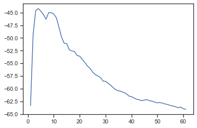

# Подготовка обучающей и тестовой выборки, кросс-валидация и подбор гиперпараметров на примере метода ближайших соседей.

## 1) Текстовое описание набора данных

В качестве набора данных мы будем использовать набор данных 
о ценах на жилье в Бостоне - https://archive.ics.uci.edu/ml/machine-learning-databases/housing/

В качестве задачи, которую должна решать модель, выберем задачу регрессии
Датасет состоит из файла:
- housing.data - обучающая выборка (в этом примере используется только данный файл)

Файл содержит следующие колонки:
- CRIM - уровень преступности на душу населения в разбивке по городам.
- ZN - доля жилой земли, зонированной на участки площадью более 25 000 кв.футов.
- INDUS - доля акров, не связанных с розничной торговлей, на город.
- CHAS - Фиктивная переменная реки Чарльз (= 1, если тракт ограничивает реку; 0 в противном случае).
- NOX - концентрация оксидов азота (частей на 10 миллионов).
- RM - среднее количество комнат в жилом помещении.
- AGE - доля жилых помещений, занятых владельцами, построенных до 1940 года.
- DIS - взвешенные расстояния до пяти бостонских центров занятости.
- RAD - индекс доступности к радиальным магистралям.
- TAX - ставка налога на недвижимость с полной стоимостью за 10 000 долларов США.
- PTRATIO - соотношение учащихся и учителей в разбивке по городам.
- B - 1000(Bk - 0,63)^2, где Bk - доля чернокожих по городам.
- LSTAT - % более низкий статус населения.
- MEDV - средняя стоимость домов, занятых владельцами, в 1000 долларов.

### Импорт библиотек


```python
import numpy as np
import pandas as pd
import seaborn as sns
from sklearn.model_selection import cross_val_score, cross_validate
from sklearn.neighbors import KNeighborsRegressor
from sklearn.model_selection import train_test_split
from sklearn.metrics import make_scorer
from sklearn.model_selection import GridSearchCV, RandomizedSearchCV
from sklearn.model_selection import KFold, RepeatedKFold, LeaveOneOut, ShuffleSplit
from sklearn.metrics import mean_absolute_error, mean_squared_error, median_absolute_error, r2_score 
import matplotlib.pyplot as plt
%matplotlib inline 
from sklearn.datasets import *
sns.set(style="ticks")
```

### Загрузка данных

Загрузим файлы датасета из библиатеке `sklearn.datasets`, и преобразуем в `DataFrame` библиотеки *Pandas*.


```python
ds = load_boston()
df = pd.DataFrame(data= np.c_[ds['data'], ds['target']],
                 columns= list(ds['feature_names']) + ['target'])
df.count()
```


    CRIM       506
    ZN         506
    INDUS      506
    CHAS       506
    NOX        506
    RM         506
    AGE        506
    DIS        506
    RAD        506
    TAX        506
    PTRATIO    506
    B          506
    LSTAT      506
    target     506
    dtype: int64


### Подготовка данных

Поделим данные на тестовую и тренеровочную выборку в пропорции 1 к 4


```python
df_X_train, df_X_test, df_y_train, df_y_test = train_test_split(
    df.drop(columns='target'), df['target'], test_size=0.2, random_state=5060)
```

### В качестве метрик для решения задачи регрессии будем использовать:

#### [Mean absolute error](https://en.wikipedia.org/wiki/Mean_absolute_error) - средняя абсолютная ошибка

$MAE(y,\hat{y}) = \frac{1}{N} \cdot \sum\limits_{i=1}^N \lvert  y_i - \hat{y_i} \rvert $

где:
- $y$ - истинное значение целевого признака
- $\hat{y}$ - предсказанное значение целевого признака
- $N$ - размер тестовой выборки

Чем ближе значение к нулю, тем лучше качество регрессии.

Основная проблема метрики состоит в том, что она не нормирована.

Вычисляется с помощью функции [mean_absolute_error.](https://scikit-learn.org/stable/modules/generated/sklearn.metrics.mean_absolute_error.html#sklearn.metrics.mean_absolute_error)

#### [Mean squared error](https://en.wikipedia.org/wiki/Mean_squared_error) - средняя квадратичная ошибка

$MSE(y,\hat{y}) = \frac{1}{N} \cdot \sum\limits_{i=1}^N ( y_i - \hat{y_i} )^2 $

где:
- $y$ - истинное значение целевого признака
- $\hat{y}$ - предсказанное значение целевого признака
- $N$ - размер тестовой выборки

Вычисляется с помощью функции [mean_squared_error.](https://scikit-learn.org/stable/modules/generated/sklearn.metrics.mean_squared_error.html#sklearn.metrics.mean_squared_error)

#### [Метрика $R^2$ или коэффициент детерминации](https://ru.wikipedia.org/wiki/%D0%9A%D0%BE%D1%8D%D1%84%D1%84%D0%B8%D1%86%D0%B8%D0%B5%D0%BD%D1%82_%D0%B4%D0%B5%D1%82%D0%B5%D1%80%D0%BC%D0%B8%D0%BD%D0%B0%D1%86%D0%B8%D0%B8) 

$R^2(y,\hat{y}) = 1 - \frac{\sum\limits_{i=1}^N ( y_i - \hat{y_i} )^2}{\sum\limits_{i=1}^N ( y_i - \overline{y_i} )^2} $

где:
- $y$ - истинное значение целевого признака
- $\hat{y}$ - предсказанное значение целевого признака
- $N$ - размер тестовой выборки
- $\overline{y_i} = \frac{1}{N} \cdot \sum\limits_{i=1}^N y_i $

Вычисляется с помощью функции [r2_score.](https://scikit-learn.org/stable/modules/generated/sklearn.metrics.r2_score.html#sklearn.metrics.r2_score)

#### [Median absolute error](https://en.wikipedia.org/wiki/Median_absolute_deviation)

$MedAE(y,\hat{y})=median(| y_1 - \hat{y_1} |, \cdot, | y_N - \hat{y_N} |) $

Метрика интересна тем, что является устойчивой к выбросам в данных.

Вычисляется с помощью функции [median_absolute_error.](https://scikit-learn.org/stable/modules/generated/sklearn.metrics.r2_score.html#sklearn.metrics.median_absolute_error)

### Обучем модель ближайщих соседей с K = 5

Создадим функции расчёта метрик и будем их сохранять в словарь


```python
results = dict()
```


```python
def calculate_result(n_neighbors, df_X_train, df_X_test, df_y_train, df_y_test):
    knn_regr = KNeighborsRegressor(n_neighbors=n_neighbors)
    knn_regr.fit(df_X_train, df_y_train)
    
    knn_regr_prediction = knn_regr.predict(df_X_test)
    
    results['mean_absolute k = {}'.format(n_neighbors)] = mean_absolute_error(df_y_test, knn_regr_prediction)
    results['mean_squared k = {}'.format(n_neighbors)] = mean_squared_error(df_y_test, knn_regr_prediction)
    results['median_absolute k = {}'.format(n_neighbors)] = median_absolute_error(df_y_test, knn_regr_prediction)
    results['r2_score k = {}'.format(n_neighbors)] = r2_score(df_y_test, knn_regr_prediction)
    
```


```python
calculate_result(5, df_X_train, df_X_test, df_y_train, df_y_test)
```


```python
print(results)
```

    {'mean_absolute k = 5': 4.197647058823529, 'mean_squared k = 5': 37.54883137254902, 'median_absolute k = 5': 2.959999999999999, 'r2_score k = 5': 0.5365764151848202}
    

### Проведём кросс-валидацию для текущего гипер параметра k = 5

Будем использовать следующие стратегии кросс-валидации: [K-fold](https://scikit-learn.org/stable/modules/generated/sklearn.model_selection.KFold.html#sklearn.model_selection.KFold),
[Repeated K-Fold](https://scikit-learn.org/stable/modules/generated/sklearn.model_selection.RepeatedKFold.html#sklearn.model_selection.RepeatedKFold),
[ShuffleSplit](https://scikit-learn.org/stable/modules/generated/sklearn.model_selection.ShuffleSplit.html#sklearn.model_selection.ShuffleSplit).
                    

Создадим схожую функцию для расчётов и зададим интересующие нас метрики


```python
scoring = {'mean_absolute': make_scorer(mean_absolute_error), 
           'mean_squared': make_scorer(mean_squared_error),
           'median_absolute': make_scorer(median_absolute_error),
           'r2_score':make_scorer(r2_score)}
validation_results = dict()
```


```python
def calculate_validation(n_neighbors, df_X, df_y, strategy, name_strategy):
    scores = cross_validate(KNeighborsRegressor(n_neighbors=n_neighbors), 
                        df_X, df_y, scoring=scoring, 
                        cv=strategy)
    for key in scoring.keys():
        scores['mean_' + key] = np.mean(scores['test_'+key])
    validation_results[name_strategy] = scores
    print(scores)
    
```


```python
calculate_validation(5, df.drop(columns='target'), df['target'], KFold(n_splits=5), 'kfold')
calculate_validation(5, df.drop(columns='target'), df['target'], RepeatedKFold(n_splits=3, n_repeats=2), 'repeat_kfold')
calculate_validation(5, df.drop(columns='target'), df['target'], ShuffleSplit(n_splits=5, test_size=0.2), 'shuffleSplit')
```

    {'fit_time': array([0.01750541, 0.0160048 , 0.01098919, 0.01294971, 0.01888275]), 'score_time': array([0.01654553, 0.01303792, 0.01279807, 0.012712  , 0.01300097]), 'test_mean_absolute': array([6.51980392, 5.7039604 , 7.65287129, 6.09188119, 4.11346535]), 'test_mean_squared': array([ 72.84204314,  77.44044752, 114.19790495,  89.00506931,
            31.22948515]), 'test_median_absolute': array([5.85, 3.8 , 4.82, 3.92, 2.58]), 'test_r2_score': array([-1.10921186,  0.14934963, -0.4259195 , -0.01474393, -0.17455668]), 'mean_mean_absolute': 6.016396427878083, 'mean_mean_squared': 76.9429900135896, 'mean_median_absolute': 4.194000000000002, 'mean_r2_score': -0.31501646812514134}
    {'fit_time': array([0.00700259, 0.00604558, 0.00499511, 0.00296402, 0.00394297,
           0.00295353]), 'score_time': array([0.0072341 , 0.00695586, 0.00368404, 0.00500274, 0.00404644,
           0.00404477]), 'test_mean_absolute': array([4.45621302, 4.2295858 , 4.63083333, 4.00556213, 4.97502959,
           4.19904762]), 'test_mean_squared': array([40.40402604, 36.22368757, 45.44649762, 33.88125207, 56.58600947,
           33.99348571]), 'test_median_absolute': array([3.02, 2.86, 2.98, 2.64, 3.08, 2.91]), 'test_r2_score': array([0.47551195, 0.56244683, 0.51154447, 0.59762716, 0.36223482,
           0.57109261]), 'mean_mean_absolute': 4.416045247487556, 'mean_mean_squared': 41.08915974687705, 'mean_median_absolute': 2.9149999999999996, 'mean_r2_score': 0.5134096391539597}
    {'fit_time': array([0.00299621, 0.00303984, 0.0030508 , 0.00302291, 0.00395441]), 'score_time': array([0.00300097, 0.00301099, 0.00299764, 0.0030365 , 0.00299883]), 'test_mean_absolute': array([3.89960784, 4.26823529, 3.81960784, 4.00411765, 4.87490196]), 'test_mean_squared': array([30.32894118, 38.0597098 , 33.45236863, 33.38003529, 43.25073725]), 'test_median_absolute': array([3.16, 3.04, 2.34, 2.76, 3.7 ]), 'test_r2_score': array([0.59751269, 0.53253752, 0.66220183, 0.60228381, 0.48599093]), 'mean_mean_absolute': 4.173294117647059, 'mean_mean_squared': 35.69435843137255, 'mean_median_absolute': 3.0, 'mean_r2_score': 0.5761053558398908}
    


```python
scoring.keys()
```


    dict_keys(['mean_absolute', 'mean_squared', 'median_absolute', 'r2_score'])


### Поиск гипперпараметров

#### [Grid Search](https://scikit-learn.org/stable/modules/generated/sklearn.model_selection.GridSearchCV.html) (решетчатый поиск)


```python
n_range = np.array(range(1,62,1))
tuned_parameters = [{'n_neighbors': n_range}]
clf_gs = GridSearchCV(KNeighborsRegressor(), tuned_parameters, cv=5, scoring='neg_mean_squared_error')
clf_gs.fit(df_X_train, df_y_train)
```


    GridSearchCV(cv=5, estimator=KNeighborsRegressor(),
                 param_grid=[{'n_neighbors': array([ 1,  2,  3,  4,  5,  6,  7,  8,  9, 10, 11, 12, 13, 14, 15, 16, 17,
           18, 19, 20, 21, 22, 23, 24, 25, 26, 27, 28, 29, 30, 31, 32, 33, 34,
           35, 36, 37, 38, 39, 40, 41, 42, 43, 44, 45, 46, 47, 48, 49, 50, 51,
           52, 53, 54, 55, 56, 57, 58, 59, 60, 61])}],
                 scoring='neg_mean_squared_error')


```python
plt.plot(n_range, clf_gs.cv_results_['mean_test_score'])
```


    [<matplotlib.lines.Line2D at 0x275c698c580>]


    

    


```python
clf_gs.best_params_
```


    {'n_neighbors': 4}


### Проверка гипперпараметра


```python
calculate_result(4, df_X_train, df_X_test, df_y_train, df_y_test)
```


```python
calculate_validation(4, df.drop(columns='target'), df['target'], KFold(n_splits=5), 'kfold_4')
calculate_validation(4, df.drop(columns='target'), df['target'], RepeatedKFold(n_splits=3, n_repeats=2), 'repeat_kfold_4')
calculate_validation(4, df.drop(columns='target'), df['target'], ShuffleSplit(n_splits=5, test_size=0.2), 'shuffleSplit_4')
```

    {'fit_time': array([0.0029974 , 0.00399923, 0.0044446 , 0.00296879, 0.00296474]), 'score_time': array([0.00408411, 0.00296283, 0.00300455, 0.00403118, 0.00402403]), 'test_mean_absolute': array([6.67132353, 5.60742574, 7.74158416, 5.98811881, 4.0019802 ]), 'test_mean_squared': array([ 74.82303309,  74.61106436, 115.04418317,  88.33102723,
            31.20767327]), 'test_median_absolute': array([5.45 , 3.575, 5.6  , 3.85 , 2.75 ]), 'test_r2_score': array([-1.16657334,  0.1804292 , -0.43648646, -0.0070592 , -0.17373632]), 'mean_mean_absolute': 6.00208648806057, 'mean_mean_squared': 76.80339622160744, 'mean_median_absolute': 4.244999999999999, 'mean_r2_score': -0.320685224628445}
    {'fit_time': array([0.00299954, 0.00400281, 0.00399971, 0.00299859, 0.00403786,
           0.00400329]), 'score_time': array([0.00399876, 0.00399876, 0.00300145, 0.00400019, 0.00396228,
           0.00503302]), 'test_mean_absolute': array([4.62751479, 4.31553254, 4.41577381, 3.8989645 , 4.7010355 ,
           4.42797619]), 'test_mean_squared': array([40.25107249, 37.7552108 , 48.73129464, 27.63421228, 42.92694157,
           43.71768601]), 'test_median_absolute': array([2.975 , 2.85  , 2.95  , 2.7   , 3.675 , 2.9875]), 'test_r2_score': array([0.49677229, 0.46354532, 0.52277871, 0.61674714, 0.51620965,
           0.52501713]), 'mean_mean_absolute': 4.397799556213017, 'mean_mean_squared': 40.16940296415657, 'mean_median_absolute': 3.022916666666667, 'mean_r2_score': 0.5235117082810277}
    {'fit_time': array([0.00400424, 0.00303292, 0.00296521, 0.00397539, 0.00400019]), 'score_time': array([0.00399995, 0.00400329, 0.00399995, 0.00396585, 0.00303197]), 'test_mean_absolute': array([4.75882353, 4.42696078, 4.18259804, 4.03676471, 3.89436275]), 'test_mean_squared': array([48.38866422, 43.22941176, 40.4143076 , 35.03091912, 33.7048223 ]), 'test_median_absolute': array([2.9625, 3.0875, 2.0625, 2.3875, 2.7625]), 'test_r2_score': array([0.52464802, 0.54648377, 0.57701131, 0.48526788, 0.4800071 ]), 'mean_mean_absolute': 4.259901960784314, 'mean_mean_squared': 40.153625, 'mean_median_absolute': 2.6525000000000007, 'mean_r2_score': 0.5226836152535201}
    


```python
results
```


    {'mean_absolute k = 5': 4.197647058823529,
     'mean_squared k = 5': 37.54883137254902,
     'median_absolute k = 5': 2.959999999999999,
     'r2_score k = 5': 0.5365764151848202,
     'mean_absolute k = 4': 3.8897058823529402,
     'mean_squared k = 4': 33.694068627450974,
     'median_absolute k = 4': 2.6499999999999977,
     'r2_score k = 4': 0.5841514769016896}


```python
validation_results
```


    {'kfold': {'fit_time': array([0.01750541, 0.0160048 , 0.01098919, 0.01294971, 0.01888275]),
      'score_time': array([0.01654553, 0.01303792, 0.01279807, 0.012712  , 0.01300097]),
      'test_mean_absolute': array([6.51980392, 5.7039604 , 7.65287129, 6.09188119, 4.11346535]),
      'test_mean_squared': array([ 72.84204314,  77.44044752, 114.19790495,  89.00506931,
              31.22948515]),
      'test_median_absolute': array([5.85, 3.8 , 4.82, 3.92, 2.58]),
      'test_r2_score': array([-1.10921186,  0.14934963, -0.4259195 , -0.01474393, -0.17455668]),
      'mean_mean_absolute': 6.016396427878083,
      'mean_mean_squared': 76.9429900135896,
      'mean_median_absolute': 4.194000000000002,
      'mean_r2_score': -0.31501646812514134},
     'repeat_kfold': {'fit_time': array([0.00700259, 0.00604558, 0.00499511, 0.00296402, 0.00394297,
             0.00295353]),
      'score_time': array([0.0072341 , 0.00695586, 0.00368404, 0.00500274, 0.00404644,
             0.00404477]),
      'test_mean_absolute': array([4.45621302, 4.2295858 , 4.63083333, 4.00556213, 4.97502959,
             4.19904762]),
      'test_mean_squared': array([40.40402604, 36.22368757, 45.44649762, 33.88125207, 56.58600947,
             33.99348571]),
      'test_median_absolute': array([3.02, 2.86, 2.98, 2.64, 3.08, 2.91]),
      'test_r2_score': array([0.47551195, 0.56244683, 0.51154447, 0.59762716, 0.36223482,
             0.57109261]),
      'mean_mean_absolute': 4.416045247487556,
      'mean_mean_squared': 41.08915974687705,
      'mean_median_absolute': 2.9149999999999996,
      'mean_r2_score': 0.5134096391539597},
     'shuffleSplit': {'fit_time': array([0.00299621, 0.00303984, 0.0030508 , 0.00302291, 0.00395441]),
      'score_time': array([0.00300097, 0.00301099, 0.00299764, 0.0030365 , 0.00299883]),
      'test_mean_absolute': array([3.89960784, 4.26823529, 3.81960784, 4.00411765, 4.87490196]),
      'test_mean_squared': array([30.32894118, 38.0597098 , 33.45236863, 33.38003529, 43.25073725]),
      'test_median_absolute': array([3.16, 3.04, 2.34, 2.76, 3.7 ]),
      'test_r2_score': array([0.59751269, 0.53253752, 0.66220183, 0.60228381, 0.48599093]),
      'mean_mean_absolute': 4.173294117647059,
      'mean_mean_squared': 35.69435843137255,
      'mean_median_absolute': 3.0,
      'mean_r2_score': 0.5761053558398908},
     'kfold_4': {'fit_time': array([0.0029974 , 0.00399923, 0.0044446 , 0.00296879, 0.00296474]),
      'score_time': array([0.00408411, 0.00296283, 0.00300455, 0.00403118, 0.00402403]),
      'test_mean_absolute': array([6.67132353, 5.60742574, 7.74158416, 5.98811881, 4.0019802 ]),
      'test_mean_squared': array([ 74.82303309,  74.61106436, 115.04418317,  88.33102723,
              31.20767327]),
      'test_median_absolute': array([5.45 , 3.575, 5.6  , 3.85 , 2.75 ]),
      'test_r2_score': array([-1.16657334,  0.1804292 , -0.43648646, -0.0070592 , -0.17373632]),
      'mean_mean_absolute': 6.00208648806057,
      'mean_mean_squared': 76.80339622160744,
      'mean_median_absolute': 4.244999999999999,
      'mean_r2_score': -0.320685224628445},
     'repeat_kfold_4': {'fit_time': array([0.00299954, 0.00400281, 0.00399971, 0.00299859, 0.00403786,
             0.00400329]),
      'score_time': array([0.00399876, 0.00399876, 0.00300145, 0.00400019, 0.00396228,
             0.00503302]),
      'test_mean_absolute': array([4.62751479, 4.31553254, 4.41577381, 3.8989645 , 4.7010355 ,
             4.42797619]),
      'test_mean_squared': array([40.25107249, 37.7552108 , 48.73129464, 27.63421228, 42.92694157,
             43.71768601]),
      'test_median_absolute': array([2.975 , 2.85  , 2.95  , 2.7   , 3.675 , 2.9875]),
      'test_r2_score': array([0.49677229, 0.46354532, 0.52277871, 0.61674714, 0.51620965,
             0.52501713]),
      'mean_mean_absolute': 4.397799556213017,
      'mean_mean_squared': 40.16940296415657,
      'mean_median_absolute': 3.022916666666667,
      'mean_r2_score': 0.5235117082810277},
     'shuffleSplit_4': {'fit_time': array([0.00400424, 0.00303292, 0.00296521, 0.00397539, 0.00400019]),
      'score_time': array([0.00399995, 0.00400329, 0.00399995, 0.00396585, 0.00303197]),
      'test_mean_absolute': array([4.75882353, 4.42696078, 4.18259804, 4.03676471, 3.89436275]),
      'test_mean_squared': array([48.38866422, 43.22941176, 40.4143076 , 35.03091912, 33.7048223 ]),
      'test_median_absolute': array([2.9625, 3.0875, 2.0625, 2.3875, 2.7625]),
      'test_r2_score': array([0.52464802, 0.54648377, 0.57701131, 0.48526788, 0.4800071 ]),
      'mean_mean_absolute': 4.259901960784314,
      'mean_mean_squared': 40.153625,
      'mean_median_absolute': 2.6525000000000007,
      'mean_r2_score': 0.5226836152535201}}


По всем параметрам заметно улучшение


```python

```
