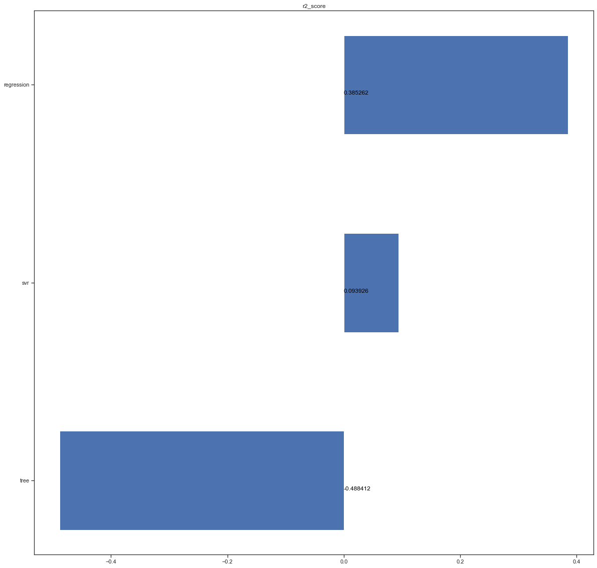
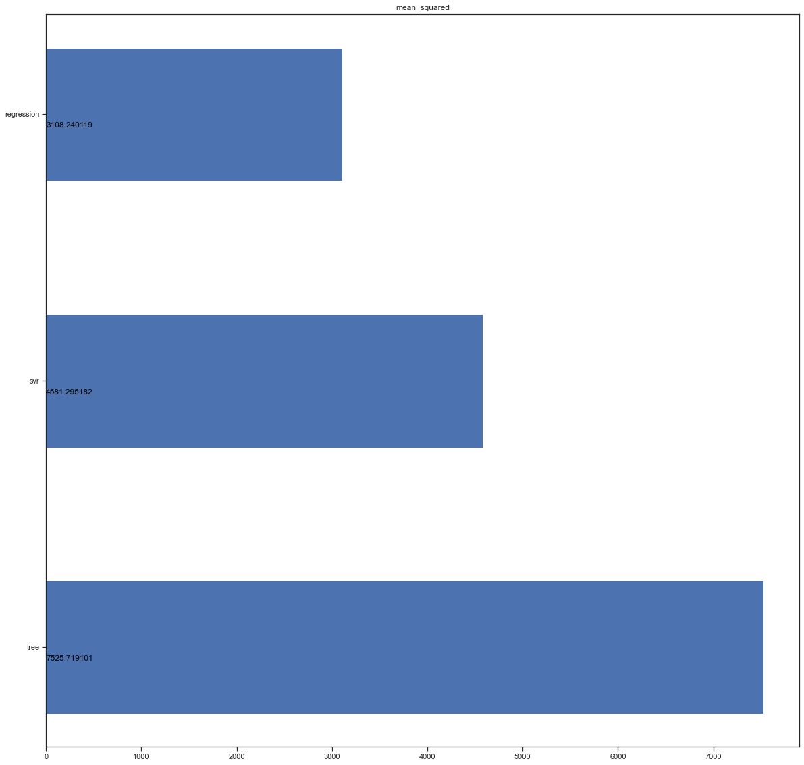
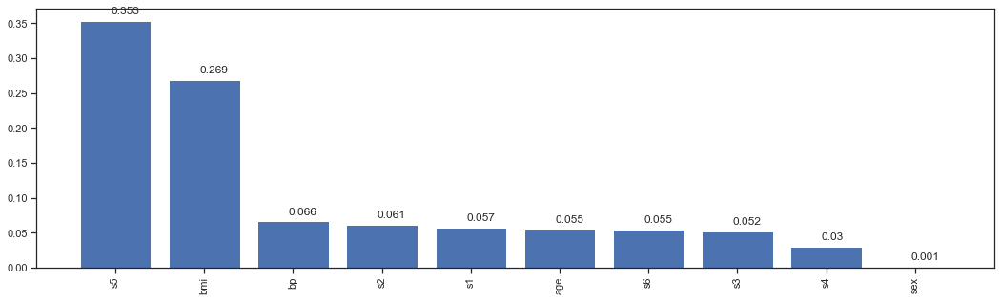

# Линейные модели, SVM и деревья решений.

### Импорт библиотек


```python
import numpy as np
import pandas as pd
from io import StringIO 
from IPython.display import Image
import pydotplus
import seaborn as sns
from sklearn.model_selection import cross_val_score, cross_validate
from sklearn.neighbors import KNeighborsRegressor
from sklearn.model_selection import train_test_split
from sklearn.metrics import make_scorer
from sklearn.pipeline import Pipeline
from sklearn.linear_model import LinearRegression
from sklearn.preprocessing import PolynomialFeatures
from sklearn.tree import DecisionTreeRegressor, export_graphviz
from sklearn.metrics import mean_squared_error, r2_score 
from sklearn.svm import SVR
import operator
import matplotlib.pyplot as plt
%matplotlib inline 
from sklearn.datasets import *
sns.set(style="ticks")
```

### Загрузка данных

В качестве набора данных мы будем использовать набор данных о заболеваемости диабетом из пакета sklearn.
Загрузим файлы датасета из библиатеке `sklearn.datasets`, и преобразуем в `DataFrame` библиотеки *Pandas*.


```python
ds = load_diabetes()
df = pd.DataFrame(data= np.c_[ds['data'], ds['target']],
                 columns= list(ds['feature_names']) + ['target'])
df.count()
```


    age       442
    sex       442
    bmi       442
    bp        442
    s1        442
    s2        442
    s3        442
    s4        442
    s5        442
    s6        442
    target    442
    dtype: int64


```python
df.corr()
```


<div>
<style scoped>
    .dataframe tbody tr th:only-of-type {
        vertical-align: middle;
    }

    .dataframe tbody tr th {
        vertical-align: top;
    }

    .dataframe thead th {
        text-align: right;
    }
</style>
<table border="1" class="dataframe">
  <thead>
    <tr style="text-align: right;">
      <th></th>
      <th>age</th>
      <th>sex</th>
      <th>bmi</th>
      <th>bp</th>
      <th>s1</th>
      <th>s2</th>
      <th>s3</th>
      <th>s4</th>
      <th>s5</th>
      <th>s6</th>
      <th>target</th>
    </tr>
  </thead>
  <tbody>
    <tr>
      <th>age</th>
      <td>1.000000</td>
      <td>0.173737</td>
      <td>0.185085</td>
      <td>0.335427</td>
      <td>0.260061</td>
      <td>0.219243</td>
      <td>-0.075181</td>
      <td>0.203841</td>
      <td>0.270777</td>
      <td>0.301731</td>
      <td>0.187889</td>
    </tr>
    <tr>
      <th>sex</th>
      <td>0.173737</td>
      <td>1.000000</td>
      <td>0.088161</td>
      <td>0.241013</td>
      <td>0.035277</td>
      <td>0.142637</td>
      <td>-0.379090</td>
      <td>0.332115</td>
      <td>0.149918</td>
      <td>0.208133</td>
      <td>0.043062</td>
    </tr>
    <tr>
      <th>bmi</th>
      <td>0.185085</td>
      <td>0.088161</td>
      <td>1.000000</td>
      <td>0.395415</td>
      <td>0.249777</td>
      <td>0.261170</td>
      <td>-0.366811</td>
      <td>0.413807</td>
      <td>0.446159</td>
      <td>0.388680</td>
      <td>0.586450</td>
    </tr>
    <tr>
      <th>bp</th>
      <td>0.335427</td>
      <td>0.241013</td>
      <td>0.395415</td>
      <td>1.000000</td>
      <td>0.242470</td>
      <td>0.185558</td>
      <td>-0.178761</td>
      <td>0.257653</td>
      <td>0.393478</td>
      <td>0.390429</td>
      <td>0.441484</td>
    </tr>
    <tr>
      <th>s1</th>
      <td>0.260061</td>
      <td>0.035277</td>
      <td>0.249777</td>
      <td>0.242470</td>
      <td>1.000000</td>
      <td>0.896663</td>
      <td>0.051519</td>
      <td>0.542207</td>
      <td>0.515501</td>
      <td>0.325717</td>
      <td>0.212022</td>
    </tr>
    <tr>
      <th>s2</th>
      <td>0.219243</td>
      <td>0.142637</td>
      <td>0.261170</td>
      <td>0.185558</td>
      <td>0.896663</td>
      <td>1.000000</td>
      <td>-0.196455</td>
      <td>0.659817</td>
      <td>0.318353</td>
      <td>0.290600</td>
      <td>0.174054</td>
    </tr>
    <tr>
      <th>s3</th>
      <td>-0.075181</td>
      <td>-0.379090</td>
      <td>-0.366811</td>
      <td>-0.178761</td>
      <td>0.051519</td>
      <td>-0.196455</td>
      <td>1.000000</td>
      <td>-0.738493</td>
      <td>-0.398577</td>
      <td>-0.273697</td>
      <td>-0.394789</td>
    </tr>
    <tr>
      <th>s4</th>
      <td>0.203841</td>
      <td>0.332115</td>
      <td>0.413807</td>
      <td>0.257653</td>
      <td>0.542207</td>
      <td>0.659817</td>
      <td>-0.738493</td>
      <td>1.000000</td>
      <td>0.617857</td>
      <td>0.417212</td>
      <td>0.430453</td>
    </tr>
    <tr>
      <th>s5</th>
      <td>0.270777</td>
      <td>0.149918</td>
      <td>0.446159</td>
      <td>0.393478</td>
      <td>0.515501</td>
      <td>0.318353</td>
      <td>-0.398577</td>
      <td>0.617857</td>
      <td>1.000000</td>
      <td>0.464670</td>
      <td>0.565883</td>
    </tr>
    <tr>
      <th>s6</th>
      <td>0.301731</td>
      <td>0.208133</td>
      <td>0.388680</td>
      <td>0.390429</td>
      <td>0.325717</td>
      <td>0.290600</td>
      <td>-0.273697</td>
      <td>0.417212</td>
      <td>0.464670</td>
      <td>1.000000</td>
      <td>0.382483</td>
    </tr>
    <tr>
      <th>target</th>
      <td>0.187889</td>
      <td>0.043062</td>
      <td>0.586450</td>
      <td>0.441484</td>
      <td>0.212022</td>
      <td>0.174054</td>
      <td>-0.394789</td>
      <td>0.430453</td>
      <td>0.565883</td>
      <td>0.382483</td>
      <td>1.000000</td>
    </tr>
  </tbody>
</table>
</div>


```python
df.isnull().sum()
```


    age       0
    sex       0
    bmi       0
    bp        0
    s1        0
    s2        0
    s3        0
    s4        0
    s5        0
    s6        0
    target    0
    dtype: int64


### Подготовка данных

Поделим данные на тестовую и тренеровочную выборку в пропорции 1 к 4


```python
df_X_train, df_X_test, df_y_train, df_y_test = train_test_split(
    df.drop(columns='target'), df['target'], test_size=0.2, random_state=12)
```

## Нелинейная регрессия


```python
reg = Pipeline([('poly', PolynomialFeatures(degree=1)),
                       ('linear', LinearRegression(fit_intercept=False))])
reg.fit(df_X_train, df_y_train)
reg_y = reg.predict(df_X_test)
```


```python
reg_y, df_y_test
```


    (array([223.34963038,  87.13115153, 156.73883649,  90.65628945,
            207.64698598, 134.23898745, 116.68204278, 167.02028142,
            140.05600383, 193.75122783, 254.96424625, 199.48468043,
            160.00742593, 141.13066838,  44.17930598, 214.30553134,
            169.71292348,  64.27385478, 158.99410512, 178.26923506,
             92.88794623,  80.87626341, 264.22184719, 151.74454782,
            197.18239595, 138.00059227, 156.72821506, 113.22489858,
             74.76118156, 103.95066862, 176.52736622, 161.80188635,
            186.92682947, 114.71866245,  80.36143189, 202.88646071,
             98.1614235 , 208.71688312, 164.73729624, 150.28486735,
            232.76421078, 219.69137405, 122.9768008 ,  82.98244353,
            161.62838691, 108.6221338 , 198.79871187,  78.20198425,
            237.01251351, 266.37819836,  88.11098912, 123.93554037,
            205.34398198, 161.61588715, 168.43675909, 144.94009536,
            136.10097855, 208.13169313, 215.82287398, 189.68933412,
            262.12838732, 122.18097158, 162.15285962,  81.26917877,
             44.45922017,  50.93494487, 162.33110024, 229.59307215,
            112.49379656, 197.06603809, 101.50556801, 119.51085363,
            136.20190022,  72.82836707, 155.83574093, 162.03414579,
            184.95367542, 100.14230494, 182.55478335, 203.48574022,
            114.86652512, 162.64681221, 111.04930888,  94.97060629,
            157.05244138, 166.68327424, 221.84906343, 149.68565834,
             50.99383556]),
     169    152.0
     35     102.0
     37     276.0
     21      49.0
     310    109.0
            ...  
     50     155.0
     426    120.0
     122    180.0
     66     150.0
     391     63.0
     Name: target, Length: 89, dtype: float64)


## Метод опорных векторов¶


```python
svr = SVR(kernel='rbf', gamma=1.8, C=2.0)
svr.fit(df_X_train, df_y_train)
svr_y = svr.predict(df_X_test)
```

# Деревья решений


```python
tree = DecisionTreeRegressor(max_depth=50)
tree.fit(df_X_train, df_y_train)
tree_y = tree.predict(df_X_test)
```

## Проверка качества моделей

### Для оценки качества моделей будем пользовать следующие метрики

#### [Mean squared error](https://en.wikipedia.org/wiki/Mean_squared_error) - средняя квадратичная ошибка

$MSE(y,\hat{y}) = \frac{1}{N} \cdot \sum\limits_{i=1}^N ( y_i - \hat{y_i} )^2 $

где:
- $y$ - истинное значение целевого признака
- $\hat{y}$ - предсказанное значение целевого признака
- $N$ - размер тестовой выборки

Вычисляется с помощью функции [mean_squared_error.](https://scikit-learn.org/stable/modules/generated/sklearn.metrics.mean_squared_error.html#sklearn.metrics.mean_squared_error)

#### [Метрика $R^2$ или коэффициент детерминации](https://ru.wikipedia.org/wiki/%D0%9A%D0%BE%D1%8D%D1%84%D1%84%D0%B8%D1%86%D0%B8%D0%B5%D0%BD%D1%82_%D0%B4%D0%B5%D1%82%D0%B5%D1%80%D0%BC%D0%B8%D0%BD%D0%B0%D1%86%D0%B8%D0%B8) 

$R^2(y,\hat{y}) = 1 - \frac{\sum\limits_{i=1}^N ( y_i - \hat{y_i} )^2}{\sum\limits_{i=1}^N ( y_i - \overline{y_i} )^2} $

где:
- $y$ - истинное значение целевого признака
- $\hat{y}$ - предсказанное значение целевого признака
- $N$ - размер тестовой выборки
- $\overline{y_i} = \frac{1}{N} \cdot \sum\limits_{i=1}^N y_i $

Вычисляется с помощью функции [r2_score.](https://scikit-learn.org/stable/modules/generated/sklearn.metrics.r2_score.html#sklearn.metrics.r2_score)


```python
results_metrics = dict()
model_list = ['tree', 'svr', 'regression']
```


```python
results_metrics['mean_squared'] = [mean_squared_error(df_y_test, tree_y), mean_squared_error(df_y_test, svr_y), mean_squared_error(df_y_test, reg_y)] 
```


```python
results_metrics['r2_score'] = [r2_score(df_y_test, tree_y), r2_score(df_y_test, svr_y), r2_score(df_y_test, reg_y)]
```


```python
results_metrics['r2_score']
```


    [-0.4884120469368778, 0.09392646099043522, 0.3852624611229535]


```python
fig, ax = plt.subplots(figsize=(20,20))
pos = np.arange(len(model_list))
rects = ax.barh(pos, results_metrics['r2_score'],
             align='center',
             height=0.5, 
             tick_label=model_list)
ax.set_title('r2_score')
for a, b in zip(pos, results_metrics['r2_score']):
    plt.text(0, a-0.05, str(round(b,6)), color='black')
plt.show()    
```


    

    


```python
fig, ax = plt.subplots(figsize=(20,20))
pos = np.arange(len(model_list))
rects = ax.barh(pos, results_metrics['mean_squared'],
             align='center',
             height=0.5, 
             tick_label=model_list)
ax.set_title('mean_squared')
for a, b in zip(pos, results_metrics['mean_squared']):
    plt.text(0.6, a-0.05, str(round(b,6)), color='black')
plt.show() 
```


    

    


```python
def get_png_tree(tree_model_param, feature_names_param):
    dot_data = StringIO()
    export_graphviz(tree_model_param, out_file=dot_data, feature_names=feature_names_param,
                    filled=True, rounded=True, special_characters=True)
    graph = pydotplus.graph_from_dot_data(dot_data.getvalue())
    return graph.create_png()
```


```python
#Image(get_png_tree(tree, df_X_train.columns), height='100%')
with open('./tree.png', 'wb') as f:
    f.write(get_png_tree(tree, df_X_train.columns))
```


```python
Image(get_png_tree(tree, df_X_train.columns), height='100%')
```


    

    


```python
def draw_feature_importances(tree_model, X_dataset, figsize=(18,5)):
    # Сортировка значений важности признаков по убыванию
    list_to_sort = list(zip(X_dataset.columns.values, tree_model.feature_importances_))
    sorted_list = sorted(list_to_sort, key=operator.itemgetter(1), reverse = True)
    # Названия признаков
    labels = [x for x,_ in sorted_list]
    # Важности признаков
    data = [x for _,x in sorted_list]
    # Вывод графика
    fig, ax = plt.subplots(figsize=figsize)
    ind = np.arange(len(labels))
    plt.bar(ind, data)
    plt.xticks(ind, labels, rotation='vertical')
    # Вывод значений
    for a,b in zip(ind, data):
        plt.text(a-0.05, b+0.01, str(round(b,3)))
    plt.show()
    return labels, data
```


```python
draw_feature_importances(tree, df_X_train)
```


    

    


    (['s5', 'bmi', 'bp', 's2', 's1', 'age', 's6', 's3', 's4', 'sex'],
     [0.3528933116638423,
      0.2688806085165069,
      0.06610251441464647,
      0.061257156501474834,
      0.05728796435208765,
      0.05528574014455872,
      0.05485675775640735,
      0.05205821364084124,
      0.03029086909123376,
      0.0010868639184009])


```python

```
