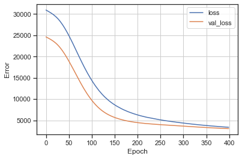
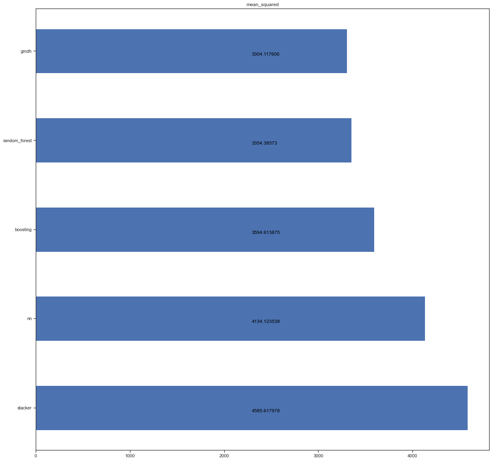

# Ансамбли моделей машинного обучения.

### Импорт библиотек


```python
import numpy as np
import pandas as pd
from io import StringIO 
from IPython.display import Image
from heamy.dataset import Dataset
from heamy.estimator import Regressor, Classifier
from heamy.pipeline import ModelsPipeline
from gmdhpy import gmdh
import pydotplus
import seaborn as sns
import xgboost as xgb
from sklearn.linear_model import LinearRegression
from sklearn.model_selection import train_test_split
from sklearn.metrics import make_scorer
from sklearn.pipeline import Pipeline
from sklearn.tree import DecisionTreeRegressor, export_graphviz
from sklearn.ensemble import RandomForestRegressor
from sklearn.preprocessing import PolynomialFeatures
from sklearn.metrics import mean_squared_error, r2_score 
import tensorflow as tf
from tensorflow import keras
from tensorflow.keras import layers
from sklearn.svm import SVR
import operator
import matplotlib.pyplot as plt
%matplotlib inline 
from sklearn.datasets import *
sns.set(style="ticks")
```

### Загрузка данных

В качестве набора данных мы будем использовать набор данных о заболеваемости диабетом из пакета sklearn.
Загрузим файлы датасета из библиатеке `sklearn.datasets`, и преобразуем в `DataFrame` библиотеки *Pandas*.


```python
ds = load_diabetes()
df = pd.DataFrame(data= np.c_[ds['data'], ds['target']],
                 columns= list(ds['feature_names']) + ['target'])
df.count()
```


    age       442
    sex       442
    bmi       442
    bp        442
    s1        442
    s2        442
    s3        442
    s4        442
    s5        442
    s6        442
    target    442
    dtype: int64


```python
df.corr()
```


<div>
<style scoped>
    .dataframe tbody tr th:only-of-type {
        vertical-align: middle;
    }

    .dataframe tbody tr th {
        vertical-align: top;
    }

    .dataframe thead th {
        text-align: right;
    }
</style>
<table border="1" class="dataframe">
  <thead>
    <tr style="text-align: right;">
      <th></th>
      <th>age</th>
      <th>sex</th>
      <th>bmi</th>
      <th>bp</th>
      <th>s1</th>
      <th>s2</th>
      <th>s3</th>
      <th>s4</th>
      <th>s5</th>
      <th>s6</th>
      <th>target</th>
    </tr>
  </thead>
  <tbody>
    <tr>
      <th>age</th>
      <td>1.000000</td>
      <td>0.173737</td>
      <td>0.185085</td>
      <td>0.335427</td>
      <td>0.260061</td>
      <td>0.219243</td>
      <td>-0.075181</td>
      <td>0.203841</td>
      <td>0.270777</td>
      <td>0.301731</td>
      <td>0.187889</td>
    </tr>
    <tr>
      <th>sex</th>
      <td>0.173737</td>
      <td>1.000000</td>
      <td>0.088161</td>
      <td>0.241013</td>
      <td>0.035277</td>
      <td>0.142637</td>
      <td>-0.379090</td>
      <td>0.332115</td>
      <td>0.149918</td>
      <td>0.208133</td>
      <td>0.043062</td>
    </tr>
    <tr>
      <th>bmi</th>
      <td>0.185085</td>
      <td>0.088161</td>
      <td>1.000000</td>
      <td>0.395415</td>
      <td>0.249777</td>
      <td>0.261170</td>
      <td>-0.366811</td>
      <td>0.413807</td>
      <td>0.446159</td>
      <td>0.388680</td>
      <td>0.586450</td>
    </tr>
    <tr>
      <th>bp</th>
      <td>0.335427</td>
      <td>0.241013</td>
      <td>0.395415</td>
      <td>1.000000</td>
      <td>0.242470</td>
      <td>0.185558</td>
      <td>-0.178761</td>
      <td>0.257653</td>
      <td>0.393478</td>
      <td>0.390429</td>
      <td>0.441484</td>
    </tr>
    <tr>
      <th>s1</th>
      <td>0.260061</td>
      <td>0.035277</td>
      <td>0.249777</td>
      <td>0.242470</td>
      <td>1.000000</td>
      <td>0.896663</td>
      <td>0.051519</td>
      <td>0.542207</td>
      <td>0.515501</td>
      <td>0.325717</td>
      <td>0.212022</td>
    </tr>
    <tr>
      <th>s2</th>
      <td>0.219243</td>
      <td>0.142637</td>
      <td>0.261170</td>
      <td>0.185558</td>
      <td>0.896663</td>
      <td>1.000000</td>
      <td>-0.196455</td>
      <td>0.659817</td>
      <td>0.318353</td>
      <td>0.290600</td>
      <td>0.174054</td>
    </tr>
    <tr>
      <th>s3</th>
      <td>-0.075181</td>
      <td>-0.379090</td>
      <td>-0.366811</td>
      <td>-0.178761</td>
      <td>0.051519</td>
      <td>-0.196455</td>
      <td>1.000000</td>
      <td>-0.738493</td>
      <td>-0.398577</td>
      <td>-0.273697</td>
      <td>-0.394789</td>
    </tr>
    <tr>
      <th>s4</th>
      <td>0.203841</td>
      <td>0.332115</td>
      <td>0.413807</td>
      <td>0.257653</td>
      <td>0.542207</td>
      <td>0.659817</td>
      <td>-0.738493</td>
      <td>1.000000</td>
      <td>0.617857</td>
      <td>0.417212</td>
      <td>0.430453</td>
    </tr>
    <tr>
      <th>s5</th>
      <td>0.270777</td>
      <td>0.149918</td>
      <td>0.446159</td>
      <td>0.393478</td>
      <td>0.515501</td>
      <td>0.318353</td>
      <td>-0.398577</td>
      <td>0.617857</td>
      <td>1.000000</td>
      <td>0.464670</td>
      <td>0.565883</td>
    </tr>
    <tr>
      <th>s6</th>
      <td>0.301731</td>
      <td>0.208133</td>
      <td>0.388680</td>
      <td>0.390429</td>
      <td>0.325717</td>
      <td>0.290600</td>
      <td>-0.273697</td>
      <td>0.417212</td>
      <td>0.464670</td>
      <td>1.000000</td>
      <td>0.382483</td>
    </tr>
    <tr>
      <th>target</th>
      <td>0.187889</td>
      <td>0.043062</td>
      <td>0.586450</td>
      <td>0.441484</td>
      <td>0.212022</td>
      <td>0.174054</td>
      <td>-0.394789</td>
      <td>0.430453</td>
      <td>0.565883</td>
      <td>0.382483</td>
      <td>1.000000</td>
    </tr>
  </tbody>
</table>
</div>


```python
df.isnull().sum()
```


    age       0
    sex       0
    bmi       0
    bp        0
    s1        0
    s2        0
    s3        0
    s4        0
    s5        0
    s6        0
    target    0
    dtype: int64


### Подготовка данных

Поделим данные на тестовую и тренеровочную выборку в пропорции 1 к 4


```python
df_X_train, df_X_test, df_y_train, df_y_test = train_test_split(
    df.drop(columns='target'), df['target'], test_size=0.2, random_state=12)
```

### Случаный лес


```python
tree = RandomForestRegressor(n_estimators=10, random_state=12)
tree.fit(df_X_train, df_y_train)
tree_y = tree.predict(df_X_test)
```


```python
tree_y
```


    array([184.2, 136.3, 143.7, 114.2, 194.2, 160. ,  71.1, 245.4, 136.7,
           243.8, 260.5, 201.4, 161. , 154.4, 105.5, 224.8, 173.3,  66.5,
           199. , 152.2, 156.2, 122. , 261.1, 142.5, 157.8, 108.8, 156. ,
           126.6,  68. , 144.4, 174.4, 162.7, 181.5,  93.4, 117.1, 191.8,
           112.1, 212.8, 222.9, 191. , 236.7, 200.5, 123.4,  77. , 182.3,
            76.6, 223.3,  80.9, 263.9, 290.8,  95.8, 172.5, 214.2, 181.3,
           150.5, 132.3, 142.8, 205.9, 225. , 238.1, 266.8, 101. , 140.8,
           113.8,  76.5,  71.1, 139.7, 216.7, 100.7, 155.6,  85.8,  72.2,
            79.9,  82. , 123.8, 190.6, 126.7, 129.6, 152.8, 181.6, 117.5,
           179. ,  91.2,  84.9, 100.2, 174.3, 244.2, 148.2,  56.2])


### Бустинг


```python
reg = xgb.XGBRegressor(
    n_estimators=10,
    eval_metric=mean_squared_error,
)
reg.fit(df_X_train, df_y_train, eval_set=[(df_X_train, df_y_train)])
reg_y = reg.predict(df_X_test)
```

    [0]	validation_0-rmse:126.78217
    [1]	validation_0-rmse:95.65629
    [2]	validation_0-rmse:73.21293
    [3]	validation_0-rmse:57.39291
    [4]	validation_0-rmse:46.06264
    [5]	validation_0-rmse:38.16575
    [6]	validation_0-rmse:32.10063
    [7]	validation_0-rmse:27.78214
    [8]	validation_0-rmse:23.98275
    [9]	validation_0-rmse:21.76612
    

    D:\anaconda3\lib\site-packages\xgboost\data.py:250: FutureWarning: pandas.Int64Index is deprecated and will be removed from pandas in a future version. Use pandas.Index with the appropriate dtype instead.
      elif isinstance(data.columns, (pd.Int64Index, pd.RangeIndex)):
    


```python
reg_y
```


    array([149.30428 , 105.880424, 145.81374 , 102.04156 , 174.46553 ,
           114.801186, 110.59888 , 243.877   , 154.5212  , 237.16719 ,
           222.18236 , 217.16653 , 150.85403 , 134.93927 ,  95.98342 ,
           237.88918 , 180.51299 ,  83.54547 , 207.24379 , 109.5174  ,
           142.41653 , 119.48074 , 239.61699 , 103.94377 , 155.80708 ,
           130.35544 , 102.680244,  89.2868  ,  76.83893 , 145.3199  ,
           104.73179 , 145.29933 , 134.9832  , 120.21382 ,  85.30003 ,
           168.91045 ,  76.302284, 209.41447 , 228.50658 , 179.25017 ,
           202.60506 , 186.886   ,  85.2626  , 101.48372 , 173.86761 ,
            73.36852 , 214.41394 ,  84.811356, 232.04376 , 272.86478 ,
           101.107605, 146.30386 , 185.52725 , 171.97969 , 142.88792 ,
           112.13408 , 123.32981 , 248.35106 , 223.41351 , 244.65875 ,
           247.1172  ,  69.80298 , 153.20953 ,  87.67907 ,  92.2524  ,
            83.07777 ,  85.56129 , 217.9154  ,  94.80268 , 129.47073 ,
            83.429146,  83.567856,  82.01156 ,  52.425613,  99.1951  ,
           143.71127 , 154.04832 , 115.452675, 132.10777 , 186.45786 ,
           102.96815 , 208.654   ,  74.69237 ,  78.96792 ,  96.96595 ,
           137.61682 , 213.70499 , 121.17906 ,  57.572853], dtype=float32)


### Стекинг


```python
dataset = Dataset(df_X_train, df_y_train, df_X_test)

model_rf = Regressor(dataset=dataset, estimator=RandomForestRegressor, parameters={'n_estimators': 10},name='rf')
model_lr = Regressor(dataset=dataset, estimator=LinearRegression, parameters={'normalize': True},name='lr')

pipeline = ModelsPipeline(model_rf, model_lr)
stack_ds = pipeline.stack(k=15, seed=111)

stacker = Regressor(dataset=stack_ds, estimator=DecisionTreeRegressor)
stacker_y = stacker.predict()
results = stacker.validate(k=15, scorer=mean_squared_error)
```

    Metric: mean_squared_error
    Folds accuracy: [7022.25, 12363.958333333334, 5662.666666666667, 6137.416666666667, 8583.041666666666, 7334.791666666667, 5365.958333333333, 7370.333333333333, 6070.95652173913, 4447.173913043478, 4680.826086956522, 4341.521739130435, 8708.91304347826, 4379.521739130435, 4062.6521739130435]
    Mean accuracy: 6435.465458937198
    Standard Deviation: 2163.197180008688
    Variance: 4679422.03959754
    


```python
stacker_y
```


    array([237., 170., 302., 137., 189., 124.,  79., 129., 244., 212., 277.,
           288., 263., 103.,  78., 275., 214.,  59.,  85., 144., 201.,  55.,
           243., 144.,  60.,  50., 262., 200., 128.,  71.,  91., 109., 138.,
            68.,  37., 222., 137., 233., 258., 172., 257., 192., 150., 114.,
           118., 129., 197.,  64., 258., 245.,  60.,  68., 189., 235., 185.,
           172., 198., 233., 275., 164., 242., 131., 110.,  87.,  45.,  63.,
           136., 232., 160., 272., 137.,  64.,  90.,  65.,  78., 131., 277.,
           113., 164., 265.,  71., 110., 135.,  91., 200., 128., 173.,  78.,
           104.])


### Многослойного персептрона

Для реализации данной модели будем использовать функционал библиоткеи TenserFlow


```python
# Нормализуем обучающую выборку с помощью отдельного слоя нормализации
normalizer = tf.keras.layers.Normalization(axis=-1)
normalizer.adapt(np.array(df_X_train))
```


```python
print(normalizer.mean.numpy())
```

    [[-0.00158359 -0.00089624  0.00031588 -0.00096308 -0.00051653 -0.00046802
      -0.00057182  0.00042046  0.0001608   0.00014264]]
    


```python
df_X_train.describe()
```


<div>
<style scoped>
    .dataframe tbody tr th:only-of-type {
        vertical-align: middle;
    }

    .dataframe tbody tr th {
        vertical-align: top;
    }

    .dataframe thead th {
        text-align: right;
    }
</style>
<table border="1" class="dataframe">
  <thead>
    <tr style="text-align: right;">
      <th></th>
      <th>age</th>
      <th>sex</th>
      <th>bmi</th>
      <th>bp</th>
      <th>s1</th>
      <th>s2</th>
      <th>s3</th>
      <th>s4</th>
      <th>s5</th>
      <th>s6</th>
    </tr>
  </thead>
  <tbody>
    <tr>
      <th>count</th>
      <td>353.000000</td>
      <td>353.000000</td>
      <td>353.000000</td>
      <td>353.000000</td>
      <td>353.000000</td>
      <td>353.000000</td>
      <td>353.000000</td>
      <td>353.000000</td>
      <td>353.000000</td>
      <td>353.000000</td>
    </tr>
    <tr>
      <th>mean</th>
      <td>-0.001584</td>
      <td>-0.000896</td>
      <td>0.000316</td>
      <td>-0.000963</td>
      <td>-0.000517</td>
      <td>-0.000468</td>
      <td>-0.000572</td>
      <td>0.000420</td>
      <td>0.000161</td>
      <td>0.000143</td>
    </tr>
    <tr>
      <th>std</th>
      <td>0.049006</td>
      <td>0.047567</td>
      <td>0.049150</td>
      <td>0.048559</td>
      <td>0.049247</td>
      <td>0.048940</td>
      <td>0.048204</td>
      <td>0.048292</td>
      <td>0.047684</td>
      <td>0.046903</td>
    </tr>
    <tr>
      <th>min</th>
      <td>-0.107226</td>
      <td>-0.044642</td>
      <td>-0.090275</td>
      <td>-0.112400</td>
      <td>-0.126781</td>
      <td>-0.112795</td>
      <td>-0.102307</td>
      <td>-0.076395</td>
      <td>-0.126097</td>
      <td>-0.129483</td>
    </tr>
    <tr>
      <th>25%</th>
      <td>-0.041840</td>
      <td>-0.044642</td>
      <td>-0.036385</td>
      <td>-0.036656</td>
      <td>-0.035968</td>
      <td>-0.032002</td>
      <td>-0.036038</td>
      <td>-0.039493</td>
      <td>-0.033249</td>
      <td>-0.030072</td>
    </tr>
    <tr>
      <th>50%</th>
      <td>0.005383</td>
      <td>-0.044642</td>
      <td>-0.008362</td>
      <td>-0.005671</td>
      <td>-0.004321</td>
      <td>-0.005072</td>
      <td>-0.006584</td>
      <td>-0.002592</td>
      <td>-0.003304</td>
      <td>-0.001078</td>
    </tr>
    <tr>
      <th>75%</th>
      <td>0.038076</td>
      <td>0.050680</td>
      <td>0.033673</td>
      <td>0.034496</td>
      <td>0.027326</td>
      <td>0.031254</td>
      <td>0.026550</td>
      <td>0.034309</td>
      <td>0.033047</td>
      <td>0.027917</td>
    </tr>
    <tr>
      <th>max</th>
      <td>0.110727</td>
      <td>0.050680</td>
      <td>0.170555</td>
      <td>0.132044</td>
      <td>0.153914</td>
      <td>0.198788</td>
      <td>0.181179</td>
      <td>0.185234</td>
      <td>0.133599</td>
      <td>0.135612</td>
    </tr>
  </tbody>
</table>
</div>


```python
#Создадим нейроную сеть с одним скрытым слоем
nn_model = keras.Sequential([
      normalizer,
      layers.Dense(20, activation='relu'),
      layers.Dense(1)
  ])

nn_model.compile(loss='mean_squared_error',
            optimizer=tf.keras.optimizers.Adam(0.001))
history = nn_model.fit(
    df_X_train,
    df_y_train,
    validation_split=0.2,
    verbose=0,
    epochs=400
)
nn_y = nn_model.predict(df_X_test)
nn_y
```

    3/3 [==============================] - 0s 1ms/step
    


    array([[212.92929 ],
           [ 19.594112],
           [106.97292 ],
           [ 70.99605 ],
           [189.48883 ],
           [ 86.36806 ],
           [111.75647 ],
           [116.60968 ],
           [122.602585],
           [186.56653 ],
           [243.88792 ],
           [152.87848 ],
           [127.72024 ],
           [136.28882 ],
           [ 60.78453 ],
           [230.90665 ],
           [129.89294 ],
           [106.85017 ],
           [167.22697 ],
           [150.80173 ],
           [ 68.531204],
           [142.75902 ],
           [283.63235 ],
           [128.60912 ],
           [152.00255 ],
           [118.70987 ],
           [114.60079 ],
           [ 63.414852],
           [ 66.22781 ],
           [ 60.62016 ],
           [163.18936 ],
           [125.61765 ],
           [152.70609 ],
           [ 66.165245],
           [ 51.140064],
           [192.25508 ],
           [ 86.394844],
           [181.1155  ],
           [172.6566  ],
           [110.59793 ],
           [281.3926  ],
           [225.30415 ],
           [ 83.13081 ],
           [ 92.2989  ],
           [199.2587  ],
           [ 74.624916],
           [160.40106 ],
           [ 58.419716],
           [235.88925 ],
           [310.13818 ],
           [101.25036 ],
           [111.54132 ],
           [198.2014  ],
           [121.38501 ],
           [172.93774 ],
           [ 91.53825 ],
           [ 71.94856 ],
           [214.13223 ],
           [174.2966  ],
           [196.82266 ],
           [273.973   ],
           [ 65.883736],
           [134.82565 ],
           [ 92.42822 ],
           [153.13995 ],
           [101.361725],
           [164.9628  ],
           [202.02533 ],
           [ 87.275406],
           [135.85161 ],
           [ 31.933609],
           [ 85.35344 ],
           [105.59263 ],
           [ 27.264675],
           [120.45435 ],
           [120.036194],
           [146.60416 ],
           [ 42.239822],
           [128.82458 ],
           [177.50784 ],
           [138.09705 ],
           [108.38889 ],
           [ 49.237446],
           [ 43.287865],
           [122.67038 ],
           [186.49951 ],
           [278.9737  ],
           [ 97.3726  ],
           [109.22105 ]], dtype=float32)


```python
# посмотрим историю обучения

plt.plot(history.history['loss'], label='loss')
plt.plot(history.history['val_loss'], label='val_loss')
plt.xlabel('Epoch')
plt.ylabel('Error')
plt.legend()
plt.grid(True)
```


    

    


### Модель МГУА 


```python
gmdh_model = gmdh.Regressor(ref_functions=('linear_cov', 'quadratic', 'cubic', 'linear'))
gmdh_model.fit(df_X_train.values, df_y_train.values)
gmdh_y = gmdh_model.predict(df_X_test.values)
gmdh_y
```

    train layer0 in 0.18 sec
    train layer1 in 0.53 sec
    train layer2 in 0.52 sec
    train layer3 in 0.52 sec
    train layer4 in 0.51 sec
    train layer5 in 0.53 sec
    


    array([209.10020708, 122.5295096 , 159.51721852,  99.38626424,
           193.47445709, 138.60592576, 122.73902489, 165.22235386,
           178.97968777, 189.02133524, 258.40734395, 179.30405188,
           135.75473228, 141.39286193,  68.37846824, 218.25632299,
           152.71693688,  73.28522292, 171.01202591, 194.23892706,
           127.43402267,  81.2616121 , 244.41066279, 142.97809548,
           148.28352379, 105.93573428, 164.23881249, 116.73649724,
            91.84712255, 127.59577046, 153.39128262, 178.53827268,
           176.22114935, 126.20823383, 103.85699124, 169.48493727,
           101.92350582, 194.07724585, 168.23861498, 145.92825908,
           264.6936559 , 230.78248817, 142.74540707,  84.90167377,
           187.76470783, 124.70535705, 179.84582544, 103.29003094,
           199.52872972, 271.75801822,  97.38062031, 124.40470526,
           211.20313612, 155.36240341, 197.9754771 , 156.52174031,
           173.60673959, 187.08229415, 189.81847303, 194.86499065,
           249.71941818, 140.51922649, 128.79353257,  94.69480909,
            66.84532263,  58.24483861, 165.47981933, 204.76503817,
           109.4112695 , 164.12303524, 124.14778806, 107.53705998,
           129.66411255,  90.37030001, 139.87412475, 170.05686851,
           188.03750376, 133.26186746, 170.62774333, 211.73070802,
           143.08267762, 163.43940807, 103.99513899, 100.92269545,
           140.97686736, 166.28475172, 248.4229277 , 157.79975723,
            65.79076495])


### Оценка моделей


```python
results_metrics = [mean_squared_error(df_y_test, tree_y), mean_squared_error(df_y_test, reg_y), mean_squared_error(df_y_test, stacker_y), mean_squared_error(df_y_test, nn_y), mean_squared_error(df_y_test, gmdh_y)]
model_list = ['random_forest', 'boosting', 'stacker', 'nn', 'gmdh']

sorted_el = list(sorted(list(zip(model_list, results_metrics)), key=lambda x: -x[1]))
results_metrics = list(map(lambda x: x[1], sorted_el))
model_list = list(map(lambda x: x[0], sorted_el))

fig, ax = plt.subplots(figsize=(20,20))
pos = np.arange(len(model_list))
rects = ax.barh(pos, results_metrics,
             align='center',
             height=0.5, 
             tick_label=model_list)
ax.set_title('mean_squared')
for a, b in zip(pos, results_metrics):
    plt.text(max(results_metrics)/2, a-0.05, str(round(b,6)), color='black')
plt.show() 
```


    

    


```python

```
