# Ансамбли моделей машинного обучения.

### Импорт библиотек


```python
import numpy as np
import pandas as pd
from io import StringIO 
from pmdarima import auto_arima
import pmdarima as pm
from IPython.display import Image
from heamy.dataset import Dataset
from heamy.estimator import Regressor, Classifier
from heamy.pipeline import ModelsPipeline
from statsmodels.tsa.arima.model import ARIMA
from gmdhpy import gmdh
import pydotplus
import seaborn as sns
import xgboost as xgb
from statsmodels.tsa.seasonal import seasonal_decompose
from statsmodels.graphics.tsaplots import plot_acf, plot_pacf
from sklearn.linear_model import LinearRegression
from sklearn.model_selection import train_test_split
from sklearn.metrics import make_scorer
from sklearn.pipeline import Pipeline
from sklearn.tree import DecisionTreeRegressor, export_graphviz
from sklearn.ensemble import RandomForestRegressor
from sklearn.preprocessing import PolynomialFeatures
from sklearn.metrics import mean_squared_error, mean_absolute_error 
import tensorflow as tf
from tensorflow import keras
from tensorflow.keras import layers
from sklearn.svm import SVR
import operator
import matplotlib.pyplot as plt
%matplotlib inline 
from sklearn.datasets import *
sns.set(style="ticks")
```


```python
df = pd.read_csv('OPEC-ORB.csv', header=0, index_col=0, parse_dates=True)
```


```python
df
```


<div>
<style scoped>
    .dataframe tbody tr th:only-of-type {
        vertical-align: middle;
    }

    .dataframe tbody tr th {
        vertical-align: top;
    }

    .dataframe thead th {
        text-align: right;
    }
</style>
<table border="1" class="dataframe">
  <thead>
    <tr style="text-align: right;">
      <th></th>
      <th>Value</th>
    </tr>
    <tr>
      <th>Date</th>
      <th></th>
    </tr>
  </thead>
  <tbody>
    <tr>
      <th>2022-06-10</th>
      <td>123.19</td>
    </tr>
    <tr>
      <th>2022-06-09</th>
      <td>123.21</td>
    </tr>
    <tr>
      <th>2022-06-08</th>
      <td>121.54</td>
    </tr>
    <tr>
      <th>2022-06-07</th>
      <td>120.16</td>
    </tr>
    <tr>
      <th>2022-06-06</th>
      <td>119.85</td>
    </tr>
    <tr>
      <th>...</th>
      <td>...</td>
    </tr>
    <tr>
      <th>2003-01-08</th>
      <td>28.86</td>
    </tr>
    <tr>
      <th>2003-01-07</th>
      <td>29.72</td>
    </tr>
    <tr>
      <th>2003-01-06</th>
      <td>30.71</td>
    </tr>
    <tr>
      <th>2003-01-03</th>
      <td>30.83</td>
    </tr>
    <tr>
      <th>2003-01-02</th>
      <td>30.05</td>
    </tr>
  </tbody>
</table>
<p>5016 rows × 1 columns</p>
</div>


```python
# рассмотрим данные только за последние три года
df = df[:720]
```

### Визуализация ряда


```python
fig, ax = plt.subplots(figsize=(20,8))
fig.suptitle('Цена нефти')
df.plot(ax=ax, legend=False)
plt.show()
```


    
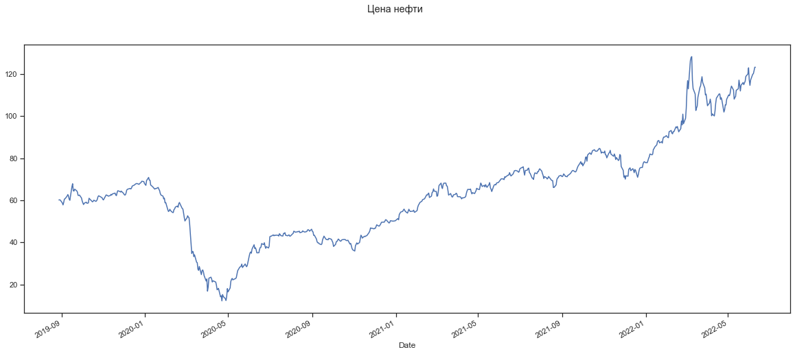
    


```python
# Первые 100 точек
fig, ax = plt.subplots(figsize=(20,8))
fig.suptitle('Цена нефти')
df[:100].plot(ax=ax, legend=False)
plt.show()
```


    
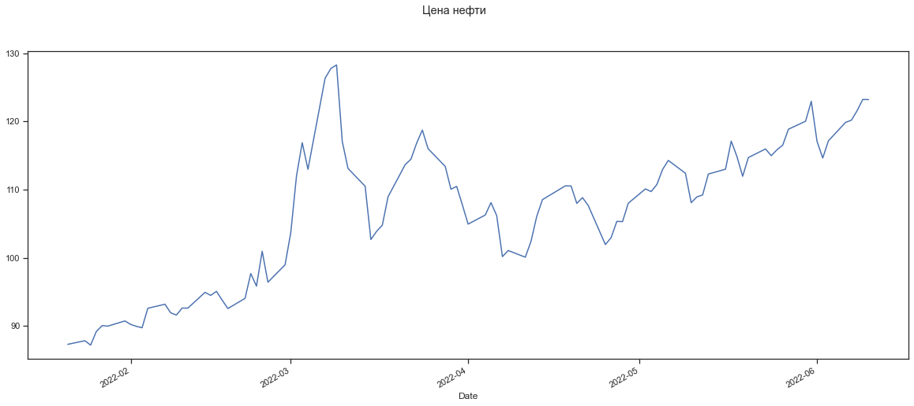
    


Вероятность распределения данных


```python
fig, ax = plt.subplots(figsize=(10,5))
fig.suptitle('Плотность вероятности распределения данных')
df.plot(ax=ax, kind='kde', legend=False)
plt.show()
```


    
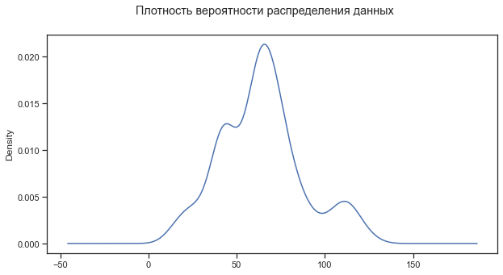
    


#### Лаги 4 порядков


```python
for i in range(1, 5):
    fig, ax = plt.subplots(1, 1, sharex='col', sharey='row', figsize=(5,4))
    fig.suptitle(f'Лаг порядка {i}')
    pd.plotting.lag_plot(df, lag=i, ax=ax)
    plt.show()
```

    *c* argument looks like a single numeric RGB or RGBA sequence, which should be avoided as value-mapping will have precedence in case its length matches with *x* & *y*.  Please use the *color* keyword-argument or provide a 2D array with a single row if you intend to specify the same RGB or RGBA value for all points.
    


    
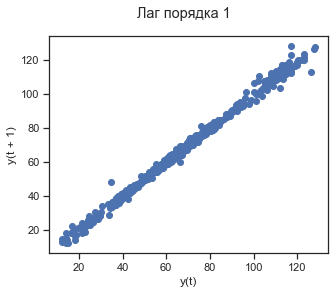
    


    *c* argument looks like a single numeric RGB or RGBA sequence, which should be avoided as value-mapping will have precedence in case its length matches with *x* & *y*.  Please use the *color* keyword-argument or provide a 2D array with a single row if you intend to specify the same RGB or RGBA value for all points.
    


    
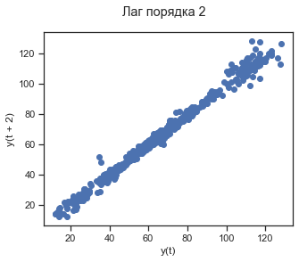
    


    *c* argument looks like a single numeric RGB or RGBA sequence, which should be avoided as value-mapping will have precedence in case its length matches with *x* & *y*.  Please use the *color* keyword-argument or provide a 2D array with a single row if you intend to specify the same RGB or RGBA value for all points.
    


    
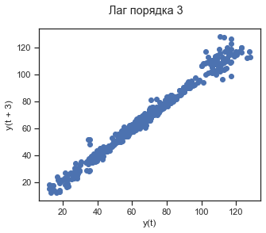
    


    *c* argument looks like a single numeric RGB or RGBA sequence, which should be avoided as value-mapping will have precedence in case its length matches with *x* & *y*.  Please use the *color* keyword-argument or provide a 2D array with a single row if you intend to specify the same RGB or RGBA value for all points.
    


    

    


#### Автокорелляционная диаграммы


```python
fig, ax = plt.subplots(1, 1, sharex='col', sharey='row', figsize=(10,5))
fig.suptitle('Автокорреляционная диаграмма')
pd.plotting.autocorrelation_plot(df, ax=ax)
plt.show()
```


    
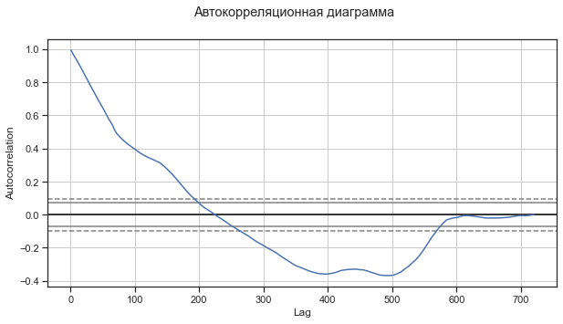
    


```python
plot_acf(df, lags=100)
plt.tight_layout()
```


    
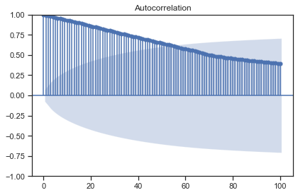
    


```python
plot_pacf(df, lags=100, method='ywm')
plt.tight_layout()
```


    
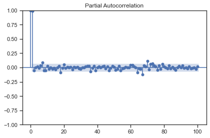
    


#### Декомпозиция ряда


```python
result_add = seasonal_decompose(df, model = 'add', extrapolate_trend='freq', period=5)
fg = result_add.plot()
fg.set_size_inches((20, 16))
# Перерисовка
fg.tight_layout()
plt.show()
```


    
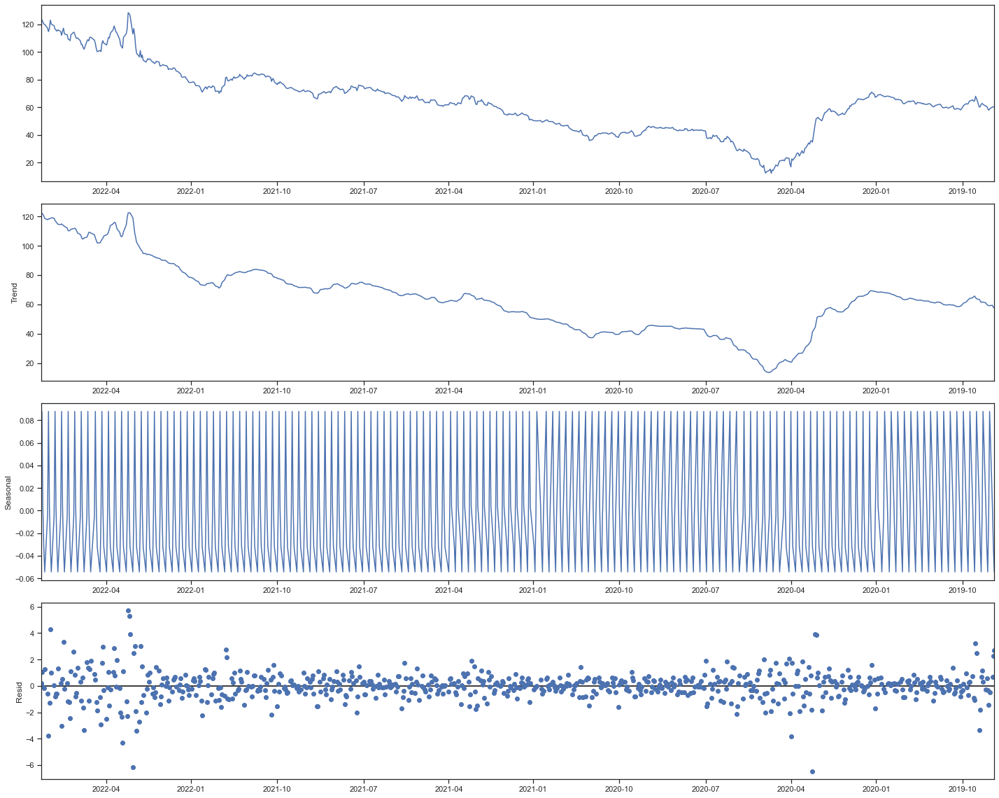
    


#### Скользящее среднее


```python
df_mean = df.copy()
```


```python
df_mean['SMA_20'] = df_mean['Value'].rolling(20, min_periods=1).mean()
df_mean['SMA_60'] = df_mean['Value'].rolling(60, min_periods=1).mean()
df_mean['SMA_5'] = df_mean['Value'].rolling(5, min_periods=1).mean()
```


```python
fig, ax = plt.subplots(sharey='row', figsize=(10,5))
fig.suptitle('Временной ряд со скользящими средними')
df_mean[:200].plot(ax=ax, legend=True)
plt.show()
```


    
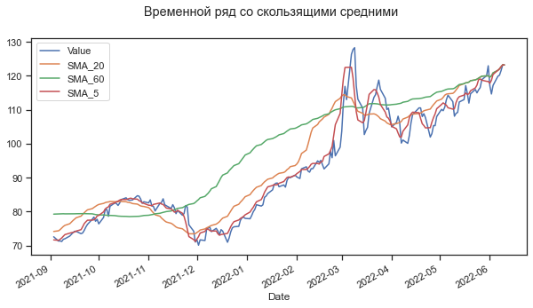
    


### Метод ARIMA

Подготовка данных, разделение на тестовую и тренеровочную выборки


```python
arima_order = (5,1,5)
df_sort = df.sort_index()
# Целочисленная метка шкалы времени 
xnum = list(range(df_sort.shape[0]))
# Разделение выборки на обучающую и тестовую
Y = df_sort['Value'].values
train_size = int(len(Y) * 0.8)
xnum_train, xnum_test = xnum[0:train_size], xnum[train_size:]
train, test = Y[0:train_size], Y[train_size:]
train
```


    array([60.16, 60.24, 60.11, 58.76, 57.81, 58.97, 60.58, 60.75, 62.  ,
           62.74, 62.08, 60.51, 60.02, 66.43, 67.88, 64.57, 64.39, 65.3 ,
           64.51, 63.93, 62.35, 62.31, 62.51, 61.09, 59.68, 58.75, 57.99,
           58.62, 59.12, 58.56, 58.68, 58.74, 60.97, 59.95, 59.62, 59.28,
           59.54, 60.06, 59.5 , 59.78, 60.42, 61.63, 62.16, 61.65, 61.44,
           61.24, 60.52, 60.19, 62.  , 62.57, 62.39, 62.32, 61.98, 62.26,
           62.82, 62.48, 63.  , 63.12, 63.44, 62.51, 62.22, 63.68, 64.56,
           64.21, 63.92, 64.4 , 63.94, 63.83, 62.5 , 62.57, 63.39, 64.81,
           65.24, 65.57, 65.66, 65.38, 65.81, 66.76, 67.22, 67.48, 67.77,
           67.93, 68.  , 67.58, 67.99, 68.48, 69.07, 68.89, 67.96, 67.12,
           69.38, 70.87, 69.6 , 69.58, 67.24, 67.02, 66.07, 65.63, 65.32,
           65.62, 65.58, 66.11, 65.26, 64.66, 63.26, 62.52, 61.98, 60.67,
           61.04, 58.8 , 58.94, 55.53, 54.68, 55.01, 55.74, 55.13, 54.21,
           54.2 , 55.59, 55.9 , 56.77, 57.28, 56.72, 58.39, 58.98, 58.21,
           56.14, 55.91, 54.04, 51.92, 50.19, 51.68, 52.66, 52.01, 51.75,
           48.35, 34.72, 35.73, 35.56, 33.27, 34.14, 30.63, 30.36, 27.31,
           26.73, 28.57, 24.72, 26.53, 26.94, 26.04, 24.26, 21.66, 22.61,
           16.85, 18.91, 23.01, 23.48, 22.67, 21.19, 21.77, 21.18, 19.7 ,
           17.51, 17.73, 18.17, 14.19, 14.63, 12.22, 15.23, 14.31, 13.3 ,
           12.41, 14.36, 18.05, 16.52, 18.36, 21.43, 22.4 , 22.91, 22.21,
           22.71, 22.83, 23.25, 24.93, 26.54, 28.21, 28.43, 28.68, 29.7 ,
           28.06, 29.75, 29.03, 28.45, 29.01, 33.69, 34.96, 35.47, 34.85,
           36.84, 38.89, 37.1 , 37.46, 36.56, 35.06, 35.09, 36.75, 37.59,
           37.7 , 39.45, 38.96, 39.85, 38.17, 37.18, 37.99, 37.34, 38.22,
           42.69, 42.93, 42.96, 43.57, 43.15, 43.44, 43.31, 43.47, 43.38,
           43.02, 44.12, 43.8 , 43.22, 43.03, 44.29, 44.24, 44.62, 43.38,
           43.14, 43.4 , 43.59, 42.99, 43.02, 44.02, 44.27, 45.34, 45.17,
           44.87, 45.01, 45.21, 45.08, 45.34, 44.62, 44.94, 45.49, 45.19,
           45.05, 44.92, 45.19, 45.87, 46.05, 45.81, 45.33, 46.27, 45.3 ,
           45.02, 43.36, 43.42, 41.64, 40.29, 39.82, 39.83, 39.37, 38.96,
           39.35, 41.29, 42.07, 42.98, 41.49, 41.32, 41.4 , 41.22, 41.93,
           41.61, 41.46, 40.65, 39.94, 38.09, 39.07, 40.33, 40.45, 41.06,
           41.61, 40.57, 40.68, 41.2 , 41.29, 41.37, 41.38, 41.04, 40.88,
           40.91, 41.05, 39.22, 39.53, 38.42, 37.12, 36.5 , 35.89, 38.44,
           39.09, 39.79, 39.22, 39.97, 41.72, 43.42, 42.97, 42.05, 42.93,
           42.76, 43.05, 43.12, 43.38, 44.75, 45.51, 46.91, 46.66, 46.79,
           46.43, 46.73, 46.69, 47.46, 48.35, 47.77, 47.79, 48.31, 48.87,
           49.58, 49.65, 49.61, 50.12, 50.78, 50.69, 49.57, 49.22, 49.46,
           50.31, 50.1 , 50.16, 50.22, 50.24, 51.35, 50.75, 53.29, 53.84,
           54.39, 54.76, 55.41, 55.81, 55.19, 54.68, 53.92, 54.85, 55.75,
           55.14, 54.69, 54.85, 54.87, 55.31, 54.36, 54.41, 55.14, 56.82,
           57.74, 58.26, 58.94, 59.59, 60.3 , 60.47, 60.55, 60.79, 62.61,
           62.49, 63.06, 63.44, 61.32, 62.01, 63.73, 64.  , 65.42, 64.37,
           64.21, 61.94, 62.12, 64.23, 67.03, 68.17, 66.38, 65.6 , 67.39,
           68.14, 68.18, 66.89, 66.76, 64.79, 62.47, 63.22, 62.27, 61.61,
           61.63, 62.56, 62.86, 63.37, 63.07, 61.75, 61.68, 61.31, 60.67,
           61.2 , 61.12, 61.44, 61.85, 63.39, 64.48, 65.21, 65.1 , 65.36,
           64.02, 63.06, 63.63, 63.22, 63.91, 64.53, 65.71, 65.42, 65.09,
           66.67, 68.2 , 67.49, 66.57, 67.1 , 66.39, 67.46, 66.78, 66.16,
           67.52, 68.39, 65.95, 65.29, 64.18, 66.93, 67.41, 67.47, 67.32,
           68.2 , 68.53, 69.03, 69.39, 69.91, 70.23, 70.15, 69.83, 71.21,
           70.9 , 71.31, 71.99, 72.05, 73.16, 72.29, 71.56, 72.45, 73.13,
           74.01, 74.09, 74.19, 73.84, 73.34, 73.6 , 74.87, 75.21, 75.71,
           75.94, 73.58, 71.97, 74.18, 74.33, 75.13, 75.29, 73.15, 72.84,
           70.54, 70.5 , 69.93, 72.09, 73.03, 72.68, 73.62, 73.57, 74.42,
           74.98, 73.89, 72.71, 71.83, 70.34, 71.3 , 70.66, 70.13, 70.52,
           71.32, 70.9 , 69.65, 69.4 , 69.32, 66.08, 66.13, 67.33, 69.71,
           70.59, 70.75, 71.48, 71.88, 71.43, 71.25, 71.63, 72.56, 71.29,
           71.34, 71.17, 71.82, 71.98, 72.77, 73.29, 73.78, 74.17, 74.14,
           73.47, 73.68, 74.46, 75.44, 76.21, 77.73, 78.37, 77.13, 77.72,
           76.36, 78.26, 80.44, 80.63, 78.58, 81.54, 82.53, 82.37, 81.79,
           82.5 , 83.54, 84.04, 83.48, 83.3 , 83.36, 83.4 , 84.66, 84.52,
           83.72, 82.41, 82.87, 82.55, 83.43, 81.64, 81.48, 80.16, 82.39,
           82.7 , 83.75, 81.99, 81.7 , 80.9 , 82.01, 81.1 , 79.37, 80.32])


```python
history_base_arima = [x for x in train]

# Формирование предсказаний на основе простого метода ARIMA
predictions_base_arima = list()
for t in range(len(test)):
    model_arima = ARIMA(history_base_arima, order=arima_order)
    model_arima_fit = model_arima.fit(method_kwargs={'warn_convergence':False})
    yhat_arima = model_arima_fit.forecast()[0]
    predictions_base_arima.append(yhat_arima)
    history_base_arima.append(test[t])
```

    D:\anaconda3\lib\site-packages\statsmodels\tsa\statespace\sarimax.py:978: UserWarning: Non-invertible starting MA parameters found. Using zeros as starting parameters.
      warn('Non-invertible starting MA parameters found.'
    


```python
history_auto_arima = [x for x in train]

# Формирование предсказаний на основе метода ARIMA с автоподбором гипперпараметров
predictions_auto_arima = list()
for t in range(len(test)):
    model_arima = pm.auto_arima(history_auto_arima, suppress_warnings=True, error_action='trace')
    yhat_arima = model_arima.predict(n_periods=1)
    predictions_auto_arima.append(yhat_arima[0])
    history_auto_arima.append(test[t])
```

### Рекуретная нейроная сесть

Опишем некоторые константы


```python
SEQ_SIZE = 240 # размер окна
N_LSTM_NEQRON = 120 # число нейронов LSTM
DROPOUT = 0.2
EPOCH = 100
```

Создадим функцию формирования тренеровочной выборки по скользящему окну


```python
def generate_train_df(seq_size, train_data):
    train_x, train_y = [], []
    for i in range(len(train_data) - seq_size - 1):
        train_x.append(np.expand_dims(train_data[i:i+seq_size], axis=1).tolist())
        train_y.append(train_data[i+seq_size+1])
    return train_x, train_y
```

Нормализуем данные


```python
train_mean = train.mean()
train_std = train.std()

train_norm = (train - train_mean) / train_std
test_norm = (test - train_mean) / train_std
```

Сформируем тренеровочные данные с размером окна 20 (эквивалентно месяцу выборки)


```python
train_x, train_y = generate_train_df(SEQ_SIZE, train_norm)
```

Формируем и обучаем модель


```python
lstm_model = tf.keras.models.Sequential([
    tf.keras.layers.Bidirectional(tf.keras.layers.LSTM(N_LSTM_NEQRON, return_sequences=True, input_shape=(SEQ_SIZE, 1))),
    tf.keras.layers.Dropout(DROPOUT),
    tf.keras.layers.Bidirectional(tf.keras.layers.LSTM(N_LSTM_NEQRON, return_sequences=False)),
    tf.keras.layers.Dropout(DROPOUT),
    tf.keras.layers.Dense(1)
])
```


```python
early_stopping = tf.keras.callbacks.EarlyStopping(monitor='mean_absolute_error',
                                                    patience=50,
                                                    mode='min')

lstm_model.compile(loss=tf.losses.MeanSquaredError(),
            optimizer=tf.optimizers.Adam(),
            metrics=[tf.metrics.MeanAbsoluteError()])

history = lstm_model.fit(train_x, train_y, epochs=EPOCH,
                  callbacks=[early_stopping])
```

    Epoch 1/20
    11/11 [==============================] - 30s 2s/step - loss: 0.1686 - mean_absolute_error: 0.3039
    Epoch 2/20
    11/11 [==============================] - 20s 2s/step - loss: 0.0376 - mean_absolute_error: 0.1569
    Epoch 3/20
    11/11 [==============================] - 20s 2s/step - loss: 0.0263 - mean_absolute_error: 0.1265
    Epoch 4/20
    11/11 [==============================] - 19s 2s/step - loss: 0.0198 - mean_absolute_error: 0.1128
    Epoch 5/20
    11/11 [==============================] - 20s 2s/step - loss: 0.0182 - mean_absolute_error: 0.1048
    Epoch 6/20
    11/11 [==============================] - 19s 2s/step - loss: 0.0182 - mean_absolute_error: 0.1044
    Epoch 7/20
    11/11 [==============================] - 19s 2s/step - loss: 0.0174 - mean_absolute_error: 0.1033
    Epoch 8/20
    11/11 [==============================] - 19s 2s/step - loss: 0.0161 - mean_absolute_error: 0.1002
    Epoch 9/20
    11/11 [==============================] - 19s 2s/step - loss: 0.0163 - mean_absolute_error: 0.1010
    Epoch 10/20
    11/11 [==============================] - 19s 2s/step - loss: 0.0176 - mean_absolute_error: 0.1061
    Epoch 11/20
    11/11 [==============================] - 18s 2s/step - loss: 0.0162 - mean_absolute_error: 0.0990
    Epoch 12/20
    11/11 [==============================] - 19s 2s/step - loss: 0.0149 - mean_absolute_error: 0.0974
    Epoch 13/20
    11/11 [==============================] - 18s 2s/step - loss: 0.0147 - mean_absolute_error: 0.0938
    Epoch 14/20
    11/11 [==============================] - 18s 2s/step - loss: 0.0162 - mean_absolute_error: 0.0990
    Epoch 15/20
    11/11 [==============================] - 19s 2s/step - loss: 0.0135 - mean_absolute_error: 0.0900
    Epoch 16/20
    11/11 [==============================] - 19s 2s/step - loss: 0.0135 - mean_absolute_error: 0.0898
    Epoch 17/20
    11/11 [==============================] - 20s 2s/step - loss: 0.0145 - mean_absolute_error: 0.0953
    Epoch 18/20
    11/11 [==============================] - 19s 2s/step - loss: 0.0139 - mean_absolute_error: 0.0934
    Epoch 19/20
    11/11 [==============================] - 19s 2s/step - loss: 0.0175 - mean_absolute_error: 0.1040
    Epoch 20/20
    11/11 [==============================] - 18s 2s/step - loss: 0.0169 - mean_absolute_error: 0.0986
    

Создадим функцию получения предсказания


```python
def predict(train, test):
    result = []
    test_seq = train[len(train)-SEQ_SIZE:]
    for t in range(len(test)):
        prediction = lstm_model.predict(np.expand_dims(test_seq, axis=0))[0]
        result.append(prediction[0])
        test_seq = np.append(test_seq[1:], test[t])
    return result
```


```python
lstm_predicts = predict(train_norm, test_norm)
```

    1/1 [==============================] - 0s 50ms/step
    1/1 [==============================] - 0s 45ms/step
    1/1 [==============================] - 0s 46ms/step
    1/1 [==============================] - 0s 46ms/step
    1/1 [==============================] - 0s 47ms/step
    1/1 [==============================] - 0s 47ms/step
    1/1 [==============================] - 0s 47ms/step
    1/1 [==============================] - 0s 45ms/step
    1/1 [==============================] - 0s 45ms/step
    1/1 [==============================] - 0s 47ms/step
    1/1 [==============================] - 0s 42ms/step
    1/1 [==============================] - 0s 46ms/step
    1/1 [==============================] - 0s 45ms/step
    1/1 [==============================] - 0s 43ms/step
    1/1 [==============================] - 0s 43ms/step
    1/1 [==============================] - 0s 44ms/step
    1/1 [==============================] - 0s 48ms/step
    1/1 [==============================] - 0s 47ms/step
    1/1 [==============================] - 0s 46ms/step
    1/1 [==============================] - 0s 43ms/step
    1/1 [==============================] - 0s 44ms/step
    1/1 [==============================] - 0s 43ms/step
    1/1 [==============================] - 0s 43ms/step
    1/1 [==============================] - 0s 45ms/step
    1/1 [==============================] - 0s 43ms/step
    1/1 [==============================] - 0s 43ms/step
    1/1 [==============================] - 0s 43ms/step
    1/1 [==============================] - 0s 44ms/step
    1/1 [==============================] - 0s 44ms/step
    1/1 [==============================] - 0s 43ms/step
    1/1 [==============================] - 0s 44ms/step
    1/1 [==============================] - 0s 44ms/step
    1/1 [==============================] - 0s 43ms/step
    1/1 [==============================] - 0s 46ms/step
    1/1 [==============================] - 0s 43ms/step
    1/1 [==============================] - 0s 43ms/step
    1/1 [==============================] - 0s 44ms/step
    1/1 [==============================] - 0s 43ms/step
    1/1 [==============================] - 0s 44ms/step
    1/1 [==============================] - 0s 43ms/step
    1/1 [==============================] - 0s 44ms/step
    1/1 [==============================] - 0s 46ms/step
    1/1 [==============================] - 0s 44ms/step
    1/1 [==============================] - 0s 46ms/step
    1/1 [==============================] - 0s 45ms/step
    1/1 [==============================] - 0s 43ms/step
    1/1 [==============================] - 0s 44ms/step
    1/1 [==============================] - 0s 47ms/step
    1/1 [==============================] - 0s 43ms/step
    1/1 [==============================] - 0s 43ms/step
    1/1 [==============================] - 0s 44ms/step
    1/1 [==============================] - 0s 44ms/step
    1/1 [==============================] - 0s 44ms/step
    1/1 [==============================] - 0s 49ms/step
    1/1 [==============================] - 0s 48ms/step
    1/1 [==============================] - 0s 46ms/step
    1/1 [==============================] - 0s 45ms/step
    1/1 [==============================] - 0s 43ms/step
    1/1 [==============================] - 0s 47ms/step
    1/1 [==============================] - 0s 44ms/step
    1/1 [==============================] - 0s 43ms/step
    1/1 [==============================] - 0s 44ms/step
    1/1 [==============================] - 0s 44ms/step
    1/1 [==============================] - 0s 43ms/step
    1/1 [==============================] - 0s 44ms/step
    1/1 [==============================] - 0s 46ms/step
    1/1 [==============================] - 0s 43ms/step
    1/1 [==============================] - 0s 46ms/step
    1/1 [==============================] - 0s 45ms/step
    1/1 [==============================] - 0s 43ms/step
    1/1 [==============================] - 0s 45ms/step
    1/1 [==============================] - 0s 44ms/step
    1/1 [==============================] - 0s 45ms/step
    1/1 [==============================] - 0s 44ms/step
    1/1 [==============================] - 0s 45ms/step
    1/1 [==============================] - 0s 45ms/step
    1/1 [==============================] - 0s 44ms/step
    1/1 [==============================] - 0s 44ms/step
    1/1 [==============================] - 0s 45ms/step
    1/1 [==============================] - 0s 46ms/step
    1/1 [==============================] - 0s 44ms/step
    1/1 [==============================] - 0s 45ms/step
    1/1 [==============================] - 0s 44ms/step
    1/1 [==============================] - 0s 43ms/step
    1/1 [==============================] - 0s 43ms/step
    1/1 [==============================] - 0s 43ms/step
    1/1 [==============================] - 0s 44ms/step
    1/1 [==============================] - 0s 44ms/step
    1/1 [==============================] - 0s 45ms/step
    1/1 [==============================] - 0s 47ms/step
    1/1 [==============================] - 0s 45ms/step
    1/1 [==============================] - 0s 44ms/step
    1/1 [==============================] - 0s 45ms/step
    1/1 [==============================] - 0s 46ms/step
    1/1 [==============================] - 0s 46ms/step
    1/1 [==============================] - 0s 44ms/step
    1/1 [==============================] - 0s 47ms/step
    1/1 [==============================] - 0s 44ms/step
    1/1 [==============================] - 0s 44ms/step
    1/1 [==============================] - 0s 45ms/step
    1/1 [==============================] - 0s 46ms/step
    1/1 [==============================] - 0s 46ms/step
    1/1 [==============================] - 0s 48ms/step
    1/1 [==============================] - 0s 47ms/step
    1/1 [==============================] - 0s 56ms/step
    1/1 [==============================] - 0s 54ms/step
    1/1 [==============================] - 0s 60ms/step
    1/1 [==============================] - 0s 53ms/step
    1/1 [==============================] - 0s 45ms/step
    1/1 [==============================] - 0s 51ms/step
    1/1 [==============================] - 0s 49ms/step
    1/1 [==============================] - 0s 46ms/step
    1/1 [==============================] - 0s 47ms/step
    1/1 [==============================] - 0s 45ms/step
    1/1 [==============================] - 0s 44ms/step
    1/1 [==============================] - 0s 45ms/step
    1/1 [==============================] - 0s 50ms/step
    1/1 [==============================] - 0s 45ms/step
    1/1 [==============================] - 0s 45ms/step
    1/1 [==============================] - 0s 45ms/step
    1/1 [==============================] - 0s 48ms/step
    1/1 [==============================] - 0s 44ms/step
    1/1 [==============================] - 0s 44ms/step
    1/1 [==============================] - 0s 44ms/step
    1/1 [==============================] - 0s 44ms/step
    1/1 [==============================] - 0s 45ms/step
    1/1 [==============================] - 0s 47ms/step
    1/1 [==============================] - 0s 44ms/step
    1/1 [==============================] - 0s 45ms/step
    1/1 [==============================] - 0s 43ms/step
    1/1 [==============================] - 0s 44ms/step
    1/1 [==============================] - 0s 43ms/step
    1/1 [==============================] - 0s 43ms/step
    1/1 [==============================] - 0s 43ms/step
    1/1 [==============================] - 0s 44ms/step
    1/1 [==============================] - 0s 45ms/step
    1/1 [==============================] - 0s 43ms/step
    1/1 [==============================] - 0s 45ms/step
    1/1 [==============================] - 0s 43ms/step
    1/1 [==============================] - 0s 53ms/step
    1/1 [==============================] - 0s 43ms/step
    1/1 [==============================] - 0s 45ms/step
    1/1 [==============================] - 0s 52ms/step
    1/1 [==============================] - 0s 46ms/step
    


```python
# получем реальные значения от нормализованных
lstm_predicts_un_normal = np.array(lstm_predicts) * train_std + train_mean
```


```python
lstm_predicts_un_normal
```


    array([ 81.10838 ,  80.54591 ,  80.15297 ,  80.30316 ,  80.40771 ,
            79.47123 ,  78.167435,  76.313736,  74.744736,  73.08183 ,
            71.99024 ,  71.11838 ,  71.13566 ,  71.41081 ,  71.85671 ,
            72.03592 ,  72.380226,  72.523346,  72.37824 ,  72.50959 ,
            72.51621 ,  71.80892 ,  71.3347  ,  71.29444 ,  71.5616  ,
            71.90491 ,  72.24277 ,  72.89289 ,  73.62599 ,  74.28486 ,
            74.71008 ,  74.96854 ,  75.30121 ,  75.79183 ,  76.34424 ,
            77.067314,  77.59727 ,  78.07838 ,  78.8919  ,  79.65158 ,
            80.41083 ,  81.23309 ,  82.24147 ,  83.15177 ,  83.90118 ,
            84.26802 ,  84.52961 ,  84.56374 ,  84.93074 ,  85.39798 ,
            85.80646 ,  86.24101 ,  86.478806,  86.51329 ,  86.434975,
            86.888916,  87.4731  ,  87.77995 ,  87.90227 ,  88.13397 ,
            88.36517 ,  88.99492 ,  89.494675,  89.9988  ,  90.192314,
            90.050156,  90.07683 ,  90.7443  ,  91.016815,  92.09306 ,
            92.273026,  92.80223 ,  94.03496 ,  96.472145,  99.31122 ,
           101.050415, 104.19456 , 106.824036, 108.846725, 109.035   ,
           108.5031  , 107.53183 , 105.54532 , 103.83504 , 102.42332 ,
           101.80629 , 102.013664, 102.41551 , 103.10701 , 103.95337 ,
           104.3285  , 104.250885, 103.69074 , 103.19679 , 102.38937 ,
           101.24953 , 100.39149 ,  99.95592 ,  99.39767 ,  98.042946,
            96.93137 ,  95.845055,  95.27515 ,  95.46364 ,  96.10567 ,
            97.038216,  97.92197 ,  98.33601 ,  98.69892 ,  98.77505 ,
            97.898895,  97.24105 ,  96.99304 ,  96.78566 ,  97.00992 ,
            97.56494 ,  98.0172  ,  98.55594 ,  99.32062 , 100.15399 ,
           100.58453 , 100.29852 , 100.06123 ,  99.878265, 100.10841 ,
           100.418144, 101.25686 , 101.682304, 101.6646  , 101.93332 ,
           102.27695 , 102.4449  , 102.68808 , 102.98537 , 103.520386,
           104.11519 , 104.949356, 104.921906, 104.55327 , 104.532455,
           104.84675 , 105.18417 , 105.6591  , 106.19976 ], dtype=float32)


#### Построение графика с результатами предсказаний


```python
df_sort['predictions_BASE_ARIMA'] = (train_size * [np.NAN]) + list(predictions_base_arima)
df_sort['predictions_AUTO_ARIMA'] = (train_size * [np.NAN]) + list(predictions_auto_arima)
df_sort['predictions_LSTM'] = (train_size * [np.NAN]) + list(lstm_predicts_un_normal)
```


```python
fig, ax = plt.subplots(1, 1, sharex='col', sharey='row', figsize=(20,10))
fig.suptitle('Предсказания временного ряда')
df_sort.plot(ax=ax, legend=True)
plt.show()
```


    
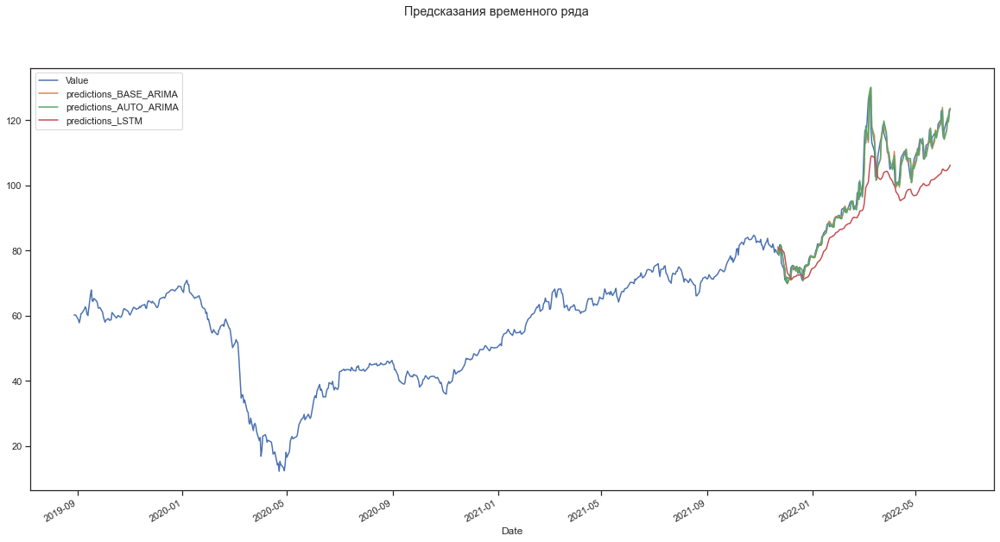
    


### Оценка моеделей

Будем оценивать модели двумя метриками: Среднеяя абсолютная ошибка и Средняя квадратичная ошибка


```python
def plot_metrics(metrics, models, test_y):
    for name, fun in metrics.items():
        fig, ax = plt.subplots(figsize=(10,10))
        results_metrics = []
        
        for nm, results in models.items():
            results_metrics.append(fun(test_y, results))
    
        sorted_el = list(sorted(list(zip(models.keys(), results_metrics)), key=lambda x: -x[1]))
        results_metrics = list(map(lambda x: x[1], sorted_el))
        model_list = list(map(lambda x: x[0], sorted_el))
        
        pos = np.arange(len(model_list))
        rects = ax.barh(pos, results_metrics,
                     align='center',
                     height=0.5, 
                     tick_label=model_list)
        ax.set_title(name)
        for a, b in zip(pos, results_metrics):
            plt.text(max(results_metrics) * 0.1, a-0.05, str(round(b,6)), color='black')
        plt.show() 
```


```python
metrics = {
    'mean_squared':mean_squared_error,
    'mean_absolute':mean_absolute_error
}

predictions = {
    'base-arima': predictions_base_arima,
    'auto-arima': predictions_auto_arima,
    'lstm': lstm_predicts_un_normal
}

plot_metrics(metrics, predictions, test)
```


    
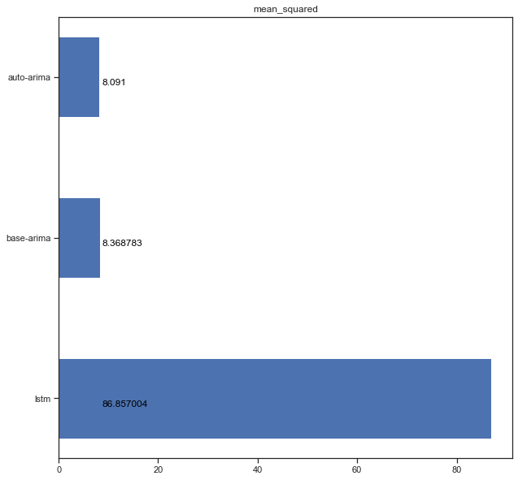
    


    
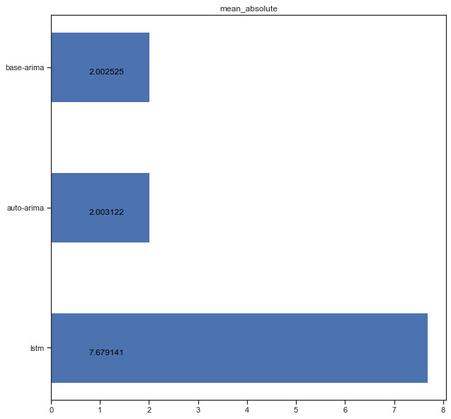
    


```python

```
