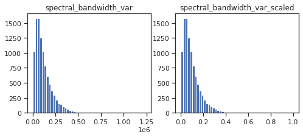
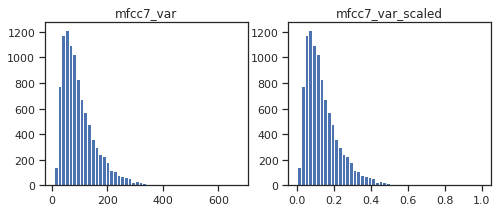
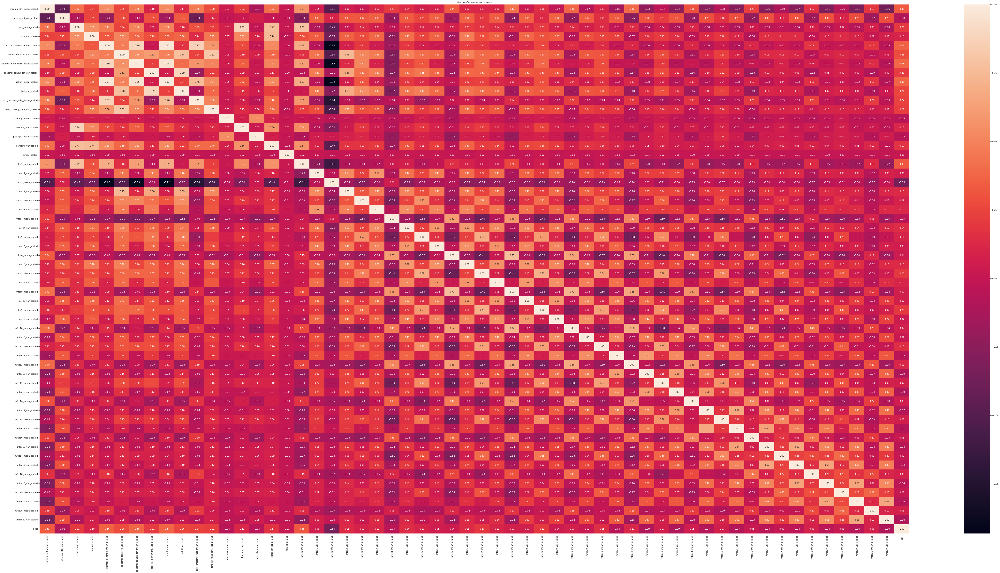

## Поиск и выбор набора данных для построения моделей машинного обучения.

В качестве набора данных мы будем использовать набор данных,
описывающий характеристики 10 жанров музыки - https://www.kaggle.com/datasets/andradaolteanu/gtzan-dataset-music-genre-classification

Задача заключается в определении жанра музыки по её математическим характеристикам. Может быть актуальна при поиске различных треков по жанрам.

Датасет состоит из трех файлов:
- features_30_sec.csv - выборка метрик из 1000 30 секундных треков
- features_3_sec.csv - выборка метрик из 1000 30 секундных треков, которые были поделены на 3 секудные отрезки, за счёи чего число элементов выборки увеличилось в 10 раз

Каждый файл содержит следующие колонки:
- filename - название звукового файла.
- length - длина звукового файла.
- chroma_stft_mean/var - хромограмма или цветность трека(среднее и медианное значение).
- rms_mean/var - реднеквадратическое значение громкостей всех семплов дорожки(среднее и медианное значение).
- spectral_centroid_mean/var - cпектральный центроид(среднее и медианное значение).
- spectral_bandwidth_mean/var - cпектральная ширина(среднее и медианное значение).
- rolloff_mean/var - cпектральный спад(среднее и медианное значение).
- zero_crossing_rate_mean/var - cкорость пересечения нуля(среднее и медианное значение).
- harmony_mean/var - гармония(среднее и медианное значение).
- perceptr_mean/var - хромограмма или цветность трека(среднее и медианное значение).
- tempo - темп.
- mfcc(1-20)_mean/var - набор признаков, который кратко описывают общую форму спектральной огибающей(среднее и медианное значение).
- label - жанр трека.

В рассматриваемом примере будем решать задачу классификации. Для решения **задачи классификации** в качестве целевого признака будем использовать "label". Данный признак имеет 10 строковых значений. Их надо будет преобразовать в числовые


```python
from google.colab import drive
drive.mount('/content/drive')
```

    Mounted at /content/drive
    

### Импорт библиотек
Импортируем библиотеки с помощью команды import. Как правило, все команды import размещают в первых ячейках ноутбука.


```python
import numpy as np
import pandas as pd
import seaborn as sns
import matplotlib.pyplot as plt
from itertools import cycle
from sklearn.preprocessing import MinMaxScaler
from sklearn.linear_model import LinearRegression, LogisticRegression
from sklearn.model_selection import train_test_split
from sklearn.neighbors import KNeighborsRegressor, KNeighborsClassifier
from sklearn.metrics import accuracy_score, balanced_accuracy_score
from sklearn.metrics import precision_score, recall_score, f1_score, classification_report
from sklearn.metrics import confusion_matrix
from sklearn.metrics import plot_confusion_matrix
from sklearn.model_selection import GridSearchCV
from sklearn.model_selection import train_test_split
from sklearn.metrics import mean_absolute_error, mean_squared_error, mean_squared_log_error, median_absolute_error, r2_score 
from sklearn.metrics import roc_curve, roc_auc_score, auc
from sklearn.svm import SVC, NuSVC, LinearSVC, OneClassSVM, SVR, NuSVR, LinearSVR
from sklearn.tree import DecisionTreeClassifier, DecisionTreeRegressor, export_graphviz
from sklearn.ensemble import RandomForestClassifier, RandomForestRegressor
from sklearn.ensemble import ExtraTreesClassifier, ExtraTreesRegressor
from sklearn.ensemble import GradientBoostingClassifier, GradientBoostingRegressor
from sklearn.preprocessing import LabelEncoder
%matplotlib inline 
sns.set(style="ticks")
```

### Загрузка данных

Загрузим файлы датасета в помощью библиотеки Pandas. 


```python
# Обучающая выборка
original_dataset = pd.read_csv('/content/drive/MyDrive/Colab_Notebooks/features_30_sec.csv', sep=",")
original_dataset_large = pd.read_csv('/content/drive/MyDrive/Colab_Notebooks/features_3_sec.csv', sep=",")
```


```python
# Удалим дубликаты записей, если они присутствуют
dts = original_dataset.drop_duplicates()
dtsl = original_dataset_large.drop_duplicates()
```

## Проведение разведочного анализа данных. Построение графиков, необходимых для понимания структуры данных. Анализ и заполнение пропусков в данных.

### Основные характеристики датасетов


```python
# Первые 5 строк датасета
dts.head()
```


  <div id="df-9f0fefa7-e9de-439c-a896-e5c5b4ad08fa">
    <div class="colab-df-container">
      <div>
<style scoped>
    .dataframe tbody tr th:only-of-type {
        vertical-align: middle;
    }

    .dataframe tbody tr th {
        vertical-align: top;
    }

    .dataframe thead th {
        text-align: right;
    }
</style>
<table border="1" class="dataframe">
  <thead>
    <tr style="text-align: right;">
      <th></th>
      <th>filename</th>
      <th>length</th>
      <th>chroma_stft_mean</th>
      <th>chroma_stft_var</th>
      <th>rms_mean</th>
      <th>rms_var</th>
      <th>spectral_centroid_mean</th>
      <th>spectral_centroid_var</th>
      <th>spectral_bandwidth_mean</th>
      <th>spectral_bandwidth_var</th>
      <th>...</th>
      <th>mfcc16_var</th>
      <th>mfcc17_mean</th>
      <th>mfcc17_var</th>
      <th>mfcc18_mean</th>
      <th>mfcc18_var</th>
      <th>mfcc19_mean</th>
      <th>mfcc19_var</th>
      <th>mfcc20_mean</th>
      <th>mfcc20_var</th>
      <th>label</th>
    </tr>
  </thead>
  <tbody>
    <tr>
      <th>0</th>
      <td>blues.00000.wav</td>
      <td>661794</td>
      <td>0.350088</td>
      <td>0.088757</td>
      <td>0.130228</td>
      <td>0.002827</td>
      <td>1784.165850</td>
      <td>129774.064525</td>
      <td>2002.449060</td>
      <td>85882.761315</td>
      <td>...</td>
      <td>52.420910</td>
      <td>-1.690215</td>
      <td>36.524071</td>
      <td>-0.408979</td>
      <td>41.597103</td>
      <td>-2.303523</td>
      <td>55.062923</td>
      <td>1.221291</td>
      <td>46.936035</td>
      <td>blues</td>
    </tr>
    <tr>
      <th>1</th>
      <td>blues.00001.wav</td>
      <td>661794</td>
      <td>0.340914</td>
      <td>0.094980</td>
      <td>0.095948</td>
      <td>0.002373</td>
      <td>1530.176679</td>
      <td>375850.073649</td>
      <td>2039.036516</td>
      <td>213843.755497</td>
      <td>...</td>
      <td>55.356403</td>
      <td>-0.731125</td>
      <td>60.314529</td>
      <td>0.295073</td>
      <td>48.120598</td>
      <td>-0.283518</td>
      <td>51.106190</td>
      <td>0.531217</td>
      <td>45.786282</td>
      <td>blues</td>
    </tr>
    <tr>
      <th>2</th>
      <td>blues.00002.wav</td>
      <td>661794</td>
      <td>0.363637</td>
      <td>0.085275</td>
      <td>0.175570</td>
      <td>0.002746</td>
      <td>1552.811865</td>
      <td>156467.643368</td>
      <td>1747.702312</td>
      <td>76254.192257</td>
      <td>...</td>
      <td>40.598766</td>
      <td>-7.729093</td>
      <td>47.639427</td>
      <td>-1.816407</td>
      <td>52.382141</td>
      <td>-3.439720</td>
      <td>46.639660</td>
      <td>-2.231258</td>
      <td>30.573025</td>
      <td>blues</td>
    </tr>
    <tr>
      <th>3</th>
      <td>blues.00003.wav</td>
      <td>661794</td>
      <td>0.404785</td>
      <td>0.093999</td>
      <td>0.141093</td>
      <td>0.006346</td>
      <td>1070.106615</td>
      <td>184355.942417</td>
      <td>1596.412872</td>
      <td>166441.494769</td>
      <td>...</td>
      <td>44.427753</td>
      <td>-3.319597</td>
      <td>50.206673</td>
      <td>0.636965</td>
      <td>37.319130</td>
      <td>-0.619121</td>
      <td>37.259739</td>
      <td>-3.407448</td>
      <td>31.949339</td>
      <td>blues</td>
    </tr>
    <tr>
      <th>4</th>
      <td>blues.00004.wav</td>
      <td>661794</td>
      <td>0.308526</td>
      <td>0.087841</td>
      <td>0.091529</td>
      <td>0.002303</td>
      <td>1835.004266</td>
      <td>343399.939274</td>
      <td>1748.172116</td>
      <td>88445.209036</td>
      <td>...</td>
      <td>86.099236</td>
      <td>-5.454034</td>
      <td>75.269707</td>
      <td>-0.916874</td>
      <td>53.613918</td>
      <td>-4.404827</td>
      <td>62.910812</td>
      <td>-11.703234</td>
      <td>55.195160</td>
      <td>blues</td>
    </tr>
  </tbody>
</table>
<p>5 rows × 60 columns</p>
</div>
      <button class="colab-df-convert" onclick="convertToInteractive('df-9f0fefa7-e9de-439c-a896-e5c5b4ad08fa')"
              title="Convert this dataframe to an interactive table."
              style="display:none;">

  <svg xmlns="http://www.w3.org/2000/svg" height="24px"viewBox="0 0 24 24"
       width="24px">
    <path d="M0 0h24v24H0V0z" fill="none"/>
    <path d="M18.56 5.44l.94 2.06.94-2.06 2.06-.94-2.06-.94-.94-2.06-.94 2.06-2.06.94zm-11 1L8.5 8.5l.94-2.06 2.06-.94-2.06-.94L8.5 2.5l-.94 2.06-2.06.94zm10 10l.94 2.06.94-2.06 2.06-.94-2.06-.94-.94-2.06-.94 2.06-2.06.94z"/><path d="M17.41 7.96l-1.37-1.37c-.4-.4-.92-.59-1.43-.59-.52 0-1.04.2-1.43.59L10.3 9.45l-7.72 7.72c-.78.78-.78 2.05 0 2.83L4 21.41c.39.39.9.59 1.41.59.51 0 1.02-.2 1.41-.59l7.78-7.78 2.81-2.81c.8-.78.8-2.07 0-2.86zM5.41 20L4 18.59l7.72-7.72 1.47 1.35L5.41 20z"/>
  </svg>
      </button>

  <style>
    .colab-df-container {
      display:flex;
      flex-wrap:wrap;
      gap: 12px;
    }

    .colab-df-convert {
      background-color: #E8F0FE;
      border: none;
      border-radius: 50%;
      cursor: pointer;
      display: none;
      fill: #1967D2;
      height: 32px;
      padding: 0 0 0 0;
      width: 32px;
    }

    .colab-df-convert:hover {
      background-color: #E2EBFA;
      box-shadow: 0px 1px 2px rgba(60, 64, 67, 0.3), 0px 1px 3px 1px rgba(60, 64, 67, 0.15);
      fill: #174EA6;
    }

    [theme=dark] .colab-df-convert {
      background-color: #3B4455;
      fill: #D2E3FC;
    }

    [theme=dark] .colab-df-convert:hover {
      background-color: #434B5C;
      box-shadow: 0px 1px 3px 1px rgba(0, 0, 0, 0.15);
      filter: drop-shadow(0px 1px 2px rgba(0, 0, 0, 0.3));
      fill: #FFFFFF;
    }
  </style>

      <script>
        const buttonEl =
          document.querySelector('#df-9f0fefa7-e9de-439c-a896-e5c5b4ad08fa button.colab-df-convert');
        buttonEl.style.display =
          google.colab.kernel.accessAllowed ? 'block' : 'none';

        async function convertToInteractive(key) {
          const element = document.querySelector('#df-9f0fefa7-e9de-439c-a896-e5c5b4ad08fa');
          const dataTable =
            await google.colab.kernel.invokeFunction('convertToInteractive',
                                                     [key], {});
          if (!dataTable) return;

          const docLinkHtml = 'Like what you see? Visit the ' +
            '<a target="_blank" href=https://colab.research.google.com/notebooks/data_table.ipynb>data table notebook</a>'
            + ' to learn more about interactive tables.';
          element.innerHTML = '';
          dataTable['output_type'] = 'display_data';
          await google.colab.output.renderOutput(dataTable, element);
          const docLink = document.createElement('div');
          docLink.innerHTML = docLinkHtml;
          element.appendChild(docLink);
        }
      </script>
    </div>
  </div>


```python
dtsl.head()
```


  <div id="df-44903ae7-c051-49d8-8b98-0b7a69b19d8b">
    <div class="colab-df-container">
      <div>
<style scoped>
    .dataframe tbody tr th:only-of-type {
        vertical-align: middle;
    }

    .dataframe tbody tr th {
        vertical-align: top;
    }

    .dataframe thead th {
        text-align: right;
    }
</style>
<table border="1" class="dataframe">
  <thead>
    <tr style="text-align: right;">
      <th></th>
      <th>filename</th>
      <th>length</th>
      <th>chroma_stft_mean</th>
      <th>chroma_stft_var</th>
      <th>rms_mean</th>
      <th>rms_var</th>
      <th>spectral_centroid_mean</th>
      <th>spectral_centroid_var</th>
      <th>spectral_bandwidth_mean</th>
      <th>spectral_bandwidth_var</th>
      <th>...</th>
      <th>mfcc16_var</th>
      <th>mfcc17_mean</th>
      <th>mfcc17_var</th>
      <th>mfcc18_mean</th>
      <th>mfcc18_var</th>
      <th>mfcc19_mean</th>
      <th>mfcc19_var</th>
      <th>mfcc20_mean</th>
      <th>mfcc20_var</th>
      <th>label</th>
    </tr>
  </thead>
  <tbody>
    <tr>
      <th>0</th>
      <td>blues.00000.0.wav</td>
      <td>66149</td>
      <td>0.335406</td>
      <td>0.091048</td>
      <td>0.130405</td>
      <td>0.003521</td>
      <td>1773.065032</td>
      <td>167541.630869</td>
      <td>1972.744388</td>
      <td>117335.771563</td>
      <td>...</td>
      <td>39.687145</td>
      <td>-3.241280</td>
      <td>36.488243</td>
      <td>0.722209</td>
      <td>38.099152</td>
      <td>-5.050335</td>
      <td>33.618073</td>
      <td>-0.243027</td>
      <td>43.771767</td>
      <td>blues</td>
    </tr>
    <tr>
      <th>1</th>
      <td>blues.00000.1.wav</td>
      <td>66149</td>
      <td>0.343065</td>
      <td>0.086147</td>
      <td>0.112699</td>
      <td>0.001450</td>
      <td>1816.693777</td>
      <td>90525.690866</td>
      <td>2010.051501</td>
      <td>65671.875673</td>
      <td>...</td>
      <td>64.748276</td>
      <td>-6.055294</td>
      <td>40.677654</td>
      <td>0.159015</td>
      <td>51.264091</td>
      <td>-2.837699</td>
      <td>97.030830</td>
      <td>5.784063</td>
      <td>59.943081</td>
      <td>blues</td>
    </tr>
    <tr>
      <th>2</th>
      <td>blues.00000.2.wav</td>
      <td>66149</td>
      <td>0.346815</td>
      <td>0.092243</td>
      <td>0.132003</td>
      <td>0.004620</td>
      <td>1788.539719</td>
      <td>111407.437613</td>
      <td>2084.565132</td>
      <td>75124.921716</td>
      <td>...</td>
      <td>67.336563</td>
      <td>-1.768610</td>
      <td>28.348579</td>
      <td>2.378768</td>
      <td>45.717648</td>
      <td>-1.938424</td>
      <td>53.050835</td>
      <td>2.517375</td>
      <td>33.105122</td>
      <td>blues</td>
    </tr>
    <tr>
      <th>3</th>
      <td>blues.00000.3.wav</td>
      <td>66149</td>
      <td>0.363639</td>
      <td>0.086856</td>
      <td>0.132565</td>
      <td>0.002448</td>
      <td>1655.289045</td>
      <td>111952.284517</td>
      <td>1960.039988</td>
      <td>82913.639269</td>
      <td>...</td>
      <td>47.739452</td>
      <td>-3.841155</td>
      <td>28.337118</td>
      <td>1.218588</td>
      <td>34.770935</td>
      <td>-3.580352</td>
      <td>50.836224</td>
      <td>3.630866</td>
      <td>32.023678</td>
      <td>blues</td>
    </tr>
    <tr>
      <th>4</th>
      <td>blues.00000.4.wav</td>
      <td>66149</td>
      <td>0.335579</td>
      <td>0.088129</td>
      <td>0.143289</td>
      <td>0.001701</td>
      <td>1630.656199</td>
      <td>79667.267654</td>
      <td>1948.503884</td>
      <td>60204.020268</td>
      <td>...</td>
      <td>30.336359</td>
      <td>0.664582</td>
      <td>45.880913</td>
      <td>1.689446</td>
      <td>51.363583</td>
      <td>-3.392489</td>
      <td>26.738789</td>
      <td>0.536961</td>
      <td>29.146694</td>
      <td>blues</td>
    </tr>
  </tbody>
</table>
<p>5 rows × 60 columns</p>
</div>
      <button class="colab-df-convert" onclick="convertToInteractive('df-44903ae7-c051-49d8-8b98-0b7a69b19d8b')"
              title="Convert this dataframe to an interactive table."
              style="display:none;">

  <svg xmlns="http://www.w3.org/2000/svg" height="24px"viewBox="0 0 24 24"
       width="24px">
    <path d="M0 0h24v24H0V0z" fill="none"/>
    <path d="M18.56 5.44l.94 2.06.94-2.06 2.06-.94-2.06-.94-.94-2.06-.94 2.06-2.06.94zm-11 1L8.5 8.5l.94-2.06 2.06-.94-2.06-.94L8.5 2.5l-.94 2.06-2.06.94zm10 10l.94 2.06.94-2.06 2.06-.94-2.06-.94-.94-2.06-.94 2.06-2.06.94z"/><path d="M17.41 7.96l-1.37-1.37c-.4-.4-.92-.59-1.43-.59-.52 0-1.04.2-1.43.59L10.3 9.45l-7.72 7.72c-.78.78-.78 2.05 0 2.83L4 21.41c.39.39.9.59 1.41.59.51 0 1.02-.2 1.41-.59l7.78-7.78 2.81-2.81c.8-.78.8-2.07 0-2.86zM5.41 20L4 18.59l7.72-7.72 1.47 1.35L5.41 20z"/>
  </svg>
      </button>

  <style>
    .colab-df-container {
      display:flex;
      flex-wrap:wrap;
      gap: 12px;
    }

    .colab-df-convert {
      background-color: #E8F0FE;
      border: none;
      border-radius: 50%;
      cursor: pointer;
      display: none;
      fill: #1967D2;
      height: 32px;
      padding: 0 0 0 0;
      width: 32px;
    }

    .colab-df-convert:hover {
      background-color: #E2EBFA;
      box-shadow: 0px 1px 2px rgba(60, 64, 67, 0.3), 0px 1px 3px 1px rgba(60, 64, 67, 0.15);
      fill: #174EA6;
    }

    [theme=dark] .colab-df-convert {
      background-color: #3B4455;
      fill: #D2E3FC;
    }

    [theme=dark] .colab-df-convert:hover {
      background-color: #434B5C;
      box-shadow: 0px 1px 3px 1px rgba(0, 0, 0, 0.15);
      filter: drop-shadow(0px 1px 2px rgba(0, 0, 0, 0.3));
      fill: #FFFFFF;
    }
  </style>

      <script>
        const buttonEl =
          document.querySelector('#df-44903ae7-c051-49d8-8b98-0b7a69b19d8b button.colab-df-convert');
        buttonEl.style.display =
          google.colab.kernel.accessAllowed ? 'block' : 'none';

        async function convertToInteractive(key) {
          const element = document.querySelector('#df-44903ae7-c051-49d8-8b98-0b7a69b19d8b');
          const dataTable =
            await google.colab.kernel.invokeFunction('convertToInteractive',
                                                     [key], {});
          if (!dataTable) return;

          const docLinkHtml = 'Like what you see? Visit the ' +
            '<a target="_blank" href=https://colab.research.google.com/notebooks/data_table.ipynb>data table notebook</a>'
            + ' to learn more about interactive tables.';
          element.innerHTML = '';
          dataTable['output_type'] = 'display_data';
          await google.colab.output.renderOutput(dataTable, element);
          const docLink = document.createElement('div');
          docLink.innerHTML = docLinkHtml;
          element.appendChild(docLink);
        }
      </script>
    </div>
  </div>


```python
# Размер датасета - 1000 строк, 60 колонок, Размер увеличенного датасета - 9990 строк, 6 колонок
dts.shape, dtsl.shape
```


    ((1000, 60), (9990, 60))


```python
# Список колонок
dts.columns
```


    Index(['filename', 'length', 'chroma_stft_mean', 'chroma_stft_var', 'rms_mean',
           'rms_var', 'spectral_centroid_mean', 'spectral_centroid_var',
           'spectral_bandwidth_mean', 'spectral_bandwidth_var', 'rolloff_mean',
           'rolloff_var', 'zero_crossing_rate_mean', 'zero_crossing_rate_var',
           'harmony_mean', 'harmony_var', 'perceptr_mean', 'perceptr_var', 'tempo',
           'mfcc1_mean', 'mfcc1_var', 'mfcc2_mean', 'mfcc2_var', 'mfcc3_mean',
           'mfcc3_var', 'mfcc4_mean', 'mfcc4_var', 'mfcc5_mean', 'mfcc5_var',
           'mfcc6_mean', 'mfcc6_var', 'mfcc7_mean', 'mfcc7_var', 'mfcc8_mean',
           'mfcc8_var', 'mfcc9_mean', 'mfcc9_var', 'mfcc10_mean', 'mfcc10_var',
           'mfcc11_mean', 'mfcc11_var', 'mfcc12_mean', 'mfcc12_var', 'mfcc13_mean',
           'mfcc13_var', 'mfcc14_mean', 'mfcc14_var', 'mfcc15_mean', 'mfcc15_var',
           'mfcc16_mean', 'mfcc16_var', 'mfcc17_mean', 'mfcc17_var', 'mfcc18_mean',
           'mfcc18_var', 'mfcc19_mean', 'mfcc19_var', 'mfcc20_mean', 'mfcc20_var',
           'label'],
          dtype='object')


```python
# Список колонок с типами данных 
# убедимся что типы данных одинаковы в обоих выборках
dts.dtypes
```


    filename                    object
    length                       int64
    chroma_stft_mean           float64
    chroma_stft_var            float64
    rms_mean                   float64
    rms_var                    float64
    spectral_centroid_mean     float64
    spectral_centroid_var      float64
    spectral_bandwidth_mean    float64
    spectral_bandwidth_var     float64
    rolloff_mean               float64
    rolloff_var                float64
    zero_crossing_rate_mean    float64
    zero_crossing_rate_var     float64
    harmony_mean               float64
    harmony_var                float64
    perceptr_mean              float64
    perceptr_var               float64
    tempo                      float64
    mfcc1_mean                 float64
    mfcc1_var                  float64
    mfcc2_mean                 float64
    mfcc2_var                  float64
    mfcc3_mean                 float64
    mfcc3_var                  float64
    mfcc4_mean                 float64
    mfcc4_var                  float64
    mfcc5_mean                 float64
    mfcc5_var                  float64
    mfcc6_mean                 float64
    mfcc6_var                  float64
    mfcc7_mean                 float64
    mfcc7_var                  float64
    mfcc8_mean                 float64
    mfcc8_var                  float64
    mfcc9_mean                 float64
    mfcc9_var                  float64
    mfcc10_mean                float64
    mfcc10_var                 float64
    mfcc11_mean                float64
    mfcc11_var                 float64
    mfcc12_mean                float64
    mfcc12_var                 float64
    mfcc13_mean                float64
    mfcc13_var                 float64
    mfcc14_mean                float64
    mfcc14_var                 float64
    mfcc15_mean                float64
    mfcc15_var                 float64
    mfcc16_mean                float64
    mfcc16_var                 float64
    mfcc17_mean                float64
    mfcc17_var                 float64
    mfcc18_mean                float64
    mfcc18_var                 float64
    mfcc19_mean                float64
    mfcc19_var                 float64
    mfcc20_mean                float64
    mfcc20_var                 float64
    label                       object
    dtype: object


```python
dtsl.dtypes
```


    filename                    object
    length                       int64
    chroma_stft_mean           float64
    chroma_stft_var            float64
    rms_mean                   float64
    rms_var                    float64
    spectral_centroid_mean     float64
    spectral_centroid_var      float64
    spectral_bandwidth_mean    float64
    spectral_bandwidth_var     float64
    rolloff_mean               float64
    rolloff_var                float64
    zero_crossing_rate_mean    float64
    zero_crossing_rate_var     float64
    harmony_mean               float64
    harmony_var                float64
    perceptr_mean              float64
    perceptr_var               float64
    tempo                      float64
    mfcc1_mean                 float64
    mfcc1_var                  float64
    mfcc2_mean                 float64
    mfcc2_var                  float64
    mfcc3_mean                 float64
    mfcc3_var                  float64
    mfcc4_mean                 float64
    mfcc4_var                  float64
    mfcc5_mean                 float64
    mfcc5_var                  float64
    mfcc6_mean                 float64
    mfcc6_var                  float64
    mfcc7_mean                 float64
    mfcc7_var                  float64
    mfcc8_mean                 float64
    mfcc8_var                  float64
    mfcc9_mean                 float64
    mfcc9_var                  float64
    mfcc10_mean                float64
    mfcc10_var                 float64
    mfcc11_mean                float64
    mfcc11_var                 float64
    mfcc12_mean                float64
    mfcc12_var                 float64
    mfcc13_mean                float64
    mfcc13_var                 float64
    mfcc14_mean                float64
    mfcc14_var                 float64
    mfcc15_mean                float64
    mfcc15_var                 float64
    mfcc16_mean                float64
    mfcc16_var                 float64
    mfcc17_mean                float64
    mfcc17_var                 float64
    mfcc18_mean                float64
    mfcc18_var                 float64
    mfcc19_mean                float64
    mfcc19_var                 float64
    mfcc20_mean                float64
    mfcc20_var                 float64
    label                       object
    dtype: object


```python
# Проверим наличие пустых значений
dts.isnull().sum()
```


    filename                   0
    length                     0
    chroma_stft_mean           0
    chroma_stft_var            0
    rms_mean                   0
    rms_var                    0
    spectral_centroid_mean     0
    spectral_centroid_var      0
    spectral_bandwidth_mean    0
    spectral_bandwidth_var     0
    rolloff_mean               0
    rolloff_var                0
    zero_crossing_rate_mean    0
    zero_crossing_rate_var     0
    harmony_mean               0
    harmony_var                0
    perceptr_mean              0
    perceptr_var               0
    tempo                      0
    mfcc1_mean                 0
    mfcc1_var                  0
    mfcc2_mean                 0
    mfcc2_var                  0
    mfcc3_mean                 0
    mfcc3_var                  0
    mfcc4_mean                 0
    mfcc4_var                  0
    mfcc5_mean                 0
    mfcc5_var                  0
    mfcc6_mean                 0
    mfcc6_var                  0
    mfcc7_mean                 0
    mfcc7_var                  0
    mfcc8_mean                 0
    mfcc8_var                  0
    mfcc9_mean                 0
    mfcc9_var                  0
    mfcc10_mean                0
    mfcc10_var                 0
    mfcc11_mean                0
    mfcc11_var                 0
    mfcc12_mean                0
    mfcc12_var                 0
    mfcc13_mean                0
    mfcc13_var                 0
    mfcc14_mean                0
    mfcc14_var                 0
    mfcc15_mean                0
    mfcc15_var                 0
    mfcc16_mean                0
    mfcc16_var                 0
    mfcc17_mean                0
    mfcc17_var                 0
    mfcc18_mean                0
    mfcc18_var                 0
    mfcc19_mean                0
    mfcc19_var                 0
    mfcc20_mean                0
    mfcc20_var                 0
    label                      0
    dtype: int64


```python
dtsl.isnull().sum()
```


    filename                   0
    length                     0
    chroma_stft_mean           0
    chroma_stft_var            0
    rms_mean                   0
    rms_var                    0
    spectral_centroid_mean     0
    spectral_centroid_var      0
    spectral_bandwidth_mean    0
    spectral_bandwidth_var     0
    rolloff_mean               0
    rolloff_var                0
    zero_crossing_rate_mean    0
    zero_crossing_rate_var     0
    harmony_mean               0
    harmony_var                0
    perceptr_mean              0
    perceptr_var               0
    tempo                      0
    mfcc1_mean                 0
    mfcc1_var                  0
    mfcc2_mean                 0
    mfcc2_var                  0
    mfcc3_mean                 0
    mfcc3_var                  0
    mfcc4_mean                 0
    mfcc4_var                  0
    mfcc5_mean                 0
    mfcc5_var                  0
    mfcc6_mean                 0
    mfcc6_var                  0
    mfcc7_mean                 0
    mfcc7_var                  0
    mfcc8_mean                 0
    mfcc8_var                  0
    mfcc9_mean                 0
    mfcc9_var                  0
    mfcc10_mean                0
    mfcc10_var                 0
    mfcc11_mean                0
    mfcc11_var                 0
    mfcc12_mean                0
    mfcc12_var                 0
    mfcc13_mean                0
    mfcc13_var                 0
    mfcc14_mean                0
    mfcc14_var                 0
    mfcc15_mean                0
    mfcc15_var                 0
    mfcc16_mean                0
    mfcc16_var                 0
    mfcc17_mean                0
    mfcc17_var                 0
    mfcc18_mean                0
    mfcc18_var                 0
    mfcc19_mean                0
    mfcc19_var                 0
    mfcc20_mean                0
    mfcc20_var                 0
    label                      0
    dtype: int64


Удалим строковый столбец filename, а также закодируем катигариальный признак


```python
dts = dts.drop(columns='filename')
dtsl = dtsl.drop(columns='filename')

dts_le = LabelEncoder()
dtsl_le = LabelEncoder()
cat_dts_le = dts_le.fit_transform(dts['label'])
cat_dtsl_le = dtsl_le.fit_transform(dtsl['label'])

df_dts = pd.DataFrame(cat_dts_le, columns=['label'])
df_dtsl = pd.DataFrame(cat_dtsl_le, columns=['label'])

dts = dts.drop(columns='label')
dtsl = dtsl.drop(columns='label')
dts = dts.join(df_dts)
dtsl = dtsl.join(df_dtsl)
```


```python
dts
```


  <div id="df-a97995ac-e322-4f5d-8608-87fdec4865fa">
    <div class="colab-df-container">
      <div>
<style scoped>
    .dataframe tbody tr th:only-of-type {
        vertical-align: middle;
    }

    .dataframe tbody tr th {
        vertical-align: top;
    }

    .dataframe thead th {
        text-align: right;
    }
</style>
<table border="1" class="dataframe">
  <thead>
    <tr style="text-align: right;">
      <th></th>
      <th>length</th>
      <th>chroma_stft_mean</th>
      <th>chroma_stft_var</th>
      <th>rms_mean</th>
      <th>rms_var</th>
      <th>spectral_centroid_mean</th>
      <th>spectral_centroid_var</th>
      <th>spectral_bandwidth_mean</th>
      <th>spectral_bandwidth_var</th>
      <th>rolloff_mean</th>
      <th>...</th>
      <th>mfcc16_var</th>
      <th>mfcc17_mean</th>
      <th>mfcc17_var</th>
      <th>mfcc18_mean</th>
      <th>mfcc18_var</th>
      <th>mfcc19_mean</th>
      <th>mfcc19_var</th>
      <th>mfcc20_mean</th>
      <th>mfcc20_var</th>
      <th>label</th>
    </tr>
  </thead>
  <tbody>
    <tr>
      <th>0</th>
      <td>661794</td>
      <td>0.350088</td>
      <td>0.088757</td>
      <td>0.130228</td>
      <td>0.002827</td>
      <td>1784.165850</td>
      <td>129774.064525</td>
      <td>2002.449060</td>
      <td>85882.761315</td>
      <td>3805.839606</td>
      <td>...</td>
      <td>52.420910</td>
      <td>-1.690215</td>
      <td>36.524071</td>
      <td>-0.408979</td>
      <td>41.597103</td>
      <td>-2.303523</td>
      <td>55.062923</td>
      <td>1.221291</td>
      <td>46.936035</td>
      <td>0</td>
    </tr>
    <tr>
      <th>1</th>
      <td>661794</td>
      <td>0.340914</td>
      <td>0.094980</td>
      <td>0.095948</td>
      <td>0.002373</td>
      <td>1530.176679</td>
      <td>375850.073649</td>
      <td>2039.036516</td>
      <td>213843.755497</td>
      <td>3550.522098</td>
      <td>...</td>
      <td>55.356403</td>
      <td>-0.731125</td>
      <td>60.314529</td>
      <td>0.295073</td>
      <td>48.120598</td>
      <td>-0.283518</td>
      <td>51.106190</td>
      <td>0.531217</td>
      <td>45.786282</td>
      <td>0</td>
    </tr>
    <tr>
      <th>2</th>
      <td>661794</td>
      <td>0.363637</td>
      <td>0.085275</td>
      <td>0.175570</td>
      <td>0.002746</td>
      <td>1552.811865</td>
      <td>156467.643368</td>
      <td>1747.702312</td>
      <td>76254.192257</td>
      <td>3042.260232</td>
      <td>...</td>
      <td>40.598766</td>
      <td>-7.729093</td>
      <td>47.639427</td>
      <td>-1.816407</td>
      <td>52.382141</td>
      <td>-3.439720</td>
      <td>46.639660</td>
      <td>-2.231258</td>
      <td>30.573025</td>
      <td>0</td>
    </tr>
    <tr>
      <th>3</th>
      <td>661794</td>
      <td>0.404785</td>
      <td>0.093999</td>
      <td>0.141093</td>
      <td>0.006346</td>
      <td>1070.106615</td>
      <td>184355.942417</td>
      <td>1596.412872</td>
      <td>166441.494769</td>
      <td>2184.745799</td>
      <td>...</td>
      <td>44.427753</td>
      <td>-3.319597</td>
      <td>50.206673</td>
      <td>0.636965</td>
      <td>37.319130</td>
      <td>-0.619121</td>
      <td>37.259739</td>
      <td>-3.407448</td>
      <td>31.949339</td>
      <td>0</td>
    </tr>
    <tr>
      <th>4</th>
      <td>661794</td>
      <td>0.308526</td>
      <td>0.087841</td>
      <td>0.091529</td>
      <td>0.002303</td>
      <td>1835.004266</td>
      <td>343399.939274</td>
      <td>1748.172116</td>
      <td>88445.209036</td>
      <td>3579.757627</td>
      <td>...</td>
      <td>86.099236</td>
      <td>-5.454034</td>
      <td>75.269707</td>
      <td>-0.916874</td>
      <td>53.613918</td>
      <td>-4.404827</td>
      <td>62.910812</td>
      <td>-11.703234</td>
      <td>55.195160</td>
      <td>0</td>
    </tr>
    <tr>
      <th>...</th>
      <td>...</td>
      <td>...</td>
      <td>...</td>
      <td>...</td>
      <td>...</td>
      <td>...</td>
      <td>...</td>
      <td>...</td>
      <td>...</td>
      <td>...</td>
      <td>...</td>
      <td>...</td>
      <td>...</td>
      <td>...</td>
      <td>...</td>
      <td>...</td>
      <td>...</td>
      <td>...</td>
      <td>...</td>
      <td>...</td>
      <td>...</td>
    </tr>
    <tr>
      <th>995</th>
      <td>661794</td>
      <td>0.352063</td>
      <td>0.080487</td>
      <td>0.079486</td>
      <td>0.000345</td>
      <td>2008.149458</td>
      <td>282174.689224</td>
      <td>2106.541053</td>
      <td>88609.749506</td>
      <td>4253.557033</td>
      <td>...</td>
      <td>45.050526</td>
      <td>-13.289984</td>
      <td>41.754955</td>
      <td>2.484145</td>
      <td>36.778877</td>
      <td>-6.713265</td>
      <td>54.866825</td>
      <td>-1.193787</td>
      <td>49.950665</td>
      <td>9</td>
    </tr>
    <tr>
      <th>996</th>
      <td>661794</td>
      <td>0.398687</td>
      <td>0.075086</td>
      <td>0.076458</td>
      <td>0.000588</td>
      <td>2006.843354</td>
      <td>182114.709510</td>
      <td>2068.942009</td>
      <td>82426.016726</td>
      <td>4149.338328</td>
      <td>...</td>
      <td>33.851742</td>
      <td>-10.848309</td>
      <td>39.395096</td>
      <td>1.881229</td>
      <td>32.010040</td>
      <td>-7.461491</td>
      <td>39.196327</td>
      <td>-2.795338</td>
      <td>31.773624</td>
      <td>9</td>
    </tr>
    <tr>
      <th>997</th>
      <td>661794</td>
      <td>0.432142</td>
      <td>0.075268</td>
      <td>0.081651</td>
      <td>0.000322</td>
      <td>2077.526598</td>
      <td>231657.968040</td>
      <td>1927.293153</td>
      <td>74717.124394</td>
      <td>4031.405321</td>
      <td>...</td>
      <td>33.597008</td>
      <td>-12.845291</td>
      <td>36.367264</td>
      <td>3.440978</td>
      <td>36.001110</td>
      <td>-12.588070</td>
      <td>42.502201</td>
      <td>-2.106337</td>
      <td>29.865515</td>
      <td>9</td>
    </tr>
    <tr>
      <th>998</th>
      <td>661794</td>
      <td>0.362485</td>
      <td>0.091506</td>
      <td>0.083860</td>
      <td>0.001211</td>
      <td>1398.699344</td>
      <td>240318.731073</td>
      <td>1818.450280</td>
      <td>109090.207161</td>
      <td>3015.631004</td>
      <td>...</td>
      <td>46.324894</td>
      <td>-4.416050</td>
      <td>43.583942</td>
      <td>1.556207</td>
      <td>34.331261</td>
      <td>-5.041897</td>
      <td>47.227180</td>
      <td>-3.590644</td>
      <td>41.299088</td>
      <td>9</td>
    </tr>
    <tr>
      <th>999</th>
      <td>661794</td>
      <td>0.358401</td>
      <td>0.085884</td>
      <td>0.054454</td>
      <td>0.000336</td>
      <td>1609.795082</td>
      <td>422203.216152</td>
      <td>1797.213044</td>
      <td>120115.632927</td>
      <td>3246.908930</td>
      <td>...</td>
      <td>59.167755</td>
      <td>-7.069775</td>
      <td>73.760391</td>
      <td>0.028346</td>
      <td>76.504326</td>
      <td>-2.025783</td>
      <td>72.189316</td>
      <td>1.155239</td>
      <td>49.662510</td>
      <td>9</td>
    </tr>
  </tbody>
</table>
<p>1000 rows × 59 columns</p>
</div>
      <button class="colab-df-convert" onclick="convertToInteractive('df-a97995ac-e322-4f5d-8608-87fdec4865fa')"
              title="Convert this dataframe to an interactive table."
              style="display:none;">

  <svg xmlns="http://www.w3.org/2000/svg" height="24px"viewBox="0 0 24 24"
       width="24px">
    <path d="M0 0h24v24H0V0z" fill="none"/>
    <path d="M18.56 5.44l.94 2.06.94-2.06 2.06-.94-2.06-.94-.94-2.06-.94 2.06-2.06.94zm-11 1L8.5 8.5l.94-2.06 2.06-.94-2.06-.94L8.5 2.5l-.94 2.06-2.06.94zm10 10l.94 2.06.94-2.06 2.06-.94-2.06-.94-.94-2.06-.94 2.06-2.06.94z"/><path d="M17.41 7.96l-1.37-1.37c-.4-.4-.92-.59-1.43-.59-.52 0-1.04.2-1.43.59L10.3 9.45l-7.72 7.72c-.78.78-.78 2.05 0 2.83L4 21.41c.39.39.9.59 1.41.59.51 0 1.02-.2 1.41-.59l7.78-7.78 2.81-2.81c.8-.78.8-2.07 0-2.86zM5.41 20L4 18.59l7.72-7.72 1.47 1.35L5.41 20z"/>
  </svg>
      </button>

  <style>
    .colab-df-container {
      display:flex;
      flex-wrap:wrap;
      gap: 12px;
    }

    .colab-df-convert {
      background-color: #E8F0FE;
      border: none;
      border-radius: 50%;
      cursor: pointer;
      display: none;
      fill: #1967D2;
      height: 32px;
      padding: 0 0 0 0;
      width: 32px;
    }

    .colab-df-convert:hover {
      background-color: #E2EBFA;
      box-shadow: 0px 1px 2px rgba(60, 64, 67, 0.3), 0px 1px 3px 1px rgba(60, 64, 67, 0.15);
      fill: #174EA6;
    }

    [theme=dark] .colab-df-convert {
      background-color: #3B4455;
      fill: #D2E3FC;
    }

    [theme=dark] .colab-df-convert:hover {
      background-color: #434B5C;
      box-shadow: 0px 1px 3px 1px rgba(0, 0, 0, 0.15);
      filter: drop-shadow(0px 1px 2px rgba(0, 0, 0, 0.3));
      fill: #FFFFFF;
    }
  </style>

      <script>
        const buttonEl =
          document.querySelector('#df-a97995ac-e322-4f5d-8608-87fdec4865fa button.colab-df-convert');
        buttonEl.style.display =
          google.colab.kernel.accessAllowed ? 'block' : 'none';

        async function convertToInteractive(key) {
          const element = document.querySelector('#df-a97995ac-e322-4f5d-8608-87fdec4865fa');
          const dataTable =
            await google.colab.kernel.invokeFunction('convertToInteractive',
                                                     [key], {});
          if (!dataTable) return;

          const docLinkHtml = 'Like what you see? Visit the ' +
            '<a target="_blank" href=https://colab.research.google.com/notebooks/data_table.ipynb>data table notebook</a>'
            + ' to learn more about interactive tables.';
          element.innerHTML = '';
          dataTable['output_type'] = 'display_data';
          await google.colab.output.renderOutput(dataTable, element);
          const docLink = document.createElement('div');
          docLink.innerHTML = docLinkHtml;
          element.appendChild(docLink);
        }
      </script>
    </div>
  </div>


```python
dtsl
```


  <div id="df-3ee0974f-cf87-4b98-b829-0428089ee82a">
    <div class="colab-df-container">
      <div>
<style scoped>
    .dataframe tbody tr th:only-of-type {
        vertical-align: middle;
    }

    .dataframe tbody tr th {
        vertical-align: top;
    }

    .dataframe thead th {
        text-align: right;
    }
</style>
<table border="1" class="dataframe">
  <thead>
    <tr style="text-align: right;">
      <th></th>
      <th>length</th>
      <th>chroma_stft_mean</th>
      <th>chroma_stft_var</th>
      <th>rms_mean</th>
      <th>rms_var</th>
      <th>spectral_centroid_mean</th>
      <th>spectral_centroid_var</th>
      <th>spectral_bandwidth_mean</th>
      <th>spectral_bandwidth_var</th>
      <th>rolloff_mean</th>
      <th>...</th>
      <th>mfcc16_var</th>
      <th>mfcc17_mean</th>
      <th>mfcc17_var</th>
      <th>mfcc18_mean</th>
      <th>mfcc18_var</th>
      <th>mfcc19_mean</th>
      <th>mfcc19_var</th>
      <th>mfcc20_mean</th>
      <th>mfcc20_var</th>
      <th>label</th>
    </tr>
  </thead>
  <tbody>
    <tr>
      <th>0</th>
      <td>66149</td>
      <td>0.335406</td>
      <td>0.091048</td>
      <td>0.130405</td>
      <td>0.003521</td>
      <td>1773.065032</td>
      <td>167541.630869</td>
      <td>1972.744388</td>
      <td>117335.771563</td>
      <td>3714.560359</td>
      <td>...</td>
      <td>39.687145</td>
      <td>-3.241280</td>
      <td>36.488243</td>
      <td>0.722209</td>
      <td>38.099152</td>
      <td>-5.050335</td>
      <td>33.618073</td>
      <td>-0.243027</td>
      <td>43.771767</td>
      <td>0</td>
    </tr>
    <tr>
      <th>1</th>
      <td>66149</td>
      <td>0.343065</td>
      <td>0.086147</td>
      <td>0.112699</td>
      <td>0.001450</td>
      <td>1816.693777</td>
      <td>90525.690866</td>
      <td>2010.051501</td>
      <td>65671.875673</td>
      <td>3869.682242</td>
      <td>...</td>
      <td>64.748276</td>
      <td>-6.055294</td>
      <td>40.677654</td>
      <td>0.159015</td>
      <td>51.264091</td>
      <td>-2.837699</td>
      <td>97.030830</td>
      <td>5.784063</td>
      <td>59.943081</td>
      <td>0</td>
    </tr>
    <tr>
      <th>2</th>
      <td>66149</td>
      <td>0.346815</td>
      <td>0.092243</td>
      <td>0.132003</td>
      <td>0.004620</td>
      <td>1788.539719</td>
      <td>111407.437613</td>
      <td>2084.565132</td>
      <td>75124.921716</td>
      <td>3997.639160</td>
      <td>...</td>
      <td>67.336563</td>
      <td>-1.768610</td>
      <td>28.348579</td>
      <td>2.378768</td>
      <td>45.717648</td>
      <td>-1.938424</td>
      <td>53.050835</td>
      <td>2.517375</td>
      <td>33.105122</td>
      <td>0</td>
    </tr>
    <tr>
      <th>3</th>
      <td>66149</td>
      <td>0.363639</td>
      <td>0.086856</td>
      <td>0.132565</td>
      <td>0.002448</td>
      <td>1655.289045</td>
      <td>111952.284517</td>
      <td>1960.039988</td>
      <td>82913.639269</td>
      <td>3568.300218</td>
      <td>...</td>
      <td>47.739452</td>
      <td>-3.841155</td>
      <td>28.337118</td>
      <td>1.218588</td>
      <td>34.770935</td>
      <td>-3.580352</td>
      <td>50.836224</td>
      <td>3.630866</td>
      <td>32.023678</td>
      <td>0</td>
    </tr>
    <tr>
      <th>4</th>
      <td>66149</td>
      <td>0.335579</td>
      <td>0.088129</td>
      <td>0.143289</td>
      <td>0.001701</td>
      <td>1630.656199</td>
      <td>79667.267654</td>
      <td>1948.503884</td>
      <td>60204.020268</td>
      <td>3469.992864</td>
      <td>...</td>
      <td>30.336359</td>
      <td>0.664582</td>
      <td>45.880913</td>
      <td>1.689446</td>
      <td>51.363583</td>
      <td>-3.392489</td>
      <td>26.738789</td>
      <td>0.536961</td>
      <td>29.146694</td>
      <td>0</td>
    </tr>
    <tr>
      <th>...</th>
      <td>...</td>
      <td>...</td>
      <td>...</td>
      <td>...</td>
      <td>...</td>
      <td>...</td>
      <td>...</td>
      <td>...</td>
      <td>...</td>
      <td>...</td>
      <td>...</td>
      <td>...</td>
      <td>...</td>
      <td>...</td>
      <td>...</td>
      <td>...</td>
      <td>...</td>
      <td>...</td>
      <td>...</td>
      <td>...</td>
      <td>...</td>
    </tr>
    <tr>
      <th>9985</th>
      <td>66149</td>
      <td>0.349126</td>
      <td>0.080515</td>
      <td>0.050019</td>
      <td>0.000097</td>
      <td>1499.083005</td>
      <td>164266.886443</td>
      <td>1718.707215</td>
      <td>85931.574523</td>
      <td>3015.559458</td>
      <td>...</td>
      <td>42.485981</td>
      <td>-9.094270</td>
      <td>38.326839</td>
      <td>-4.246976</td>
      <td>31.049839</td>
      <td>-5.625813</td>
      <td>48.804092</td>
      <td>1.818823</td>
      <td>38.966969</td>
      <td>9</td>
    </tr>
    <tr>
      <th>9986</th>
      <td>66149</td>
      <td>0.372564</td>
      <td>0.082626</td>
      <td>0.057897</td>
      <td>0.000088</td>
      <td>1847.965128</td>
      <td>281054.935973</td>
      <td>1906.468492</td>
      <td>99727.037054</td>
      <td>3746.694524</td>
      <td>...</td>
      <td>32.415203</td>
      <td>-12.375726</td>
      <td>66.418587</td>
      <td>-3.081278</td>
      <td>54.414265</td>
      <td>-11.960546</td>
      <td>63.452255</td>
      <td>0.428857</td>
      <td>18.697033</td>
      <td>9</td>
    </tr>
    <tr>
      <th>9987</th>
      <td>66149</td>
      <td>0.347481</td>
      <td>0.089019</td>
      <td>0.052403</td>
      <td>0.000701</td>
      <td>1346.157659</td>
      <td>662956.246325</td>
      <td>1561.859087</td>
      <td>138762.841945</td>
      <td>2442.362154</td>
      <td>...</td>
      <td>78.228149</td>
      <td>-2.524483</td>
      <td>21.778994</td>
      <td>4.809936</td>
      <td>25.980829</td>
      <td>1.775686</td>
      <td>48.582378</td>
      <td>-0.299545</td>
      <td>41.586990</td>
      <td>9</td>
    </tr>
    <tr>
      <th>9988</th>
      <td>66149</td>
      <td>0.387527</td>
      <td>0.084815</td>
      <td>0.066430</td>
      <td>0.000320</td>
      <td>2084.515327</td>
      <td>203891.039161</td>
      <td>2018.366254</td>
      <td>22860.992562</td>
      <td>4313.266226</td>
      <td>...</td>
      <td>28.323744</td>
      <td>-5.363541</td>
      <td>17.209942</td>
      <td>6.462601</td>
      <td>21.442928</td>
      <td>2.354765</td>
      <td>24.843613</td>
      <td>0.675824</td>
      <td>12.787750</td>
      <td>9</td>
    </tr>
    <tr>
      <th>9989</th>
      <td>66149</td>
      <td>0.369293</td>
      <td>0.086759</td>
      <td>0.050524</td>
      <td>0.000067</td>
      <td>1634.330126</td>
      <td>411429.169769</td>
      <td>1867.422378</td>
      <td>119722.211518</td>
      <td>3462.042142</td>
      <td>...</td>
      <td>38.801735</td>
      <td>-11.598399</td>
      <td>58.983097</td>
      <td>-0.178517</td>
      <td>55.761299</td>
      <td>-6.903252</td>
      <td>39.485901</td>
      <td>-3.412534</td>
      <td>31.727489</td>
      <td>9</td>
    </tr>
  </tbody>
</table>
<p>9990 rows × 59 columns</p>
</div>
      <button class="colab-df-convert" onclick="convertToInteractive('df-3ee0974f-cf87-4b98-b829-0428089ee82a')"
              title="Convert this dataframe to an interactive table."
              style="display:none;">

  <svg xmlns="http://www.w3.org/2000/svg" height="24px"viewBox="0 0 24 24"
       width="24px">
    <path d="M0 0h24v24H0V0z" fill="none"/>
    <path d="M18.56 5.44l.94 2.06.94-2.06 2.06-.94-2.06-.94-.94-2.06-.94 2.06-2.06.94zm-11 1L8.5 8.5l.94-2.06 2.06-.94-2.06-.94L8.5 2.5l-.94 2.06-2.06.94zm10 10l.94 2.06.94-2.06 2.06-.94-2.06-.94-.94-2.06-.94 2.06-2.06.94z"/><path d="M17.41 7.96l-1.37-1.37c-.4-.4-.92-.59-1.43-.59-.52 0-1.04.2-1.43.59L10.3 9.45l-7.72 7.72c-.78.78-.78 2.05 0 2.83L4 21.41c.39.39.9.59 1.41.59.51 0 1.02-.2 1.41-.59l7.78-7.78 2.81-2.81c.8-.78.8-2.07 0-2.86zM5.41 20L4 18.59l7.72-7.72 1.47 1.35L5.41 20z"/>
  </svg>
      </button>

  <style>
    .colab-df-container {
      display:flex;
      flex-wrap:wrap;
      gap: 12px;
    }

    .colab-df-convert {
      background-color: #E8F0FE;
      border: none;
      border-radius: 50%;
      cursor: pointer;
      display: none;
      fill: #1967D2;
      height: 32px;
      padding: 0 0 0 0;
      width: 32px;
    }

    .colab-df-convert:hover {
      background-color: #E2EBFA;
      box-shadow: 0px 1px 2px rgba(60, 64, 67, 0.3), 0px 1px 3px 1px rgba(60, 64, 67, 0.15);
      fill: #174EA6;
    }

    [theme=dark] .colab-df-convert {
      background-color: #3B4455;
      fill: #D2E3FC;
    }

    [theme=dark] .colab-df-convert:hover {
      background-color: #434B5C;
      box-shadow: 0px 1px 3px 1px rgba(0, 0, 0, 0.15);
      filter: drop-shadow(0px 1px 2px rgba(0, 0, 0, 0.3));
      fill: #FFFFFF;
    }
  </style>

      <script>
        const buttonEl =
          document.querySelector('#df-3ee0974f-cf87-4b98-b829-0428089ee82a button.colab-df-convert');
        buttonEl.style.display =
          google.colab.kernel.accessAllowed ? 'block' : 'none';

        async function convertToInteractive(key) {
          const element = document.querySelector('#df-3ee0974f-cf87-4b98-b829-0428089ee82a');
          const dataTable =
            await google.colab.kernel.invokeFunction('convertToInteractive',
                                                     [key], {});
          if (!dataTable) return;

          const docLinkHtml = 'Like what you see? Visit the ' +
            '<a target="_blank" href=https://colab.research.google.com/notebooks/data_table.ipynb>data table notebook</a>'
            + ' to learn more about interactive tables.';
          element.innerHTML = '';
          dataTable['output_type'] = 'display_data';
          await google.colab.output.renderOutput(dataTable, element);
          const docLink = document.createElement('div');
          docLink.innerHTML = docLinkHtml;
          element.appendChild(docLink);
        }
      </script>
    </div>
  </div>


**Вывод. Представленный набор данных не содержит пропусков ни в обучающей, ни в тестовой выборках.**

### Построение графиков для понимания структуры данных


```python
# Парные диаграммы
# Для экономии времени возьмём только 10 mffc характеристику
sns.pairplot(dts[['length', 'mfcc10_mean', 'mfcc10_var', 'chroma_stft_mean', 'chroma_stft_var', 'rms_mean', 'rms_var', 'spectral_centroid_mean', 'spectral_centroid_var', 'spectral_bandwidth_mean', 'spectral_bandwidth_var', 'rolloff_mean', 'rolloff_var', 'zero_crossing_rate_mean', 'zero_crossing_rate_var', 'harmony_mean', 'harmony_var', 'perceptr_mean', 'perceptr_var', 'tempo', 'label']])
```


    <seaborn.axisgrid.PairGrid at 0x7f6bad01f110>


    

    


```python
sns.pairplot(dts[['length', 'mfcc10_mean', 'mfcc10_var', 'chroma_stft_mean', 'chroma_stft_var', 'rms_mean', 'rms_var', 'spectral_centroid_mean', 'spectral_centroid_var', 'spectral_bandwidth_mean', 'spectral_bandwidth_var', 'rolloff_mean', 'rolloff_var', 'zero_crossing_rate_mean', 'zero_crossing_rate_var', 'harmony_mean', 'harmony_var', 'perceptr_mean', 'perceptr_var', 'tempo', 'label']], hue="label")
```


    <seaborn.axisgrid.PairGrid at 0x7f6ba7370690>


    

    


```python
# Оценим дисбаланс классов для label
fig, ax = plt.subplots(figsize=(10,10)) 
plt.hist(dts['label'])
plt.show()
```


    

    


```python
dts['label'].value_counts()
```


    0    100
    1    100
    2    100
    3    100
    4    100
    5    100
    6    100
    7    100
    8    100
    9    100
    Name: label, dtype: int64


**Вывод. Дисбаланс классов отсутствует**


```python
dts.columns
```


    Index(['length', 'chroma_stft_mean', 'chroma_stft_var', 'rms_mean', 'rms_var',
           'spectral_centroid_mean', 'spectral_centroid_var',
           'spectral_bandwidth_mean', 'spectral_bandwidth_var', 'rolloff_mean',
           'rolloff_var', 'zero_crossing_rate_mean', 'zero_crossing_rate_var',
           'harmony_mean', 'harmony_var', 'perceptr_mean', 'perceptr_var', 'tempo',
           'mfcc1_mean', 'mfcc1_var', 'mfcc2_mean', 'mfcc2_var', 'mfcc3_mean',
           'mfcc3_var', 'mfcc4_mean', 'mfcc4_var', 'mfcc5_mean', 'mfcc5_var',
           'mfcc6_mean', 'mfcc6_var', 'mfcc7_mean', 'mfcc7_var', 'mfcc8_mean',
           'mfcc8_var', 'mfcc9_mean', 'mfcc9_var', 'mfcc10_mean', 'mfcc10_var',
           'mfcc11_mean', 'mfcc11_var', 'mfcc12_mean', 'mfcc12_var', 'mfcc13_mean',
           'mfcc13_var', 'mfcc14_mean', 'mfcc14_var', 'mfcc15_mean', 'mfcc15_var',
           'mfcc16_mean', 'mfcc16_var', 'mfcc17_mean', 'mfcc17_var', 'mfcc18_mean',
           'mfcc18_var', 'mfcc19_mean', 'mfcc19_var', 'mfcc20_mean', 'mfcc20_var',
           'label'],
          dtype='object')


```python
# Скрипичные диаграммы для числовых колонок
for col in dts.columns.delete(58):
    sns.violinplot(x=dts[col])
    plt.show()
```


    

    


    

    


    

    


    

    


    

    


    

    


    

    


    

    


    

    


    

    


    

    


    

    


    

    


    

    


    

    


    

    


    

    


    

    


    

    


    

    


    

    


    

    


    

    


    

    


    

    


    

    


    

    


    

    


    

    


    

    


    

    


    

    


    

    


    

    


    

    


    

    


    

    


    

    


    

    


    

    


    

    


    

    


    

    


    

    


    

    


    

    


    

    


    

    


    

    


    

    


    

    


    

    


    

    


    

    


    

    


    

    


    

    


    

    


## Выбор признаков, подходящих для построения моделей. Кодирование категориальных признаков. Масштабирование данных. Формирование вспомогательных признаков, улучшающих качество моделей.


```python
dts.dtypes
```


    length                       int64
    chroma_stft_mean           float64
    chroma_stft_var            float64
    rms_mean                   float64
    rms_var                    float64
    spectral_centroid_mean     float64
    spectral_centroid_var      float64
    spectral_bandwidth_mean    float64
    spectral_bandwidth_var     float64
    rolloff_mean               float64
    rolloff_var                float64
    zero_crossing_rate_mean    float64
    zero_crossing_rate_var     float64
    harmony_mean               float64
    harmony_var                float64
    perceptr_mean              float64
    perceptr_var               float64
    tempo                      float64
    mfcc1_mean                 float64
    mfcc1_var                  float64
    mfcc2_mean                 float64
    mfcc2_var                  float64
    mfcc3_mean                 float64
    mfcc3_var                  float64
    mfcc4_mean                 float64
    mfcc4_var                  float64
    mfcc5_mean                 float64
    mfcc5_var                  float64
    mfcc6_mean                 float64
    mfcc6_var                  float64
    mfcc7_mean                 float64
    mfcc7_var                  float64
    mfcc8_mean                 float64
    mfcc8_var                  float64
    mfcc9_mean                 float64
    mfcc9_var                  float64
    mfcc10_mean                float64
    mfcc10_var                 float64
    mfcc11_mean                float64
    mfcc11_var                 float64
    mfcc12_mean                float64
    mfcc12_var                 float64
    mfcc13_mean                float64
    mfcc13_var                 float64
    mfcc14_mean                float64
    mfcc14_var                 float64
    mfcc15_mean                float64
    mfcc15_var                 float64
    mfcc16_mean                float64
    mfcc16_var                 float64
    mfcc17_mean                float64
    mfcc17_var                 float64
    mfcc18_mean                float64
    mfcc18_var                 float64
    mfcc19_mean                float64
    mfcc19_var                 float64
    mfcc20_mean                float64
    mfcc20_var                 float64
    label                        int64
    dtype: object


Для построения моделей будем использовать все признаки, кроме length.

Будем использовать расширенный набор данных для увеличения числа записей.

Категориальные признак label уже был закодирован, других категориальных признаков нет.

Вспомогательные признаки для улучшения качества моделей в данном примере мы строить не будем.

Выполним масштабирование данных.


```python
#Удаляем не нужный столбец

dtsl = dtsl.drop(columns='length')
```


    ---------------------------------------------------------------------------

    KeyError                                  Traceback (most recent call last)

    <ipython-input-9-18c504b1404a> in <module>()
          1 #Удаляем не нужный столбец
          2 
    ----> 3 dtsl = dtsl.drop(columns='length')
    

    /usr/local/lib/python3.7/dist-packages/pandas/util/_decorators.py in wrapper(*args, **kwargs)
        309                     stacklevel=stacklevel,
        310                 )
    --> 311             return func(*args, **kwargs)
        312 
        313         return wrapper
    

    /usr/local/lib/python3.7/dist-packages/pandas/core/frame.py in drop(self, labels, axis, index, columns, level, inplace, errors)
       4911             level=level,
       4912             inplace=inplace,
    -> 4913             errors=errors,
       4914         )
       4915 
    

    /usr/local/lib/python3.7/dist-packages/pandas/core/generic.py in drop(self, labels, axis, index, columns, level, inplace, errors)
       4148         for axis, labels in axes.items():
       4149             if labels is not None:
    -> 4150                 obj = obj._drop_axis(labels, axis, level=level, errors=errors)
       4151 
       4152         if inplace:
    

    /usr/local/lib/python3.7/dist-packages/pandas/core/generic.py in _drop_axis(self, labels, axis, level, errors)
       4183                 new_axis = axis.drop(labels, level=level, errors=errors)
       4184             else:
    -> 4185                 new_axis = axis.drop(labels, errors=errors)
       4186             result = self.reindex(**{axis_name: new_axis})
       4187 
    

    /usr/local/lib/python3.7/dist-packages/pandas/core/indexes/base.py in drop(self, labels, errors)
       6015         if mask.any():
       6016             if errors != "ignore":
    -> 6017                 raise KeyError(f"{labels[mask]} not found in axis")
       6018             indexer = indexer[~mask]
       6019         return self.delete(indexer)
    

    KeyError: "['length'] not found in axis"


```python
# Числовые колонки для масштабирования
scale_cols = dtsl.columns.delete(57)
scale_cols
```


    Index(['chroma_stft_mean', 'chroma_stft_var', 'rms_mean', 'rms_var',
           'spectral_centroid_mean', 'spectral_centroid_var',
           'spectral_bandwidth_mean', 'spectral_bandwidth_var', 'rolloff_mean',
           'rolloff_var', 'zero_crossing_rate_mean', 'zero_crossing_rate_var',
           'harmony_mean', 'harmony_var', 'perceptr_mean', 'perceptr_var', 'tempo',
           'mfcc1_mean', 'mfcc1_var', 'mfcc2_mean', 'mfcc2_var', 'mfcc3_mean',
           'mfcc3_var', 'mfcc4_mean', 'mfcc4_var', 'mfcc5_mean', 'mfcc5_var',
           'mfcc6_mean', 'mfcc6_var', 'mfcc7_mean', 'mfcc7_var', 'mfcc8_mean',
           'mfcc8_var', 'mfcc9_mean', 'mfcc9_var', 'mfcc10_mean', 'mfcc10_var',
           'mfcc11_mean', 'mfcc11_var', 'mfcc12_mean', 'mfcc12_var', 'mfcc13_mean',
           'mfcc13_var', 'mfcc14_mean', 'mfcc14_var', 'mfcc15_mean', 'mfcc15_var',
           'mfcc16_mean', 'mfcc16_var', 'mfcc17_mean', 'mfcc17_var', 'mfcc18_mean',
           'mfcc18_var', 'mfcc19_mean', 'mfcc19_var', 'mfcc20_mean', 'mfcc20_var'],
          dtype='object')


```python
sc1 = MinMaxScaler()
sc1_dtsl = sc1.fit_transform(dtsl[scale_cols])
```


```python
# Добавим масштабированные данные в набор данных
scaled_dtsl = dtsl.copy()
for i in range(len(scale_cols)):
    col = scale_cols[i]
    new_col_name = col + '_scaled'
    scaled_dtsl[new_col_name] = sc1_dtsl[:,i]
```


```python
scaled_dtsl.head()
```


  <div id="df-09c0f71b-b6fa-44e4-b828-3c11cc071e8d">
    <div class="colab-df-container">
      <div>
<style scoped>
    .dataframe tbody tr th:only-of-type {
        vertical-align: middle;
    }

    .dataframe tbody tr th {
        vertical-align: top;
    }

    .dataframe thead th {
        text-align: right;
    }
</style>
<table border="1" class="dataframe">
  <thead>
    <tr style="text-align: right;">
      <th></th>
      <th>chroma_stft_mean</th>
      <th>chroma_stft_var</th>
      <th>rms_mean</th>
      <th>rms_var</th>
      <th>spectral_centroid_mean</th>
      <th>spectral_centroid_var</th>
      <th>spectral_bandwidth_mean</th>
      <th>spectral_bandwidth_var</th>
      <th>rolloff_mean</th>
      <th>rolloff_var</th>
      <th>...</th>
      <th>mfcc16_mean_scaled</th>
      <th>mfcc16_var_scaled</th>
      <th>mfcc17_mean_scaled</th>
      <th>mfcc17_var_scaled</th>
      <th>mfcc18_mean_scaled</th>
      <th>mfcc18_var_scaled</th>
      <th>mfcc19_mean_scaled</th>
      <th>mfcc19_var_scaled</th>
      <th>mfcc20_mean_scaled</th>
      <th>mfcc20_var_scaled</th>
    </tr>
  </thead>
  <tbody>
    <tr>
      <th>0</th>
      <td>0.335406</td>
      <td>0.091048</td>
      <td>0.130405</td>
      <td>0.003521</td>
      <td>1773.065032</td>
      <td>167541.630869</td>
      <td>1972.744388</td>
      <td>117335.771563</td>
      <td>3714.560359</td>
      <td>1.080790e+06</td>
      <td>...</td>
      <td>0.363613</td>
      <td>0.056198</td>
      <td>0.397172</td>
      <td>0.066062</td>
      <td>0.371828</td>
      <td>0.055344</td>
      <td>0.380831</td>
      <td>0.026797</td>
      <td>0.506746</td>
      <td>0.047781</td>
    </tr>
    <tr>
      <th>1</th>
      <td>0.343065</td>
      <td>0.086147</td>
      <td>0.112699</td>
      <td>0.001450</td>
      <td>1816.693777</td>
      <td>90525.690866</td>
      <td>2010.051501</td>
      <td>65671.875673</td>
      <td>3869.682242</td>
      <td>6.722448e+05</td>
      <td>...</td>
      <td>0.468596</td>
      <td>0.092912</td>
      <td>0.351681</td>
      <td>0.074001</td>
      <td>0.362068</td>
      <td>0.076365</td>
      <td>0.418452</td>
      <td>0.082414</td>
      <td>0.593029</td>
      <td>0.065548</td>
    </tr>
    <tr>
      <th>2</th>
      <td>0.346815</td>
      <td>0.092243</td>
      <td>0.132003</td>
      <td>0.004620</td>
      <td>1788.539719</td>
      <td>111407.437613</td>
      <td>2084.565132</td>
      <td>75124.921716</td>
      <td>3997.639160</td>
      <td>7.907127e+05</td>
      <td>...</td>
      <td>0.479681</td>
      <td>0.096704</td>
      <td>0.420979</td>
      <td>0.050639</td>
      <td>0.400536</td>
      <td>0.067509</td>
      <td>0.433742</td>
      <td>0.043841</td>
      <td>0.546264</td>
      <td>0.036062</td>
    </tr>
    <tr>
      <th>3</th>
      <td>0.363639</td>
      <td>0.086856</td>
      <td>0.132565</td>
      <td>0.002448</td>
      <td>1655.289045</td>
      <td>111952.284517</td>
      <td>1960.039988</td>
      <td>82913.639269</td>
      <td>3568.300218</td>
      <td>9.216524e+05</td>
      <td>...</td>
      <td>0.386258</td>
      <td>0.067995</td>
      <td>0.387474</td>
      <td>0.050617</td>
      <td>0.380430</td>
      <td>0.050030</td>
      <td>0.405824</td>
      <td>0.041898</td>
      <td>0.562204</td>
      <td>0.034873</td>
    </tr>
    <tr>
      <th>4</th>
      <td>0.335579</td>
      <td>0.088129</td>
      <td>0.143289</td>
      <td>0.001701</td>
      <td>1630.656199</td>
      <td>79667.267654</td>
      <td>1948.503884</td>
      <td>60204.020268</td>
      <td>3469.992864</td>
      <td>6.102111e+05</td>
      <td>...</td>
      <td>0.438567</td>
      <td>0.042500</td>
      <td>0.460314</td>
      <td>0.083860</td>
      <td>0.388590</td>
      <td>0.076524</td>
      <td>0.409019</td>
      <td>0.020763</td>
      <td>0.517913</td>
      <td>0.031713</td>
    </tr>
  </tbody>
</table>
<p>5 rows × 115 columns</p>
</div>
      <button class="colab-df-convert" onclick="convertToInteractive('df-09c0f71b-b6fa-44e4-b828-3c11cc071e8d')"
              title="Convert this dataframe to an interactive table."
              style="display:none;">

  <svg xmlns="http://www.w3.org/2000/svg" height="24px"viewBox="0 0 24 24"
       width="24px">
    <path d="M0 0h24v24H0V0z" fill="none"/>
    <path d="M18.56 5.44l.94 2.06.94-2.06 2.06-.94-2.06-.94-.94-2.06-.94 2.06-2.06.94zm-11 1L8.5 8.5l.94-2.06 2.06-.94-2.06-.94L8.5 2.5l-.94 2.06-2.06.94zm10 10l.94 2.06.94-2.06 2.06-.94-2.06-.94-.94-2.06-.94 2.06-2.06.94z"/><path d="M17.41 7.96l-1.37-1.37c-.4-.4-.92-.59-1.43-.59-.52 0-1.04.2-1.43.59L10.3 9.45l-7.72 7.72c-.78.78-.78 2.05 0 2.83L4 21.41c.39.39.9.59 1.41.59.51 0 1.02-.2 1.41-.59l7.78-7.78 2.81-2.81c.8-.78.8-2.07 0-2.86zM5.41 20L4 18.59l7.72-7.72 1.47 1.35L5.41 20z"/>
  </svg>
      </button>

  <style>
    .colab-df-container {
      display:flex;
      flex-wrap:wrap;
      gap: 12px;
    }

    .colab-df-convert {
      background-color: #E8F0FE;
      border: none;
      border-radius: 50%;
      cursor: pointer;
      display: none;
      fill: #1967D2;
      height: 32px;
      padding: 0 0 0 0;
      width: 32px;
    }

    .colab-df-convert:hover {
      background-color: #E2EBFA;
      box-shadow: 0px 1px 2px rgba(60, 64, 67, 0.3), 0px 1px 3px 1px rgba(60, 64, 67, 0.15);
      fill: #174EA6;
    }

    [theme=dark] .colab-df-convert {
      background-color: #3B4455;
      fill: #D2E3FC;
    }

    [theme=dark] .colab-df-convert:hover {
      background-color: #434B5C;
      box-shadow: 0px 1px 3px 1px rgba(0, 0, 0, 0.15);
      filter: drop-shadow(0px 1px 2px rgba(0, 0, 0, 0.3));
      fill: #FFFFFF;
    }
  </style>

      <script>
        const buttonEl =
          document.querySelector('#df-09c0f71b-b6fa-44e4-b828-3c11cc071e8d button.colab-df-convert');
        buttonEl.style.display =
          google.colab.kernel.accessAllowed ? 'block' : 'none';

        async function convertToInteractive(key) {
          const element = document.querySelector('#df-09c0f71b-b6fa-44e4-b828-3c11cc071e8d');
          const dataTable =
            await google.colab.kernel.invokeFunction('convertToInteractive',
                                                     [key], {});
          if (!dataTable) return;

          const docLinkHtml = 'Like what you see? Visit the ' +
            '<a target="_blank" href=https://colab.research.google.com/notebooks/data_table.ipynb>data table notebook</a>'
            + ' to learn more about interactive tables.';
          element.innerHTML = '';
          dataTable['output_type'] = 'display_data';
          await google.colab.output.renderOutput(dataTable, element);
          const docLink = document.createElement('div');
          docLink.innerHTML = docLinkHtml;
          element.appendChild(docLink);
        }
      </script>
    </div>
  </div>


```python
# Проверим, что масштабирование не повлияло на распределение данных
for col in scale_cols:
    col_scaled = col + '_scaled'

    fig, ax = plt.subplots(1, 2, figsize=(8,3))
    ax[0].hist(scaled_dtsl[col], 50)
    ax[1].hist(scaled_dtsl[col_scaled], 50)
    ax[0].title.set_text(col)
    ax[1].title.set_text(col_scaled)
    plt.show()
```


    

    


    

    


    

    


    

    


    

    


    

    


    

    


    

    


    

    


    

    


    

    


    

    


    

    


    

    


    

    


    

    


    

    


    

    


    

    


    

    


    

    


    

    


    

    


    

    


    

    


    

    


    

    


    

    


    

    


    

    


    

    


    

    


    

    


    

    


    

    


    

    


    

    


    

    


    

    


    

    


    

    


    

    


    

    


    

    


    

    


    

    


    

    


    

    


    

    


    

    


    

    


    

    


    

    


    

    


    

    


    

    


    

    


## Проведение корреляционного анализа данных. Формирование промежуточных выводов о возможности построения моделей машинного обучения. 


```python
# Воспользуемся наличием тестовых выборок, 
# включив их в корреляционную матрицу
corr_cols_1 = np.append(scale_cols.to_numpy(), 'label')
corr_cols_1
```


    array(['chroma_stft_mean', 'chroma_stft_var', 'rms_mean', 'rms_var',
           'spectral_centroid_mean', 'spectral_centroid_var',
           'spectral_bandwidth_mean', 'spectral_bandwidth_var',
           'rolloff_mean', 'rolloff_var', 'zero_crossing_rate_mean',
           'zero_crossing_rate_var', 'harmony_mean', 'harmony_var',
           'perceptr_mean', 'perceptr_var', 'tempo', 'mfcc1_mean',
           'mfcc1_var', 'mfcc2_mean', 'mfcc2_var', 'mfcc3_mean', 'mfcc3_var',
           'mfcc4_mean', 'mfcc4_var', 'mfcc5_mean', 'mfcc5_var', 'mfcc6_mean',
           'mfcc6_var', 'mfcc7_mean', 'mfcc7_var', 'mfcc8_mean', 'mfcc8_var',
           'mfcc9_mean', 'mfcc9_var', 'mfcc10_mean', 'mfcc10_var',
           'mfcc11_mean', 'mfcc11_var', 'mfcc12_mean', 'mfcc12_var',
           'mfcc13_mean', 'mfcc13_var', 'mfcc14_mean', 'mfcc14_var',
           'mfcc15_mean', 'mfcc15_var', 'mfcc16_mean', 'mfcc16_var',
           'mfcc17_mean', 'mfcc17_var', 'mfcc18_mean', 'mfcc18_var',
           'mfcc19_mean', 'mfcc19_var', 'mfcc20_mean', 'mfcc20_var', 'label'],
          dtype=object)


```python
corr_cols_2 = np.append((scale_cols + ['_scaled']).to_numpy(), 'label')
corr_cols_2
```


    array(['chroma_stft_mean_scaled', 'chroma_stft_var_scaled',
           'rms_mean_scaled', 'rms_var_scaled',
           'spectral_centroid_mean_scaled', 'spectral_centroid_var_scaled',
           'spectral_bandwidth_mean_scaled', 'spectral_bandwidth_var_scaled',
           'rolloff_mean_scaled', 'rolloff_var_scaled',
           'zero_crossing_rate_mean_scaled', 'zero_crossing_rate_var_scaled',
           'harmony_mean_scaled', 'harmony_var_scaled',
           'perceptr_mean_scaled', 'perceptr_var_scaled', 'tempo_scaled',
           'mfcc1_mean_scaled', 'mfcc1_var_scaled', 'mfcc2_mean_scaled',
           'mfcc2_var_scaled', 'mfcc3_mean_scaled', 'mfcc3_var_scaled',
           'mfcc4_mean_scaled', 'mfcc4_var_scaled', 'mfcc5_mean_scaled',
           'mfcc5_var_scaled', 'mfcc6_mean_scaled', 'mfcc6_var_scaled',
           'mfcc7_mean_scaled', 'mfcc7_var_scaled', 'mfcc8_mean_scaled',
           'mfcc8_var_scaled', 'mfcc9_mean_scaled', 'mfcc9_var_scaled',
           'mfcc10_mean_scaled', 'mfcc10_var_scaled', 'mfcc11_mean_scaled',
           'mfcc11_var_scaled', 'mfcc12_mean_scaled', 'mfcc12_var_scaled',
           'mfcc13_mean_scaled', 'mfcc13_var_scaled', 'mfcc14_mean_scaled',
           'mfcc14_var_scaled', 'mfcc15_mean_scaled', 'mfcc15_var_scaled',
           'mfcc16_mean_scaled', 'mfcc16_var_scaled', 'mfcc17_mean_scaled',
           'mfcc17_var_scaled', 'mfcc18_mean_scaled', 'mfcc18_var_scaled',
           'mfcc19_mean_scaled', 'mfcc19_var_scaled', 'mfcc20_mean_scaled',
           'mfcc20_var_scaled', 'label'], dtype=object)


```python
fig, ax = plt.subplots(figsize=(100,50))
sns.heatmap(scaled_dtsl[corr_cols_1].corr(), annot=True, fmt='.2f')
ax.set_title('Исходные данные (до масштабирования)')
plt.show()
```


    

    


```python
fig, ax = plt.subplots(figsize=(100,50))
sns.heatmap(scaled_dtsl[corr_cols_2].corr(), annot=True, fmt='.2f')
ax.set_title('Масштабированные данные')
plt.show()
```


    

    


На основе корреляционной матрицы можно сделать следующие выводы:

- Корреляционные матрицы для исходных и масштабированных данных совпадают.
- Целевой признак классификации "label" не имеет явно выраженной корреляцией с каким либо из признаков.
- Признаки "mfcc2_mean_scaled" и "mfcc2_var_scaled" имеют корреляцию близкую по модулю к 1 с достаточно большим числом параметров, поэтому исключим их из выборки.
- Также признаки спектрального анализа ("spectral_centroid_mean_scaled", "spectral_centroid_var_scaled", "spectral_bandwidth_mean_scaled", "spectral_bandwidth_var_scaled", "rolloff_mean_scaled", "rolloff_var_scaled") достаточно сильно коррелируют друг с другом, поэтому оставим только один из них: "rolloff_mean_scaled", "rolloff_var_scaled"


```python
corr_cols_2
```


    array(['chroma_stft_mean_scaled', 'chroma_stft_var_scaled',
           'rms_mean_scaled', 'rms_var_scaled',
           'spectral_centroid_mean_scaled', 'spectral_centroid_var_scaled',
           'spectral_bandwidth_mean_scaled', 'spectral_bandwidth_var_scaled',
           'rolloff_mean_scaled', 'rolloff_var_scaled',
           'zero_crossing_rate_mean_scaled', 'zero_crossing_rate_var_scaled',
           'harmony_mean_scaled', 'harmony_var_scaled',
           'perceptr_mean_scaled', 'perceptr_var_scaled', 'tempo_scaled',
           'mfcc1_mean_scaled', 'mfcc1_var_scaled', 'mfcc2_mean_scaled',
           'mfcc2_var_scaled', 'mfcc3_mean_scaled', 'mfcc3_var_scaled',
           'mfcc4_mean_scaled', 'mfcc4_var_scaled', 'mfcc5_mean_scaled',
           'mfcc5_var_scaled', 'mfcc6_mean_scaled', 'mfcc6_var_scaled',
           'mfcc7_mean_scaled', 'mfcc7_var_scaled', 'mfcc8_mean_scaled',
           'mfcc8_var_scaled', 'mfcc9_mean_scaled', 'mfcc9_var_scaled',
           'mfcc10_mean_scaled', 'mfcc10_var_scaled', 'mfcc11_mean_scaled',
           'mfcc11_var_scaled', 'mfcc12_mean_scaled', 'mfcc12_var_scaled',
           'mfcc13_mean_scaled', 'mfcc13_var_scaled', 'mfcc14_mean_scaled',
           'mfcc14_var_scaled', 'mfcc15_mean_scaled', 'mfcc15_var_scaled',
           'mfcc16_mean_scaled', 'mfcc16_var_scaled', 'mfcc17_mean_scaled',
           'mfcc17_var_scaled', 'mfcc18_mean_scaled', 'mfcc18_var_scaled',
           'mfcc19_mean_scaled', 'mfcc19_var_scaled', 'mfcc20_mean_scaled',
           'mfcc20_var_scaled', 'label'], dtype=object)


```python
#Оставим только масштабированные параметры
res_dtsl = scaled_dtsl[corr_cols_2].drop(columns=['mfcc2_mean_scaled','mfcc2_var_scaled', 'spectral_centroid_mean_scaled', 'spectral_centroid_var_scaled', 'spectral_bandwidth_mean_scaled', 'spectral_bandwidth_var_scaled'])
```

## Выбор метрик для последующей оценки качества моделей. 

### В качестве метрик для решения задачи будем использовать:

Метрики, формируемые на основе матрицы ошибок:

#### Метрика precision:

Можно переводить как точность, но такой перевод совпадает с переводом метрики "accuracy".

$precision = \frac{TP}{TP+FP}$

Доля верно предсказанных классификатором положительных объектов, из всех объектов, которые классификатор верно или неверно определил как положительные.

Используется функция [precision_score.](https://scikit-learn.org/stable/modules/generated/sklearn.metrics.precision_score.html#sklearn.metrics.precision_score)

#### Метрика recall (полнота):

$recall = \frac{TP}{TP+FN}$

Доля верно предсказанных классификатором положительных объектов, из всех действительно положительных объектов.

Используется функция [recall_score.](https://scikit-learn.org/stable/modules/generated/sklearn.metrics.recall_score.html#sklearn.metrics.recall_score)

#### Метрика $F_1$-мера

Для того, чтобы объединить precision и recall в единую метрику используется $F_\beta$-мера, которая вычисляется как среднее гармоническое от precision и recall:

$F_\beta = (1+\beta^2) \cdot \frac{precision \cdot recall}{precision + recall}$

где $\beta$ определяет вес точности в метрике.

На практике чаще всего используют вариант F1-меры (которую часто называют F-мерой) при $\beta=1$:

$F_1 = 2 \cdot \frac{precision \cdot recall}{precision + recall}$

Для вычисления используется функция [f1_score.](https://scikit-learn.org/stable/modules/generated/sklearn.metrics.f1_score.html#sklearn.metrics.f1_score)

#### Метрика ROC AUC

Основана на вычислении следующих характеристик:

$TPR = \frac{TP}{TP+FN}$ - True Positive Rate, откладывается по оси ординат. Совпадает с recall.

$FPR = \frac{FP}{FP+TN}$ - False Positive Rate, откладывается по оси абсцисс. Показывает какую долю из объектов отрицательного класса алгоритм предсказал неверно.

Идеальная ROC-кривая проходит через точки (0,0)-(0,1)-(1,1), то есть через верхний левый угол графика.

Чем сильнее отклоняется кривая от верхнего левого угла графика, тем хуже качество классификации.

В качестве количественной метрики используется площадь под кривой - ROC AUC (Area Under the Receiver Operating Characteristic Curve). Чем ниже проходит кривая тем меньше ее площадь и тем хуже качество классификатора.

Для получения ROC AUC используется функция [roc_auc_score.](https://scikit-learn.org/stable/modules/generated/sklearn.metrics.roc_auc_score.html#sklearn.metrics.roc_auc_score)

### Сохранение и визуализация метрик

Разработаем класс, который позволит сохранять метрики качества построенных моделей и реализует визуализацию метрик качества.


```python
class MetricLogger:
    
    def __init__(self):
        self.df = pd.DataFrame(
            {'metric': pd.Series([], dtype='str'),
            'alg': pd.Series([], dtype='str'),
            'value': pd.Series([], dtype='float')})

    def add(self, metric, alg, value):
        """
        Добавление значения
        """
        # Удаление значения если оно уже было ранее добавлено
        self.df.drop(self.df[(self.df['metric']==metric)&(self.df['alg']==alg)].index, inplace = True)
        # Добавление нового значения
        temp = [{'metric':metric, 'alg':alg, 'value':value}]
        self.df = self.df.append(temp, ignore_index=True)

    def get_data_for_metric(self, metric, ascending=True):
        """
        Формирование данных с фильтром по метрике
        """
        temp_data = self.df[self.df['metric']==metric]
        temp_data_2 = temp_data.sort_values(by='value', ascending=ascending)
        return temp_data_2['alg'].values, temp_data_2['value'].values
    
    def plot(self, str_header, metric, ascending=True, figsize=(5, 5)):
        """
        Вывод графика
        """
        array_labels, array_metric = self.get_data_for_metric(metric, ascending)
        fig, ax1 = plt.subplots(figsize=figsize)
        pos = np.arange(len(array_metric))
        rects = ax1.barh(pos, array_metric,
                         align='center',
                         height=0.5, 
                         tick_label=array_labels)
        ax1.set_title(str_header)
        for a,b in zip(pos, array_metric):
            plt.text(0.1, a-0.05, str(round(b,3)), color='white')
        plt.show()    
```

## Выбор наиболее подходящих моделей для решения задачи

Будем использовать следующие модели:
- Логистическая регрессия
- Метод ближайших соседей
- Машина опорных векторов
- Решающее дерево
- Случайный лес
- Градиентный бустинг


## Формирование обучающей и тестовой выборок на основе исходного набора данных.


```python
# На основе масштабированных данных выделим 
# выделим выборку целеого признока и основных признаков

task_class_cols = res_dtsl.columns.drop('label')
data_y = res_dtsl['label']
data_x = res_dtsl[task_class_cols]
```


```python
# Сформируем обучающую и тренеровочную выборку с пропорцией 1/9
class_X_train, class_X_test, class_Y_train, class_Y_test = train_test_split(data_x, data_y, 
                                                    train_size=0.9, 
                                                    random_state=20522,
                                                    stratify=data_y)

class_X_train.shape, class_X_test.shape, class_Y_train.shape, class_Y_test.shape
```


    ((8991, 51), (999, 51), (8991,), (999,))


## Построение базового решения (baseline) для выбранных моделей без подбора гиперпараметров. Производится обучение моделей на основе обучающей выборки и оценка качества моделей на основе тестовой выборки.

### Решение задачи классификации


```python
# Модели
clas_models = {'LogR': LogisticRegression(), 
               'KNN_5':KNeighborsClassifier(n_neighbors=5),
               'SVC':SVC(probability=True),
               'Tree':DecisionTreeClassifier(),
               'RF':RandomForestClassifier(),
               'GB':GradientBoostingClassifier()}
```


```python
# Сохранение метрик
clasMetricLogger = MetricLogger()
```


```python
# Отрисовка ROC-кривой
def draw_roc_curve(y_true, y_score, ax, pos_label=1, average='macro'):
    fpr = dict()
    tpr = dict()
    roc_auc = dict()
    
    for i in range(0, 10, 1):
      fpr[i], tpr[i], _ = roc_curve(y_true, y_score[:, i], pos_label=i)
      roc_auc[i] = auc(fpr[i], tpr[i])

    all_fpr = np.unique(np.concatenate([fpr[i] for i in range(0, 10, 1)]))
    mean_tpr = np.zeros_like(all_fpr)
    
    for i in range(0, 10, 1):
      mean_tpr += np.interp(all_fpr, fpr[i], tpr[i])

    fpr["macro"] = all_fpr
    tpr["macro"] = mean_tpr
    roc_auc["macro"] = auc(fpr["macro"], tpr["macro"])

    roc_auc_value = roc_auc_score(y_true, y_score, average=average, multi_class='ovo')

    lw = 2

    ax.plot(
        fpr["macro"],
        tpr["macro"],
        label="macro-average ROC curve (area = {0:0.2f})".format(roc_auc["macro"]),
        color="navy",
        linestyle=":",
        linewidth=4,
    )

    colors = cycle(["aqua", "darkorange", "cornflowerblue"])
    for i, color in zip(range(0, 10, 1), colors):
      ax.plot(
          fpr[i],
          tpr[i],
          color=color,
          lw=lw,
          label="ROC curve of class {0} (area = {1:0.2f})".format(i, roc_auc[i]),
      )

    #plt.figure()
    
    # ax.plot(fpr, tpr, color='darkorange',
    #          lw=lw, label='ROC curve (area = %0.2f)' % roc_auc_value)
    ax.plot([0, 1], [0, 1], color='navy', lw=lw, linestyle='--')
    ax.set_xlim([0.0, 1.0])
    ax.set_xlim([0.0, 1.05])
    ax.set_xlabel('False Positive Rate')
    ax.set_ylabel('True Positive Rate')
    ax.set_title('Receiver operating characteristic')
    ax.legend(loc="lower right")
```


```python
def clas_train_model(model_name, model, clasMetricLogger):
    model.fit(class_X_train, class_Y_train)
    # Предсказание значений
    Y_pred = model.predict(class_X_test)
    # Предсказание вероятности класса "1" для roc auc
    Y_pred_proba_temp = model.predict_proba(class_X_test)
    Y_pred_proba = Y_pred_proba_temp[:,1]

    precision = precision_score(class_Y_test.values, Y_pred, average='macro')
    recall = recall_score(class_Y_test.values, Y_pred, average='macro')
    f1 = f1_score(class_Y_test.values, Y_pred, average='macro')
    roc_auc = roc_auc_score(class_Y_test.values, Y_pred_proba_temp, average='macro', multi_class='ovo')
    
    clasMetricLogger.add('precision', model_name, precision)
    clasMetricLogger.add('recall', model_name, recall)
    clasMetricLogger.add('f1', model_name, f1)
    clasMetricLogger.add('roc_auc', model_name, roc_auc)

    fig, ax = plt.subplots(ncols=2, figsize=(50,25))    
    draw_roc_curve(class_Y_test.values, Y_pred_proba_temp, ax[0])
    plot_confusion_matrix(model, class_X_test, class_Y_test.values, ax=ax[1],
                      display_labels=['0','1','2','3','4','5','6','7','8','9'], 
                      cmap=plt.cm.Blues, normalize='true')
    fig.suptitle(model_name)
    plt.show()
```


```python
for model_name, model in clas_models.items():
  clas_train_model(model_name, model, clasMetricLogger)
```

    /usr/local/lib/python3.7/dist-packages/sklearn/linear_model/_logistic.py:818: ConvergenceWarning: lbfgs failed to converge (status=1):
    STOP: TOTAL NO. of ITERATIONS REACHED LIMIT.
    
    Increase the number of iterations (max_iter) or scale the data as shown in:
        https://scikit-learn.org/stable/modules/preprocessing.html
    Please also refer to the documentation for alternative solver options:
        https://scikit-learn.org/stable/modules/linear_model.html#logistic-regression
      extra_warning_msg=_LOGISTIC_SOLVER_CONVERGENCE_MSG,
    /usr/local/lib/python3.7/dist-packages/sklearn/utils/deprecation.py:87: FutureWarning: Function plot_confusion_matrix is deprecated; Function `plot_confusion_matrix` is deprecated in 1.0 and will be removed in 1.2. Use one of the class methods: ConfusionMatrixDisplay.from_predictions or ConfusionMatrixDisplay.from_estimator.
      warnings.warn(msg, category=FutureWarning)
    


    

    


    /usr/local/lib/python3.7/dist-packages/sklearn/utils/deprecation.py:87: FutureWarning: Function plot_confusion_matrix is deprecated; Function `plot_confusion_matrix` is deprecated in 1.0 and will be removed in 1.2. Use one of the class methods: ConfusionMatrixDisplay.from_predictions or ConfusionMatrixDisplay.from_estimator.
      warnings.warn(msg, category=FutureWarning)
    


    

    


    /usr/local/lib/python3.7/dist-packages/sklearn/utils/deprecation.py:87: FutureWarning: Function plot_confusion_matrix is deprecated; Function `plot_confusion_matrix` is deprecated in 1.0 and will be removed in 1.2. Use one of the class methods: ConfusionMatrixDisplay.from_predictions or ConfusionMatrixDisplay.from_estimator.
      warnings.warn(msg, category=FutureWarning)
    


    

    


    /usr/local/lib/python3.7/dist-packages/sklearn/utils/deprecation.py:87: FutureWarning: Function plot_confusion_matrix is deprecated; Function `plot_confusion_matrix` is deprecated in 1.0 and will be removed in 1.2. Use one of the class methods: ConfusionMatrixDisplay.from_predictions or ConfusionMatrixDisplay.from_estimator.
      warnings.warn(msg, category=FutureWarning)
    


    

    


    /usr/local/lib/python3.7/dist-packages/sklearn/utils/deprecation.py:87: FutureWarning: Function plot_confusion_matrix is deprecated; Function `plot_confusion_matrix` is deprecated in 1.0 and will be removed in 1.2. Use one of the class methods: ConfusionMatrixDisplay.from_predictions or ConfusionMatrixDisplay.from_estimator.
      warnings.warn(msg, category=FutureWarning)
    


    

    


    /usr/local/lib/python3.7/dist-packages/sklearn/utils/deprecation.py:87: FutureWarning: Function plot_confusion_matrix is deprecated; Function `plot_confusion_matrix` is deprecated in 1.0 and will be removed in 1.2. Use one of the class methods: ConfusionMatrixDisplay.from_predictions or ConfusionMatrixDisplay.from_estimator.
      warnings.warn(msg, category=FutureWarning)
    


    

    


## Подбор гиперпараметров для выбранных моделей. Рекомендуется использовать методы кросс-валидации. В зависимости от используемой библиотеки можно применять функцию GridSearchCV, использовать перебор параметров в цикле, или использовать другие методы.

### Пример для задачи классификации


```python
class_X_train.shape
```


    (8991, 51)


```python
n_range_list = list(range(0,1250,50))
n_range_list[0] = 1
```


```python
n_range = np.array(n_range_list)
tuned_parameters = [{'n_neighbors': n_range}]
tuned_parameters
```


    [{'n_neighbors': array([   1,   50,  100,  150,  200,  250,  300,  350,  400,  450,  500,
              550,  600,  650,  700,  750,  800,  850,  900,  950, 1000, 1050,
             1100, 1150, 1200])}]


```python
%%time
clf_gs = GridSearchCV(KNeighborsClassifier(), tuned_parameters, cv=5, scoring='roc_auc_ovr')
clf_gs.fit(class_X_train, class_Y_train)
```

    CPU times: user 1min 11s, sys: 13.6 s, total: 1min 24s
    Wall time: 1min 4s
    


```python
# Лучшая модель
clf_gs.best_estimator_
```


    KNeighborsClassifier(n_neighbors=50)


```python
# Лучшее значение параметров
clf_gs.best_params_
```


    {'n_neighbors': 50}


```python
clf_gs_best_params_txt = str(clf_gs.best_params_['n_neighbors'])
clf_gs_best_params_txt
```


    '50'


```python
# Изменение качества на тестовой выборке в зависимости от К-соседей
plt.plot(n_range, clf_gs.cv_results_['mean_test_score'])
```


    [<matplotlib.lines.Line2D at 0x7fb4f9c68dd0>]


    

    


## Повторение пункта 8 для найденных оптимальных значений гиперпараметров. Сравнение качества полученных моделей с качеством baseline-моделей.

### Решение задачи классификации


```python
clas_models_grid = {'KNN_5':KNeighborsClassifier(n_neighbors=5), 
                    str('KNN_' + clf_gs_best_params_txt):clf_gs.best_estimator_ }
```


```python
for model_name, model in clas_models_grid.items():
    clas_train_model(model_name, model, clasMetricLogger)
```

    /usr/local/lib/python3.7/dist-packages/sklearn/utils/deprecation.py:87: FutureWarning: Function plot_confusion_matrix is deprecated; Function `plot_confusion_matrix` is deprecated in 1.0 and will be removed in 1.2. Use one of the class methods: ConfusionMatrixDisplay.from_predictions or ConfusionMatrixDisplay.from_estimator.
      warnings.warn(msg, category=FutureWarning)
    


    

    


    /usr/local/lib/python3.7/dist-packages/sklearn/utils/deprecation.py:87: FutureWarning: Function plot_confusion_matrix is deprecated; Function `plot_confusion_matrix` is deprecated in 1.0 and will be removed in 1.2. Use one of the class methods: ConfusionMatrixDisplay.from_predictions or ConfusionMatrixDisplay.from_estimator.
      warnings.warn(msg, category=FutureWarning)
    


    

    


## Формирование выводов о качестве построенных моделей на основе выбранных метрик. Результаты сравнения качества рекомендуется отобразить в виде графиков и сделать выводы в форме текстового описания. Рекомендуется построение графиков обучения и валидации, влияния значений гиперпарметров на качество моделей и т.д.

### Решение задачи классификации


```python
# Метрики качества модели
clas_metrics = clasMetricLogger.df['metric'].unique()
clas_metrics
```


    array(['precision', 'recall', 'f1', 'roc_auc'], dtype=object)


```python
# Построим графики метрик качества модели
for metric in clas_metrics:
    clasMetricLogger.plot('Метрика: ' + metric, metric, figsize=(7, 6))
```


    

    


    

    


    

    


    

    


**Вывод: лучшими оказались модели на основае метода 5 ближайщих соседей и случайного леса.**


```python

```
