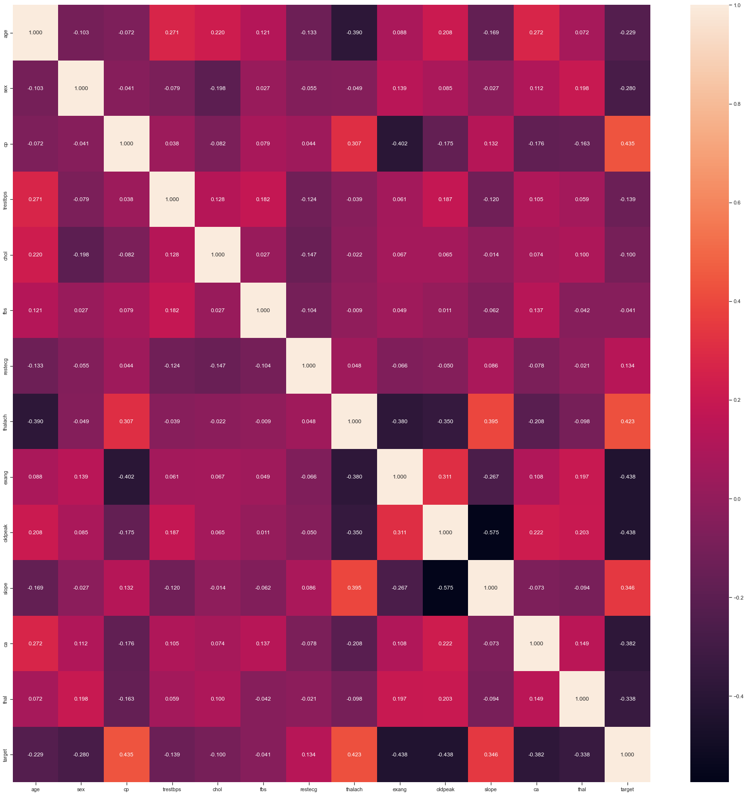

# Рубежный контроль №1

### Загружаем библиотеки


```python
#Загружаем все бибилиотеки
import numpy as np
import pandas as pd
from sklearn.datasets import *
import seaborn as sns
import matplotlib.pyplot as plt
%matplotlib inline 
sns.set(style="ticks")
```

### Загружаем данные


```python
df = pd.read_csv('heart.csv')
```


```python
df
```


<div>
<style scoped>
    .dataframe tbody tr th:only-of-type {
        vertical-align: middle;
    }

    .dataframe tbody tr th {
        vertical-align: top;
    }

    .dataframe thead th {
        text-align: right;
    }
</style>
<table border="1" class="dataframe">
  <thead>
    <tr style="text-align: right;">
      <th></th>
      <th>age</th>
      <th>sex</th>
      <th>cp</th>
      <th>trestbps</th>
      <th>chol</th>
      <th>fbs</th>
      <th>restecg</th>
      <th>thalach</th>
      <th>exang</th>
      <th>oldpeak</th>
      <th>slope</th>
      <th>ca</th>
      <th>thal</th>
      <th>target</th>
    </tr>
  </thead>
  <tbody>
    <tr>
      <th>0</th>
      <td>52</td>
      <td>1</td>
      <td>0</td>
      <td>125</td>
      <td>212</td>
      <td>0</td>
      <td>1</td>
      <td>168</td>
      <td>0</td>
      <td>1.0</td>
      <td>2</td>
      <td>2</td>
      <td>3</td>
      <td>0</td>
    </tr>
    <tr>
      <th>1</th>
      <td>53</td>
      <td>1</td>
      <td>0</td>
      <td>140</td>
      <td>203</td>
      <td>1</td>
      <td>0</td>
      <td>155</td>
      <td>1</td>
      <td>3.1</td>
      <td>0</td>
      <td>0</td>
      <td>3</td>
      <td>0</td>
    </tr>
    <tr>
      <th>2</th>
      <td>70</td>
      <td>1</td>
      <td>0</td>
      <td>145</td>
      <td>174</td>
      <td>0</td>
      <td>1</td>
      <td>125</td>
      <td>1</td>
      <td>2.6</td>
      <td>0</td>
      <td>0</td>
      <td>3</td>
      <td>0</td>
    </tr>
    <tr>
      <th>3</th>
      <td>61</td>
      <td>1</td>
      <td>0</td>
      <td>148</td>
      <td>203</td>
      <td>0</td>
      <td>1</td>
      <td>161</td>
      <td>0</td>
      <td>0.0</td>
      <td>2</td>
      <td>1</td>
      <td>3</td>
      <td>0</td>
    </tr>
    <tr>
      <th>4</th>
      <td>62</td>
      <td>0</td>
      <td>0</td>
      <td>138</td>
      <td>294</td>
      <td>1</td>
      <td>1</td>
      <td>106</td>
      <td>0</td>
      <td>1.9</td>
      <td>1</td>
      <td>3</td>
      <td>2</td>
      <td>0</td>
    </tr>
    <tr>
      <th>...</th>
      <td>...</td>
      <td>...</td>
      <td>...</td>
      <td>...</td>
      <td>...</td>
      <td>...</td>
      <td>...</td>
      <td>...</td>
      <td>...</td>
      <td>...</td>
      <td>...</td>
      <td>...</td>
      <td>...</td>
      <td>...</td>
    </tr>
    <tr>
      <th>1020</th>
      <td>59</td>
      <td>1</td>
      <td>1</td>
      <td>140</td>
      <td>221</td>
      <td>0</td>
      <td>1</td>
      <td>164</td>
      <td>1</td>
      <td>0.0</td>
      <td>2</td>
      <td>0</td>
      <td>2</td>
      <td>1</td>
    </tr>
    <tr>
      <th>1021</th>
      <td>60</td>
      <td>1</td>
      <td>0</td>
      <td>125</td>
      <td>258</td>
      <td>0</td>
      <td>0</td>
      <td>141</td>
      <td>1</td>
      <td>2.8</td>
      <td>1</td>
      <td>1</td>
      <td>3</td>
      <td>0</td>
    </tr>
    <tr>
      <th>1022</th>
      <td>47</td>
      <td>1</td>
      <td>0</td>
      <td>110</td>
      <td>275</td>
      <td>0</td>
      <td>0</td>
      <td>118</td>
      <td>1</td>
      <td>1.0</td>
      <td>1</td>
      <td>1</td>
      <td>2</td>
      <td>0</td>
    </tr>
    <tr>
      <th>1023</th>
      <td>50</td>
      <td>0</td>
      <td>0</td>
      <td>110</td>
      <td>254</td>
      <td>0</td>
      <td>0</td>
      <td>159</td>
      <td>0</td>
      <td>0.0</td>
      <td>2</td>
      <td>0</td>
      <td>2</td>
      <td>1</td>
    </tr>
    <tr>
      <th>1024</th>
      <td>54</td>
      <td>1</td>
      <td>0</td>
      <td>120</td>
      <td>188</td>
      <td>0</td>
      <td>1</td>
      <td>113</td>
      <td>0</td>
      <td>1.4</td>
      <td>1</td>
      <td>1</td>
      <td>3</td>
      <td>0</td>
    </tr>
  </tbody>
</table>
<p>1025 rows × 14 columns</p>
</div>


### Изучаем набор данных


```python
df.dtypes
```


    age           int64
    sex           int64
    cp            int64
    trestbps      int64
    chol          int64
    fbs           int64
    restecg       int64
    thalach       int64
    exang         int64
    oldpeak     float64
    slope         int64
    ca            int64
    thal          int64
    target        int64
    dtype: object


```python
# Посмотрим наличе пустых значений
df.isnull().sum()
```


    age         0
    sex         0
    cp          0
    trestbps    0
    chol        0
    fbs         0
    restecg     0
    thalach     0
    exang       0
    oldpeak     0
    slope       0
    ca          0
    thal        0
    target      0
    dtype: int64


### Корреляционный анализ


```python
df.corr()
```


<div>
<style scoped>
    .dataframe tbody tr th:only-of-type {
        vertical-align: middle;
    }

    .dataframe tbody tr th {
        vertical-align: top;
    }

    .dataframe thead th {
        text-align: right;
    }
</style>
<table border="1" class="dataframe">
  <thead>
    <tr style="text-align: right;">
      <th></th>
      <th>age</th>
      <th>sex</th>
      <th>cp</th>
      <th>trestbps</th>
      <th>chol</th>
      <th>fbs</th>
      <th>restecg</th>
      <th>thalach</th>
      <th>exang</th>
      <th>oldpeak</th>
      <th>slope</th>
      <th>ca</th>
      <th>thal</th>
      <th>target</th>
    </tr>
  </thead>
  <tbody>
    <tr>
      <th>age</th>
      <td>1.000000</td>
      <td>-0.103240</td>
      <td>-0.071966</td>
      <td>0.271121</td>
      <td>0.219823</td>
      <td>0.121243</td>
      <td>-0.132696</td>
      <td>-0.390227</td>
      <td>0.088163</td>
      <td>0.208137</td>
      <td>-0.169105</td>
      <td>0.271551</td>
      <td>0.072297</td>
      <td>-0.229324</td>
    </tr>
    <tr>
      <th>sex</th>
      <td>-0.103240</td>
      <td>1.000000</td>
      <td>-0.041119</td>
      <td>-0.078974</td>
      <td>-0.198258</td>
      <td>0.027200</td>
      <td>-0.055117</td>
      <td>-0.049365</td>
      <td>0.139157</td>
      <td>0.084687</td>
      <td>-0.026666</td>
      <td>0.111729</td>
      <td>0.198424</td>
      <td>-0.279501</td>
    </tr>
    <tr>
      <th>cp</th>
      <td>-0.071966</td>
      <td>-0.041119</td>
      <td>1.000000</td>
      <td>0.038177</td>
      <td>-0.081641</td>
      <td>0.079294</td>
      <td>0.043581</td>
      <td>0.306839</td>
      <td>-0.401513</td>
      <td>-0.174733</td>
      <td>0.131633</td>
      <td>-0.176206</td>
      <td>-0.163341</td>
      <td>0.434854</td>
    </tr>
    <tr>
      <th>trestbps</th>
      <td>0.271121</td>
      <td>-0.078974</td>
      <td>0.038177</td>
      <td>1.000000</td>
      <td>0.127977</td>
      <td>0.181767</td>
      <td>-0.123794</td>
      <td>-0.039264</td>
      <td>0.061197</td>
      <td>0.187434</td>
      <td>-0.120445</td>
      <td>0.104554</td>
      <td>0.059276</td>
      <td>-0.138772</td>
    </tr>
    <tr>
      <th>chol</th>
      <td>0.219823</td>
      <td>-0.198258</td>
      <td>-0.081641</td>
      <td>0.127977</td>
      <td>1.000000</td>
      <td>0.026917</td>
      <td>-0.147410</td>
      <td>-0.021772</td>
      <td>0.067382</td>
      <td>0.064880</td>
      <td>-0.014248</td>
      <td>0.074259</td>
      <td>0.100244</td>
      <td>-0.099966</td>
    </tr>
    <tr>
      <th>fbs</th>
      <td>0.121243</td>
      <td>0.027200</td>
      <td>0.079294</td>
      <td>0.181767</td>
      <td>0.026917</td>
      <td>1.000000</td>
      <td>-0.104051</td>
      <td>-0.008866</td>
      <td>0.049261</td>
      <td>0.010859</td>
      <td>-0.061902</td>
      <td>0.137156</td>
      <td>-0.042177</td>
      <td>-0.041164</td>
    </tr>
    <tr>
      <th>restecg</th>
      <td>-0.132696</td>
      <td>-0.055117</td>
      <td>0.043581</td>
      <td>-0.123794</td>
      <td>-0.147410</td>
      <td>-0.104051</td>
      <td>1.000000</td>
      <td>0.048411</td>
      <td>-0.065606</td>
      <td>-0.050114</td>
      <td>0.086086</td>
      <td>-0.078072</td>
      <td>-0.020504</td>
      <td>0.134468</td>
    </tr>
    <tr>
      <th>thalach</th>
      <td>-0.390227</td>
      <td>-0.049365</td>
      <td>0.306839</td>
      <td>-0.039264</td>
      <td>-0.021772</td>
      <td>-0.008866</td>
      <td>0.048411</td>
      <td>1.000000</td>
      <td>-0.380281</td>
      <td>-0.349796</td>
      <td>0.395308</td>
      <td>-0.207888</td>
      <td>-0.098068</td>
      <td>0.422895</td>
    </tr>
    <tr>
      <th>exang</th>
      <td>0.088163</td>
      <td>0.139157</td>
      <td>-0.401513</td>
      <td>0.061197</td>
      <td>0.067382</td>
      <td>0.049261</td>
      <td>-0.065606</td>
      <td>-0.380281</td>
      <td>1.000000</td>
      <td>0.310844</td>
      <td>-0.267335</td>
      <td>0.107849</td>
      <td>0.197201</td>
      <td>-0.438029</td>
    </tr>
    <tr>
      <th>oldpeak</th>
      <td>0.208137</td>
      <td>0.084687</td>
      <td>-0.174733</td>
      <td>0.187434</td>
      <td>0.064880</td>
      <td>0.010859</td>
      <td>-0.050114</td>
      <td>-0.349796</td>
      <td>0.310844</td>
      <td>1.000000</td>
      <td>-0.575189</td>
      <td>0.221816</td>
      <td>0.202672</td>
      <td>-0.438441</td>
    </tr>
    <tr>
      <th>slope</th>
      <td>-0.169105</td>
      <td>-0.026666</td>
      <td>0.131633</td>
      <td>-0.120445</td>
      <td>-0.014248</td>
      <td>-0.061902</td>
      <td>0.086086</td>
      <td>0.395308</td>
      <td>-0.267335</td>
      <td>-0.575189</td>
      <td>1.000000</td>
      <td>-0.073440</td>
      <td>-0.094090</td>
      <td>0.345512</td>
    </tr>
    <tr>
      <th>ca</th>
      <td>0.271551</td>
      <td>0.111729</td>
      <td>-0.176206</td>
      <td>0.104554</td>
      <td>0.074259</td>
      <td>0.137156</td>
      <td>-0.078072</td>
      <td>-0.207888</td>
      <td>0.107849</td>
      <td>0.221816</td>
      <td>-0.073440</td>
      <td>1.000000</td>
      <td>0.149014</td>
      <td>-0.382085</td>
    </tr>
    <tr>
      <th>thal</th>
      <td>0.072297</td>
      <td>0.198424</td>
      <td>-0.163341</td>
      <td>0.059276</td>
      <td>0.100244</td>
      <td>-0.042177</td>
      <td>-0.020504</td>
      <td>-0.098068</td>
      <td>0.197201</td>
      <td>0.202672</td>
      <td>-0.094090</td>
      <td>0.149014</td>
      <td>1.000000</td>
      <td>-0.337838</td>
    </tr>
    <tr>
      <th>target</th>
      <td>-0.229324</td>
      <td>-0.279501</td>
      <td>0.434854</td>
      <td>-0.138772</td>
      <td>-0.099966</td>
      <td>-0.041164</td>
      <td>0.134468</td>
      <td>0.422895</td>
      <td>-0.438029</td>
      <td>-0.438441</td>
      <td>0.345512</td>
      <td>-0.382085</td>
      <td>-0.337838</td>
      <td>1.000000</td>
    </tr>
  </tbody>
</table>
</div>


```python
df.corr(method='spearman')
```


<div>
<style scoped>
    .dataframe tbody tr th:only-of-type {
        vertical-align: middle;
    }

    .dataframe tbody tr th {
        vertical-align: top;
    }

    .dataframe thead th {
        text-align: right;
    }
</style>
<table border="1" class="dataframe">
  <thead>
    <tr style="text-align: right;">
      <th></th>
      <th>age</th>
      <th>sex</th>
      <th>cp</th>
      <th>trestbps</th>
      <th>chol</th>
      <th>fbs</th>
      <th>restecg</th>
      <th>thalach</th>
      <th>exang</th>
      <th>oldpeak</th>
      <th>slope</th>
      <th>ca</th>
      <th>thal</th>
      <th>target</th>
    </tr>
  </thead>
  <tbody>
    <tr>
      <th>age</th>
      <td>1.000000</td>
      <td>-0.105479</td>
      <td>-0.092148</td>
      <td>0.280189</td>
      <td>0.203253</td>
      <td>0.110958</td>
      <td>-0.149732</td>
      <td>-0.382724</td>
      <td>0.077594</td>
      <td>0.264500</td>
      <td>-0.180627</td>
      <td>0.339808</td>
      <td>0.088586</td>
      <td>-0.240326</td>
    </tr>
    <tr>
      <th>sex</th>
      <td>-0.105479</td>
      <td>1.000000</td>
      <td>-0.053450</td>
      <td>-0.071923</td>
      <td>-0.152997</td>
      <td>0.027200</td>
      <td>-0.044169</td>
      <td>-0.047053</td>
      <td>0.139157</td>
      <td>0.090896</td>
      <td>-0.020843</td>
      <td>0.113834</td>
      <td>0.241115</td>
      <td>-0.279501</td>
    </tr>
    <tr>
      <th>cp</th>
      <td>-0.092148</td>
      <td>-0.053450</td>
      <td>1.000000</td>
      <td>0.025526</td>
      <td>-0.092239</td>
      <td>0.073738</td>
      <td>0.066715</td>
      <td>0.336116</td>
      <td>-0.427933</td>
      <td>-0.195285</td>
      <td>0.169307</td>
      <td>-0.217002</td>
      <td>-0.212186</td>
      <td>0.464894</td>
    </tr>
    <tr>
      <th>trestbps</th>
      <td>0.280189</td>
      <td>-0.071923</td>
      <td>0.025526</td>
      <td>1.000000</td>
      <td>0.127010</td>
      <td>0.152272</td>
      <td>-0.137273</td>
      <td>-0.028880</td>
      <td>0.043791</td>
      <td>0.146722</td>
      <td>-0.081828</td>
      <td>0.091323</td>
      <td>0.058995</td>
      <td>-0.115009</td>
    </tr>
    <tr>
      <th>chol</th>
      <td>0.203253</td>
      <td>-0.152997</td>
      <td>-0.092239</td>
      <td>0.127010</td>
      <td>1.000000</td>
      <td>0.034139</td>
      <td>-0.163354</td>
      <td>-0.054794</td>
      <td>0.088895</td>
      <td>0.057102</td>
      <td>-0.026660</td>
      <td>0.114584</td>
      <td>0.084941</td>
      <td>-0.132926</td>
    </tr>
    <tr>
      <th>fbs</th>
      <td>0.110958</td>
      <td>0.027200</td>
      <td>0.073738</td>
      <td>0.152272</td>
      <td>0.034139</td>
      <td>1.000000</td>
      <td>-0.101709</td>
      <td>-0.016292</td>
      <td>0.049261</td>
      <td>0.032542</td>
      <td>-0.048340</td>
      <td>0.138197</td>
      <td>-0.013372</td>
      <td>-0.041164</td>
    </tr>
    <tr>
      <th>restecg</th>
      <td>-0.149732</td>
      <td>-0.044169</td>
      <td>0.066715</td>
      <td>-0.137273</td>
      <td>-0.163354</td>
      <td>-0.101709</td>
      <td>1.000000</td>
      <td>0.091548</td>
      <td>-0.073428</td>
      <td>-0.075213</td>
      <td>0.109506</td>
      <td>-0.108580</td>
      <td>-0.017285</td>
      <td>0.147402</td>
    </tr>
    <tr>
      <th>thalach</th>
      <td>-0.382724</td>
      <td>-0.047053</td>
      <td>0.336116</td>
      <td>-0.028880</td>
      <td>-0.054794</td>
      <td>-0.016292</td>
      <td>0.091548</td>
      <td>1.000000</td>
      <td>-0.405000</td>
      <td>-0.439987</td>
      <td>0.443417</td>
      <td>-0.254775</td>
      <td>-0.159190</td>
      <td>0.429832</td>
    </tr>
    <tr>
      <th>exang</th>
      <td>0.077594</td>
      <td>0.139157</td>
      <td>-0.427933</td>
      <td>0.043791</td>
      <td>0.088895</td>
      <td>0.049261</td>
      <td>-0.073428</td>
      <td>-0.405000</td>
      <td>1.000000</td>
      <td>0.322149</td>
      <td>-0.282593</td>
      <td>0.158985</td>
      <td>0.240512</td>
      <td>-0.438029</td>
    </tr>
    <tr>
      <th>oldpeak</th>
      <td>0.264500</td>
      <td>0.090896</td>
      <td>-0.195285</td>
      <td>0.146722</td>
      <td>0.057102</td>
      <td>0.032542</td>
      <td>-0.075213</td>
      <td>-0.439987</td>
      <td>0.322149</td>
      <td>1.000000</td>
      <td>-0.594413</td>
      <td>0.230183</td>
      <td>0.253489</td>
      <td>-0.437669</td>
    </tr>
    <tr>
      <th>slope</th>
      <td>-0.180627</td>
      <td>-0.020843</td>
      <td>0.169307</td>
      <td>-0.081828</td>
      <td>-0.026660</td>
      <td>-0.048340</td>
      <td>0.109506</td>
      <td>0.443417</td>
      <td>-0.282593</td>
      <td>-0.594413</td>
      <td>1.000000</td>
      <td>-0.095393</td>
      <td>-0.146059</td>
      <td>0.368808</td>
    </tr>
    <tr>
      <th>ca</th>
      <td>0.339808</td>
      <td>0.113834</td>
      <td>-0.217002</td>
      <td>0.091323</td>
      <td>0.114584</td>
      <td>0.138197</td>
      <td>-0.108580</td>
      <td>-0.254775</td>
      <td>0.158985</td>
      <td>0.230183</td>
      <td>-0.095393</td>
      <td>1.000000</td>
      <td>0.186155</td>
      <td>-0.453329</td>
    </tr>
    <tr>
      <th>thal</th>
      <td>0.088586</td>
      <td>0.241115</td>
      <td>-0.212186</td>
      <td>0.058995</td>
      <td>0.084941</td>
      <td>-0.013372</td>
      <td>-0.017285</td>
      <td>-0.159190</td>
      <td>0.240512</td>
      <td>0.253489</td>
      <td>-0.146059</td>
      <td>0.186155</td>
      <td>1.000000</td>
      <td>-0.398973</td>
    </tr>
    <tr>
      <th>target</th>
      <td>-0.240326</td>
      <td>-0.279501</td>
      <td>0.464894</td>
      <td>-0.115009</td>
      <td>-0.132926</td>
      <td>-0.041164</td>
      <td>0.147402</td>
      <td>0.429832</td>
      <td>-0.438029</td>
      <td>-0.437669</td>
      <td>0.368808</td>
      <td>-0.453329</td>
      <td>-0.398973</td>
      <td>1.000000</td>
    </tr>
  </tbody>
</table>
</div>


```python
fg, ax = plt.subplots(figsize=(30,30))
sns.heatmap(df.corr(), annot=True, fmt='.3f', ax=ax)
plt.show()
```


    

    


По полученной корреляционной матрице, можно сделать вывод, что модель может получится хорошей, т.к. целевой параметр имеет заметную корреляцию с большим числом признаков. Самый большой вклад в целевой параметр вложат признаки **cp**, **exang**, **thalach**, **oldpeack**.


```python

```
