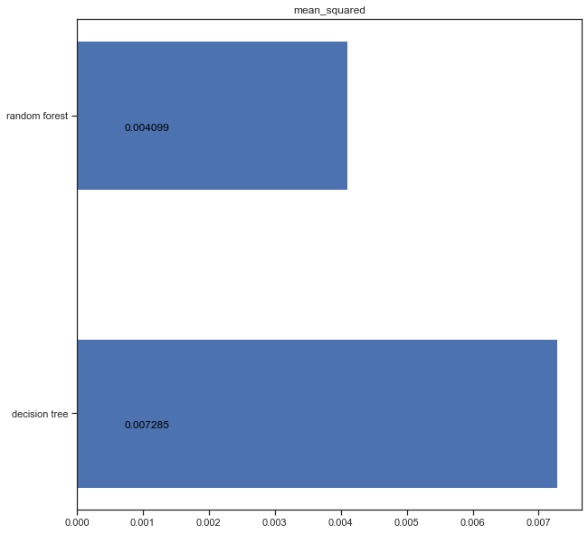
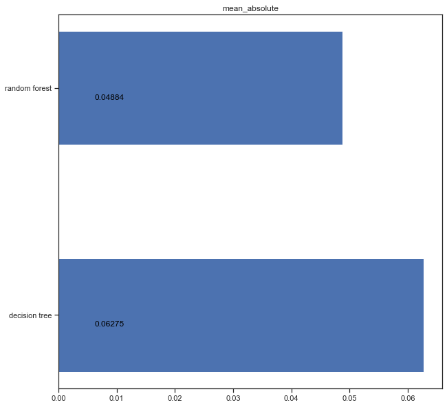
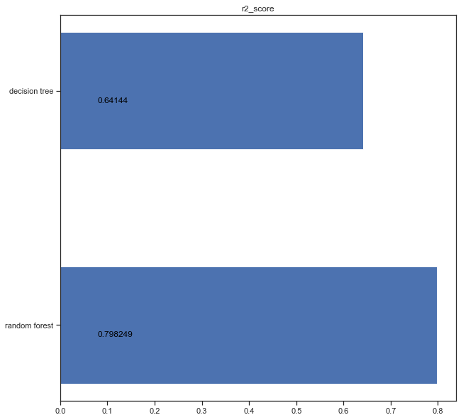

# Рубежный контроль №2

### Загружаем библиотеки


```python
import pandas as pd
from sklearn.tree import DecisionTreeRegressor
from sklearn.model_selection import train_test_split
from sklearn.metrics import mean_absolute_error, mean_squared_error, r2_score
from sklearn.preprocessing import LabelEncoder
from io import StringIO
from sklearn.tree import export_graphviz
from sklearn.ensemble import RandomForestRegressor
import pydotplus
from IPython.display import Image
import matplotlib.pyplot as plt
```

### Загружаем данные


```python
df = pd.read_csv('Admission_Predict.csv')
```


```python
df
```


<div>
<style scoped>
    .dataframe tbody tr th:only-of-type {
        vertical-align: middle;
    }

    .dataframe tbody tr th {
        vertical-align: top;
    }

    .dataframe thead th {
        text-align: right;
    }
</style>
<table border="1" class="dataframe">
  <thead>
    <tr style="text-align: right;">
      <th></th>
      <th>Serial No.</th>
      <th>GRE Score</th>
      <th>TOEFL Score</th>
      <th>University Rating</th>
      <th>SOP</th>
      <th>LOR</th>
      <th>CGPA</th>
      <th>Research</th>
      <th>Chance of Admit</th>
    </tr>
  </thead>
  <tbody>
    <tr>
      <th>0</th>
      <td>1</td>
      <td>337</td>
      <td>118</td>
      <td>4</td>
      <td>4.5</td>
      <td>4.5</td>
      <td>9.65</td>
      <td>1</td>
      <td>0.92</td>
    </tr>
    <tr>
      <th>1</th>
      <td>2</td>
      <td>324</td>
      <td>107</td>
      <td>4</td>
      <td>4.0</td>
      <td>4.5</td>
      <td>8.87</td>
      <td>1</td>
      <td>0.76</td>
    </tr>
    <tr>
      <th>2</th>
      <td>3</td>
      <td>316</td>
      <td>104</td>
      <td>3</td>
      <td>3.0</td>
      <td>3.5</td>
      <td>8.00</td>
      <td>1</td>
      <td>0.72</td>
    </tr>
    <tr>
      <th>3</th>
      <td>4</td>
      <td>322</td>
      <td>110</td>
      <td>3</td>
      <td>3.5</td>
      <td>2.5</td>
      <td>8.67</td>
      <td>1</td>
      <td>0.80</td>
    </tr>
    <tr>
      <th>4</th>
      <td>5</td>
      <td>314</td>
      <td>103</td>
      <td>2</td>
      <td>2.0</td>
      <td>3.0</td>
      <td>8.21</td>
      <td>0</td>
      <td>0.65</td>
    </tr>
    <tr>
      <th>...</th>
      <td>...</td>
      <td>...</td>
      <td>...</td>
      <td>...</td>
      <td>...</td>
      <td>...</td>
      <td>...</td>
      <td>...</td>
      <td>...</td>
    </tr>
    <tr>
      <th>395</th>
      <td>396</td>
      <td>324</td>
      <td>110</td>
      <td>3</td>
      <td>3.5</td>
      <td>3.5</td>
      <td>9.04</td>
      <td>1</td>
      <td>0.82</td>
    </tr>
    <tr>
      <th>396</th>
      <td>397</td>
      <td>325</td>
      <td>107</td>
      <td>3</td>
      <td>3.0</td>
      <td>3.5</td>
      <td>9.11</td>
      <td>1</td>
      <td>0.84</td>
    </tr>
    <tr>
      <th>397</th>
      <td>398</td>
      <td>330</td>
      <td>116</td>
      <td>4</td>
      <td>5.0</td>
      <td>4.5</td>
      <td>9.45</td>
      <td>1</td>
      <td>0.91</td>
    </tr>
    <tr>
      <th>398</th>
      <td>399</td>
      <td>312</td>
      <td>103</td>
      <td>3</td>
      <td>3.5</td>
      <td>4.0</td>
      <td>8.78</td>
      <td>0</td>
      <td>0.67</td>
    </tr>
    <tr>
      <th>399</th>
      <td>400</td>
      <td>333</td>
      <td>117</td>
      <td>4</td>
      <td>5.0</td>
      <td>4.0</td>
      <td>9.66</td>
      <td>1</td>
      <td>0.95</td>
    </tr>
  </tbody>
</table>
<p>400 rows × 9 columns</p>
</div>


#### Разделим на обучающую и тестовую выборку


```python
df_X_train, df_X_test, df_y_train, df_y_test = train_test_split(
    df.drop(columns='Chance of Admit '), df['Chance of Admit '], test_size=0.2, random_state=171)
```

### Дерево решений 


```python
tree = DecisionTreeRegressor()
tree.fit(df_X_train, df_y_train)
```


    DecisionTreeRegressor()


```python
tree_predict = tree.predict(df_X_test)
```

### Случаный лес


```python
forest = RandomForestRegressor()
forest.fit(df_X_train, df_y_train)
```


    RandomForestRegressor()


```python
forest_predict = forest.predict(df_X_test)
```

### Оценка моделей

Для оценки будем использовать три метрики: **Средняя квадратичная ошибка**, **Средняя абсолютная ошибка**, **R2 score**.


```python
def plot_metrics(metrics, models, test_y):
    for name, fun in metrics.items():
        fig, ax = plt.subplots(figsize=(10,10))
        results_metrics = []
        
        for nm, results in models.items():
            results_metrics.append(fun(test_y, results))
    
        sorted_el = list(sorted(list(zip(models.keys(), results_metrics)), key=lambda x: -x[1]))
        results_metrics = list(map(lambda x: x[1], sorted_el))
        model_list = list(map(lambda x: x[0], sorted_el))
        
        pos = np.arange(len(model_list))
        rects = ax.barh(pos, results_metrics,
                     align='center',
                     height=0.5, 
                     tick_label=model_list)
        ax.set_title(name)
        for a, b in zip(pos, results_metrics):
            plt.text(max(results_metrics) * 0.1, a-0.05, str(round(b,6)), color='black')
        plt.show() 
```


```python
metrics = {
    'mean_squared':mean_squared_error,
    'mean_absolute':mean_absolute_error,
    'r2_score':r2_score
}

predictions = {
    'decision tree': tree_predict,
    'random forest': forest_predict
}

plot_metrics(metrics, predictions, df_y_test)
```


    

    


    

    


    

    


Случаный лес лучше работает на данном наборе данных, что логично т.к. она явялется ансамблей моделей.


```python

```
